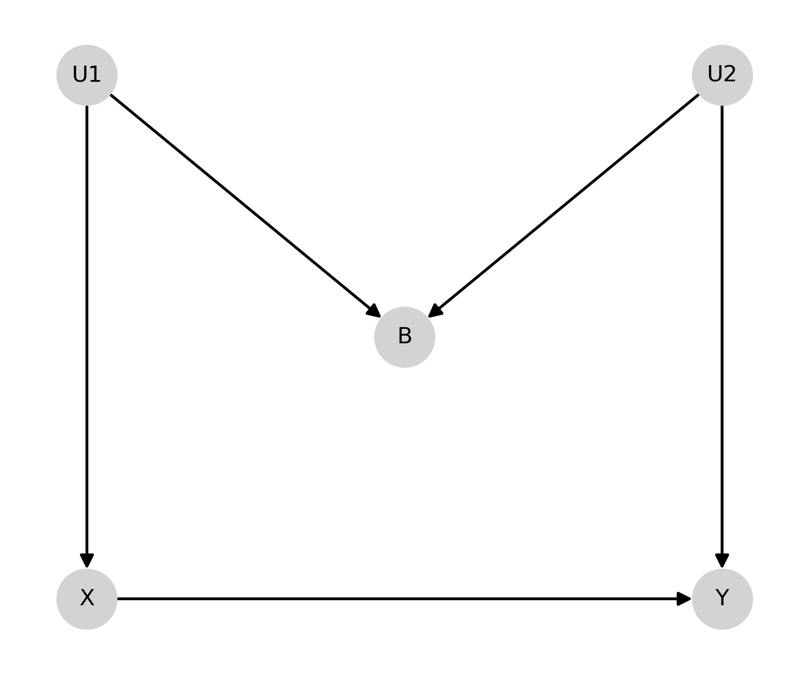
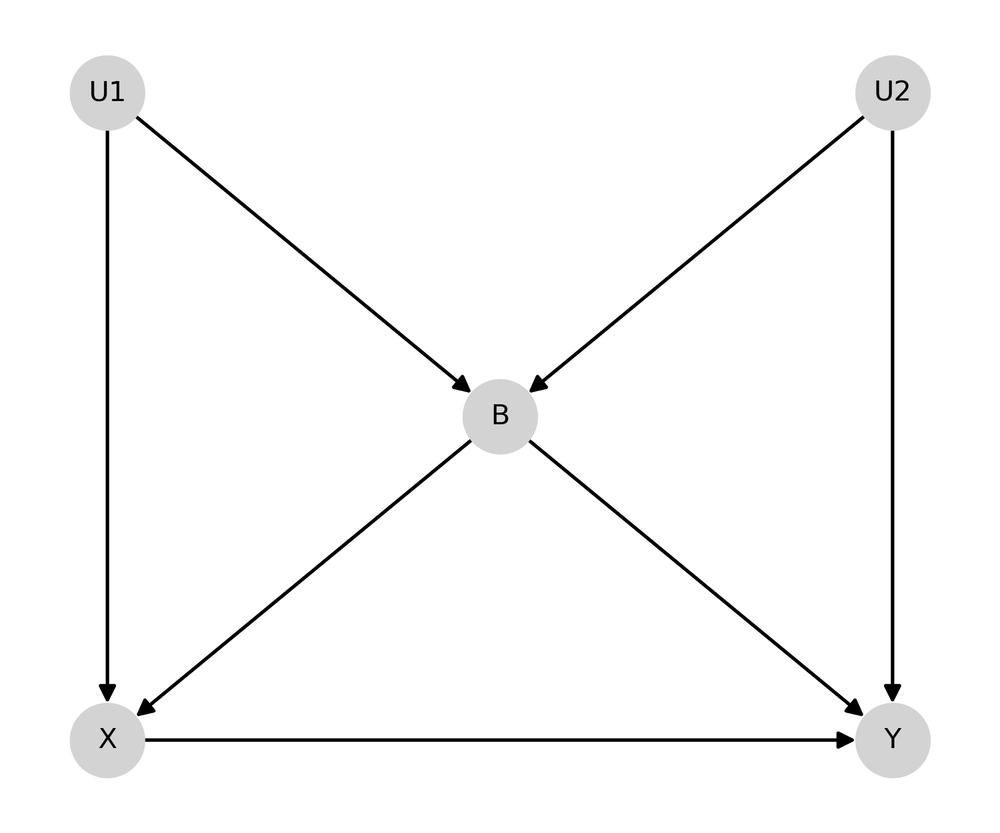

-------------------------------------

Causal Graphs
'''''''''''''

This page demonstrates analysis for causal diagrams (graphs). These diagrams are meant to help identify the sufficient
adjustment set to identify the causal effect. Currently only directed acyclic graphs supported by single-world
intervention graphs will be added.

Note that this branch requires installation of ``NetworkX`` since that library is used to analyse the graph objects

Directed Acyclic Graphs
==========================
Directed acyclic graphs (DAGs) provide an easy graphical tool to determine sufficient adjustment sets to control for all
confounding and identify the causal effect of an exposure on an outcome. DAGs rely on the assumption of d-separation of
the exposure and outcome. Currently the ``DirectedAcyclicGraph`` class only allows for assessing the d-separation
of the exposure and outcome. Additional support for checking d-separation between missingness, censoring, mediators,
and time-varying exposures will be added in future versions.

Remember that DAGs should be constructed prior to data collection preferably. Also the major assumptions that a DAG
makes is the *lack* of arrows and *lack* of nodes. The assumptions are the items not present within the diagram.

Let's look at some classical examples of DAGs.

M-Bias
^^^^^^^^^^^

First we will create the "M-bias" DAG. This DAG is named after its distinct shape

.. code:: python

   from zepid.causal.causalgraph import DirectedAcyclicGraph
   import matplotlib.pyplot as plt

   dag = DirectedAcyclicGraph(exposure='X', outcome="Y")
   dag.add_arrows((('X', 'Y'),
                   ('U1', 'X'), ('U1', 'B'),
                   ('U2', 'B'), ('U2', 'Y')
                  ))
   pos = {"X": [0, 0], "Y": [1, 0], "B": [0.5, 0.5],
          "U1": [0, 1], "U2": [1, 1]}

   dag.draw_dag(positions=pos)
   plt.tight_layout()
   plt.show()

After creating the DAG, we can determine the sufficient adjustment set

.. code:: python

   dag.calculate_adjustment_sets()
   print(dag.adjustment_sets)

Since B is a collider, the minimally sufficient adjustment set is the empty set

Butterfly-Bias
^^^^^^^^^^^^^^
Butterfly-bias is an extension of the previous M-bias DAG where we need to adjust for B but B also opens a backdoor
path (specifically the path it is a collider on).

.. code:: python

   dag.add_arrows((('X', 'Y'),
                   ('U1', 'X'), ('U1', 'B'),
                   ('U2', 'B'), ('U2', 'Y'),
                   ('B', 'X'), ('B', 'Y')
                   ))

   dag.draw_dag(positions=pos)
   plt.tight_layout()
   plt.show()

In the case of Butterfly bias, there are 3 possible adjustment sets

.. code:: python

   dag.calculate_adjustment_sets()
   print(dag.adjustment_sets)

Remember that DAGs should be constructed prior to data collection preferablly. Also the major assumptions that a DAG
makes is the *lack* of arrows and *lack* of nodes. The assumptions are the items not present within the diagram