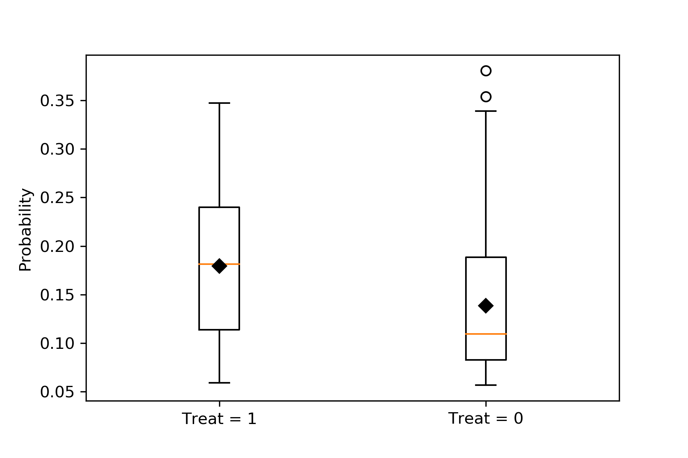
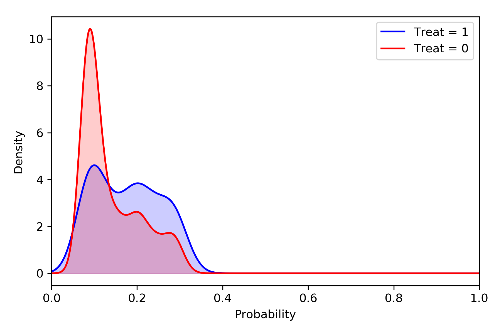
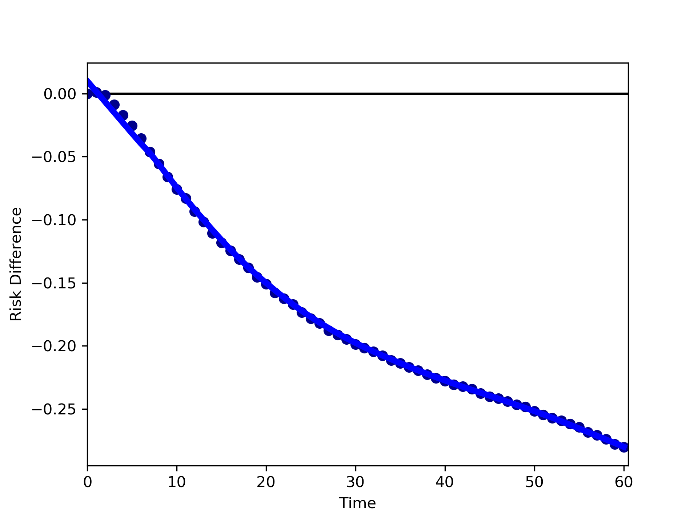
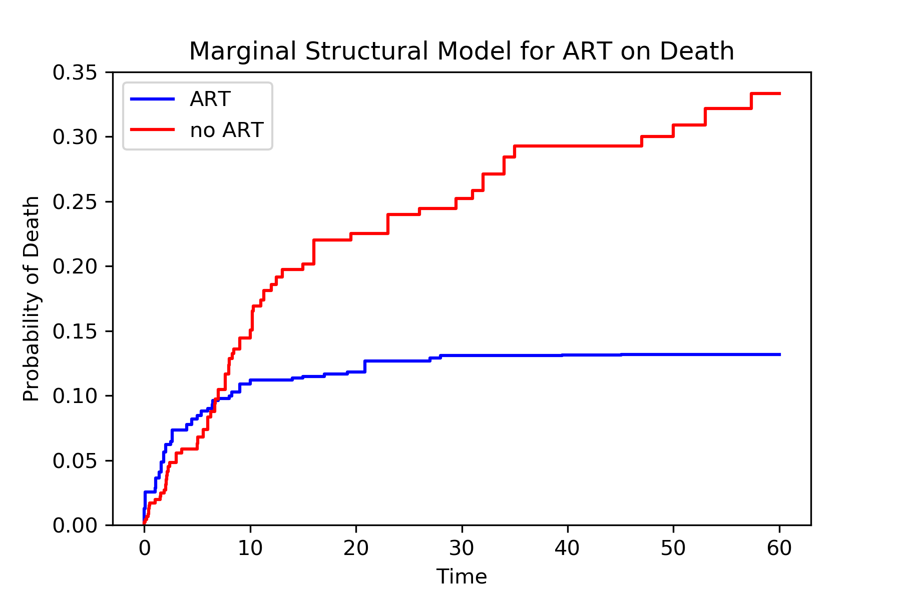

.. image:: images/zepid_logo.png

-------------------------------------

Causal
'''''''''''''''''''''''''''''''''
*zEpid* includes several different causal method implementations. This section is sub-divided into two sections;
time-fixed exposures and time-varying exposures.

Time-Fixed Exposures
==============================================
For time-fixed exposure methods, the baseline exposure is assumed to remain constant over the entire study period.
Another way to frame time-fixed exposures, is the intent-to-treat assumption. These methods deal with time-varying
confounders by ignoring (not adjusting for) exposures downstream of the causal path between the baseline exposure and
the outcome.

G-Computation Algorithm
----------------------------------------
The g-computation algorithm, also referred to as g-formula, is a method to obtain marginal estimates of various
treatment comparisons (Robins 1986). For some introductions to the utility and usage of the g-formula, I recommend
reading:

`Snowden JM et al. 2011 <https://www.ncbi.nlm.nih.gov/pmc/articles/PMC3105284/>`_

`Keil AP et al. 2014 <https://www.ncbi.nlm.nih.gov/pubmed/25140837>`_

`Westreich D et al. 2012 <https://www.ncbi.nlm.nih.gov/pmc/articles/PMC3641816/>`_

Currently, all implementations of the g-formula in *zEpid* are parametric implementations that use ``statsmodels``
logistic regression for binary outcomes and ``statsmodels`` linear regression for continuous outcomes.

To implement the g-formula in the time fixed setting, the ``TimeFixedGFormula`` class is imported from
``zepid.causal.gformula``. The class is initialized with the data set of interest, the exposure, the outcome, and the
variable type of the outcome. Currently, only binary or continuous outcomes are implemented. Once initialized, the
parametric outcome model is specified. After we specify the outcome model, we can obtain our marginal estimates for the
outcome. I recommend reviewing Snowden et al 2011 for an introduction and further information.

Binary Outcomes
~~~~~~~~~~~~~~~~~~~
By default, ``TimeFixedGFormula`` implements a binary outcome model (i.e. logistic regression). The following is an
example to obtain estimates of the g-formula for a binary outcome (death) in regards to a binary exposure
(antiretroviral therapy). First, we will initialize the time-fixed g-formula class

.. code:: python

  import zepid as ze
  from zepid.causal.gformula import TimeFixedGFormula
  #Preparing dataframe
  df = ze.load_sample_data(timevary=False)
  df[['cd4_rs1','cd4_rs2']] = ze.spline(df,'cd40',n_knots=3,term=2,restricted=True)
  df[['age_rs1','age_rs2']] = ze.spline(df,'age0',n_knots=3,term=2,restricted=True)
  #Initializing the g-formula
  g = TimeFixedGFormula(df,exposure='art',outcome='dead')

Now that our class is specified, we can fit a model to predict the outcome. This is referred to as the Q-model. For
user ease, ``TimeFixedGFormula`` refers to this as ``outcome_model()`` instead. We can fit the following outcome model

.. code:: python

  g.outcome_model(model='art + male + age0 + age_rs1 + age_rs2 + cd40 + cd4_rs1 + cd4_rs2 + dvl0')

When the Q-model is fit, the corresponding logistic regression output is provided. 

After our outcome model is specified, we can now obtain estimates of the treatment. There are three available options;
``all``, ``none``, or a custom assignment. We will discuss all and none first. ``all`` and ``none`` estimate the
observed effect with the exposures, effect if everyone was exposed, and effect if everyone was unexposed, respectively.
This is done by setting all observations to the specified exposure pattern and predicting the outcomes based on the
Q-model. We can implement the ``all`` and ``none`` comparison for the intent-to-treat effect of ART on death via the
following code

.. code:: python

  g.fit(treatment='all')
  r_all = g.marginal_outcome
  g.fit(treatment='none')
  r_none = g.marginal_outcome
  print('RD = ',r_all - r_none)
  print('RR = ',r_all / r_none)

After the g-formula is fit, it gains an attribute ``marginal_outcome`` which is the expected value of Y in that
population with the set exposure pattern.

One of the great utilities of the g-formula is being able to set custom exposure patterns / interventions. To implement
our own custom exposure, we will call the treatment function with our specified treatment pattern. In this example, we
will compare the situation where we treat all the females younger than 40 at baseline in our sample to the alternative
if no one was treated.

To set our exposure pattern we create a string object following the format construction of inside the ``pandas``
``loc`` function. For our example we will create the following string object that corresponds to females younger than
40 all being treated.

.. code:: python

  "((g['male']==0) & (g['age0']<=40))"

This should look familiar to some of the data cleaning operations. Remember that ``|`` signifies ``or`` and ``&``
signifies ``and`` in ``numpy``. **It is vitally important that the referred to dataframe within the treatment options
is referred to as** ``g`` . If it is not, there will be an error generated by ``numpy`` or ``pandas``. Inside
``TimeFixedGFormula``, the predicted dataframe is referred to as ``g`` so it must be referred to as ``g`` in the custom
treatment model.

We will fit the g-formula to our exposure strategy by 

.. code:: python

  g.fit(treatment="((g['male']==0) & (g['age0']<=40))")
  r_custom = g.marginal_outcome

Now we can make our comparison between our custom treatment compared to the counterfactual of no one being treated

.. code:: python

  print('RD = ',r_custom - r_none)
  print('RR = ',r_custom / r_none)

Multivariate Exposures
~~~~~~~~~~~~~~~~~~~~~~~~~~~
Multivariate exposures are also available. To create a multivariate exposure, first a disjoint indicator variable must
be generated. Our sample dataframe does not contain a multivariate exposure. Instead we will create one by creating a
two new variables based on CD4 count.

.. code:: python

  df['cd4_1'] = np.where(((df['cd40']>=200)&(df['cd40']<400)),1,0)
  df['cd4_2'] = np.where(df['cd40']>=400,1,0)

Now we can initialize the g-formula. For multivariate exposures, we will instead pass a list of the disjoint indicator
terms for our exposure. In our context this corresponds to ``cd4_1`` and ``cd4_2``

.. code:: python

  g = TimeFixedGFormula(df,exposure=['art_male','art_female'],outcome='dead')
  g.outcome_model(model='cd4_1 + cd4_2 + art + male + age0 + age_rs1 + age_rs2 + dvl0')

For multivariate exposures, a custom exposure pattern must be specified. Either ``all`` or ``none`` will generate an
error. We will create 3 categories (all <200 CD4 count, CD4 count between 200-400, CD4 count 400+). To do this, we
specify the treatment pattern. Since our reference category is <200 CD4 T cell count, we will set both exposure patterns
as ``False`` .

.. code:: python

  exposure_patterns = ["False",
                      "False"]
  g.fit(treatment=exposure_patterns)  # Everyone <200 CD4 T cell count
  rcd1 = g.marginal_outcome

  exposure_patterns = ["True",
                      "False"]
  g.fit(treatment=exposure_patterns)  # Everyone 200-400 CD4 T cell count
  rcd2 = g.marginal_outcome

  exposure_patterns = ["False",
                      "True"]
  g.fit(treatment=exposure_patterns)  # Everyone >400 CD4 T cell count
  rcd3 = g.marginal_outcome

The order of the input custom exposure patterns should be the same order as the inputs of the exposures when
initializing ``TimeFixedGFormula``. These options make absolute comparisons, but conditional treatment strategies can
be specified, like discussed in the binary exposure section

Continuous Outcomes
~~~~~~~~~~~~~~~~~~~~~~~
For continuous outcome variables, the ``outcome_type='continuous'`` must be specified. Instead of logistic regression,
the outcomes are predicted via linear regression. The remaining syntax is the same between binary outcomes and
continuous outcomes. We will demonstrate the functionality by switching our outcome to the last measured CD4 T cell
count for each participant

.. code:: python

  g = TimeFixedGFormula(df,exposure='art',outcome='cd4',outcome_type='continuous')
  g.outcome_model(model='art + male + age0 + age_rs1 + age_rs2 + dvl0 + cd40 + cd4_rs1 + cd4_rs2')
  g.fit(treatment='all')
  g.marginal_outcome

Generating Confidence Intervals
~~~~~~~~~~~~~~~~~~~~~~~~~~~~~~~~~~~~~
To get confidence intervals for our estimate, we need to use a bootstrap. Currently, the bootstrapped confidence
intervals need to be user generated. Below is example code to obtain non-parametric bootstrapped 95% confidence
intervals. This example generates confidence intervals for ART exposure on death

.. code:: python

  rd_results = []
  rr_results = []
  for i in range(500):
      dfs = df.sample(n=df.shape[0],replace=True)
      g = TimeFixedGFormula(dfs,exposure='art',outcome='dead')
      g.outcome_model(model='art + male + age0 + age_rs1 + age_rs2 + cd40 + cd4_rs1 + cd4_rs2 + dvl0',print_results=False)
      g.fit(treatment='all')
      r_all = g.marginal_outcome
      g.fit(treatment='none')
      r_none = g.marginal_outcome
      rd_results.append(r_all - r_none)
      rr_results.append(r_all / r_none)

  print('RD 95% CI:',np.percentile(rd_results,q=[2.5,97.5]))
  print('RR 95% CI:',np.percentile(rr_results,q=[2.5,97.5]))

**NOTE** You will definitely want to use the ``print_results=False`` option in the ``outcome_model()``, otherwise
500 logistic regression results will be printed to your terminal. It is likely this will take at least several seconds
to run, if not longer. Remember that it is fitting 500 logistic regression models to 500 bootstrapped sample to
generate the confidence intervals.

Weighted Data
~~~~~~~~~~~~~~~~~~~~~~~~~~~~~~~~~~~~~
Lastly, the ``TimeFixedGFormula`` can be estimated using weighted data. For the following example, we will calculate
inverse probability of missingness weights (IPMW) for the sample data (see below for ``zepid.causal.ipw.IPMW``). While
the functionality is demonstrated with IPMW, any type of weights are possible. For example, sampling weights are another
potential option. First, we set up the data

.. code:: python

  df = ze.load_sample_data(timevary=False)
  df[['cd4_rs1', 'cd4_rs2']] = ze.spline(df, 'cd40', n_knots=3, term=2, restricted=True)
  df[['age_rs1', 'age_rs2']] = ze.spline(df, 'age0', n_knots=3, term=2, restricted=True)

Then estimate IPMW using ``zepid.causal.ipw.IPMW``

.. code:: python

  from zepid.causal.ipw import IPMW
  ipm = IPMW(df, 'dead')
  ipm.fit(model='art + male + age0 + age_rs1 + age_rs2 + cd40 + cd4_rs1 + cd4_rs2 + dvl0')
  df['mweight'] = ipm.Weight

To fit ``TimeFixedGFormula`` with weighted data, the optional argument ``weights`` is specified. This optional argument
is set to the column label for the weights, like the following:

.. code:: python

  g = TimeFixedGFormula(df, exposure='art', outcome='dead', weights='mweight')
  g.outcome_model(model='art + male + age0 + age_rs1 + age_rs2 + cd40 + cd4_rs1 + cd4_rs2 + dvl0')
  g.fit(treatment='all')
  r1 = g.marginal_outcome
  g.fit(treatment='none')
  r0 = g.marginal_outcome

Inclusion of IPMW in the model (and accounting for missing data on the outcome) results in a slightly attenuated
estimate (-0.076 vs. -0.074), but is fairly consistent. Confidence intervals are generated using a similar procedure to
above, but within each bootstrapped sample the IPMW is estimated on the sampled data.

Inverse Probability of Treatment Weights
--------------------------------------------
Inverse Probability of Treatment Weights (IPTW) are used to adjust for confounder imbalances between exposed and
unexposed groups. SMR weights are also contained with this function. They can be accessed via the ``standardize``
option. IPTW adjusts for confounders by generating the propensity score (predicted probability of exposure) for each
individual and then uses the inverse to weight observations. *zEpid* does this by fitting a parametric logistic
regression model through ``statsmodels``

We will specify the regression model to predict our treatment, ``art``. With our adjustment set, we will now fit a
logistic regression model to predict ``art`` and generate the weights

.. code:: python 

   model = 'male + age0 + age_rs1 + age_rs2 + cd40 + cd4_rs1 + cd4_rs2 + dvl0'
   ipt = IPTW(df, treatment='art', stabilized=True)
   ipt.regression_models(model)
   ipt.fit()
   df['iptw'] = ipt.Weight
   df.iptw.describe()

With the generated weights, we can fit a GEE with robust variance to obtain an estimate a valid (albeit slightly
conservative) confidence interval. We will do this through ``statsmodels``

.. code:: python

   import statsmodels.api as sm 
   import statsmodels.formula.api as smf 
   from statsmodels.genmod.families import family,links
   
   ind = sm.cov_struct.Independence()
   f = sm.families.family.Binomial(sm.families.links.identity) 
   linrisk = smf.gee('dead ~ art',df['id'],df,cov_struct=ind,family=f,weights=df['iptw']).fit()
   print(linrisk.summary())

Note that ``statsmodels`` will generate a ``DomainWarning`` for log-binomial or identity-binomial models.

In this example, IPTW are stabilized weights and weighted to reflect the entire population (comparing everyone exposed
vs. everyone unexposed). Stabilized weights are the default. Unstabilized weights can be requested by
``stabilized==False``. There are two other weighting schemes currently implemented. First is comparing the exposed
group to if they were unexposed (specified by ``standardize='exposed'``). Second is comparing the unexposed group to
if they were exposed (specified by ``standardize='unexposed'``). These are equivalent to the SMR weighting described
by `Sato and Matsuyama 2003 <https://www.ncbi.nlm.nih.gov/pubmed/14569183>`_

Diagnostics
~~~~~~~~~~~~~~~~~~~~
There are several diagnostics implemented for IPTW that include both the probabilities (propensity scores) and the
weights themselves. The diagnostics live within the ``IPTW`` class for user ease. The following are examples of the
available diagnostics

There are two graphical assessments to look at the predicted probabilities by our binary exposure groups;
``p_boxplot`` and ``p_kde``. ``p_boxplot`` generates a boxplot stratified by the exposure of interest

.. code:: python

   import matplotlib.pyplot as plt 
   ipt.plot_boxplot()
   plt.show()

For the boxplot, the predicted probabilities should overlap largely between the two groups. A similar idea is behind
the kernel density plots. It uses ``scipy`` Gaussian kernel to generate a smoothed curve of the probability density
stratified by treatment. The density plot is implemented in a similar way

.. code:: python

  ipt.plot_kde()
  plt.xlim([0,1])
  plt.ylim([0,9])
  plt.show()

For non-graphical diagnostics, standardized mean differences and positivity (via distribution of weights). Two
diagnostics are implemented through ``positivity`` and ``StandardizedDifference``. As the name implies, ``positivity``
is helpful for checking for positivity violations. This is done by looking at the mean, min, and max weights

.. code:: python

   ipt.positivity()

``StandardizedDifference`` calculates the standardized mean difference between the specified confounder. The confounder must
be specified, along with the variable type. Only binary and continuous variables are currently supported. For categorical
variables, dummy variables can be used (will add list option for dummy variable column names in future version)

.. code:: python

  ipt.StandardizedDifference('age0',var_type='continuous')
  ipt.StandardizedDifference('male',var_type='binary')

For further discussion on IPTW diagnostics, I direct you to `Austin PC and Stuart EA <https://doi.org/10.1002/sim.6607>`_

Augmented Inverse Probability Weights
----------------------------------------
Augmented inverse probability weight estimator is a doubly robust method. Simply put, a doubly robust estimator combines
estimates from two statistical models (one for the exposure and one for the outcome) together. This has a nice property
for investigators. As long as one of the specified statistical models (either the exposure or the outcome) is correct
in a causal identifiable way, then the doubly robust estimate will be consistent. Essentially, you get two "tries" at
the correct model form rather than just one. The doubly robust estimators do not avoid the common causal identification
assumptions, and still require the use of causal graphs.

For further discussion on doubly robust estimators, see 

`Robins J et al 2007 <https://arxiv.org/abs/0804.2965>`_

`Glynn AN and Quinn KM 2009 <https://www.cambridge.org/core/journals/political-analysis/article/div-classtitlean-introduction-to-the-augmented-inverse-propensity-weighted-estimatordiv/4B1B8301E46F4432C4DCC91FE20780DB>`_

`Funk MJ et al. 2011 <https://www.ncbi.nlm.nih.gov/pubmed/21385832>`_

`Keil AP et al 2018 <https://www.ncbi.nlm.nih.gov/pubmed/29394330>`_

The AIPW doubly robust estimator described by `Funk MJ et al. 2011 <https://www.ncbi.nlm.nih.gov/pubmed/21385832>`_ is
implemented in *zEpid* through the ``AIPW`` class. This is referred to as simple, since it does *not*
handle missing data or other complex issues. Additionally, it only handles a binary exposure and binary outcome.

To obtain the double robust estimate, we first do all our background data preparation, then initialize the
``AIPW`` with the pandas dataframe, exposure column name, and outcome column name.

.. code:: python

  import zepid as ze
  from zepid.causal.doublyrobust import AIPW
  df = ze.load_sample_data(timevary=False)
  df[['cd4_rs1','cd4_rs2']] = ze.spline(df,'cd40',n_knots=3,term=2,restricted=True)
  df[['age_rs1','age_rs2']] = ze.spline(df,'age0',n_knots=3,term=2,restricted=True)

  sdr = AIPW(df,exposure='art',outcome='dead')

After initialized, we need to fit an exposure model and an outcome model, as such

.. code:: python

  sdr.exposure_model('male + age0 + age_rs1 + age_rs2 + cd40 + cd4_rs1 + cd4_rs2 + dvl0')
  sdr.outcome_model('art + male + age0 + age_rs1 + age_rs2 + cd40 + cd4_rs1 + cd4_rs2 + dvl0')

If at least one of these models is not fit, the ``fit()`` option will generate an error saying that both models must be
fit before the double-robust estimates can be produced.

After both an exposure and outcome model are fit, we can estimate the double robust model via the ``fit()`` option

.. code:: python

  sdr.fit()

After the ``fit()`` is run, the ``AIPW`` class gains the following attributes; ``riskdiff`` corresponding
to the risk difference, ``riskratio`` corresponding to the risk ratio, and the function ``summary()`` which prints both
estimates.

Confidence Intervals
~~~~~~~~~~~~~~~~~~~~~~~~~~~~~~
As recommended, confidence intervals should be obtained from a non-parametric bootstrap. As will other methods, it is
important to specify ``print_results=False`` in the model statements. Otherwise, each fit model of the bootstrap
will be printed to the terminal. The bootstrap can be implemented by the following the general structure of the below
code

.. code:: python

  rd = []
  rr = []
  for i in range(500):
      dfs = df.sample(n=df.shape[0],replace=True)
      s = AIPW(dfs,exposure='art',outcome='dead')
      s.exposure_model('male + age0 + age_rs1 + age_rs2 + cd40 + cd4_rs1 + cd4_rs2 + dvl0',print_results=False)
      s.outcome_model('art + male + age0 + age_rs1 + age_rs2 + cd40 + cd4_rs1 + cd4_rs2 + dvl0',print_model_result=False)
      s.fit()
      rd.append(s.riskdiff)
      rr.append(s.riskratio)

  print('RD 95% CI: ',np.percentile(rd,q=[2.5,97.5]))
  print('RR 95% CI: ',np.percentile(rr,q=[2.5,97.5]))

Again, this code may take a little while to run since 1000 regression models are fit (500 exposure models, 500 outcome
models).

Targeted Maximum Likelihood Estimation
--------------------------------------------
TMLE is a doubly robust method proposed by van der Laan
(`van der Laan MJ, Rubin D 2006 <https://biostats.bepress.com/ucbbiostat/paper213/>`_). You can read the following
papers for an introduction to TMLE

`Gruber S, van der Laan MJ <https://biostats.bepress.com/ucbbiostat/paper252/>`_

`Schuler MS, Rose S 2017 <https://www.ncbi.nlm.nih.gov/pubmed/27941068>`_

Currently, only a simple TMLE is implemented. Future work will include variable selection procedures and allow
predictions to be generated with machine learning algorithms (or other user models). For now, we will go through a
simple (naive) TMLE.

First, the data is loaded and prepared

.. code:: python

  df = ze.load_sample_data(False)
  df[['cd4_rs1', 'cd4_rs2']] = ze.spline(df, 'cd40', n_knots=3, term=2, restricted=True)

Next, the ``zepid.causal.doublyrobust.TMLE`` class is initialized. It is initialized with the pandas dataframe
containing the data, column name of the exposure, and column name of the outcome

  from zepid.causal.doublyrobust import TMLE
  tmle = TMLE(df, exposure='art', outcome='dead')

After initialization, the exposure model and outcome models are specified. This is the same process as the Augmented
Inverse Probability Weight fitting procedure.

.. code:: python

  tm.exposure_model('male + age0 + age_rs1 + age_rs2 + cd40 + cd4_rs1 + cd4_rs2 + dvl0',
                    print_results=False)
  tm.outcome_model('art + male + age0 + age_rs1 + age_rs2 + cd40 + cd4_rs1 + cd4_rs2 + dvl0',
                   print_results=False)

After both models are specified the TMLE model can be fit. Results can be printed to the console via ``TMLE.summary()``

.. code:: python

  tm.fit()
  tm.summary()

I am still learning about TMLE and some of the background processes. The confidence intervals come from influence
curves. You can see the step-by-step process of basically what ``zepid.causal.doublyrobust.TMLE`` calculates in the
following `LINK <https://migariane.github.io/TMLE.nb.html>`_

Only the risk difference is supported. I need to find more information to calculate the risk ratio

TMLE with custom model
~~~~~~~~~~~~~~~~~~~~~~~~~~~
Still deciding if this needs to be separate from the machine learning section...

TMLE with Machine Learning
~~~~~~~~~~~~~~~~~~~~~~~~~~~
One of the great things about TMLE is the ability to incorporate Machine Learning models and return valid confidence
intervals. I recommend reading one of van der Laan's publications or another publication detailing TMLE. The
``zepid.causal.doublyrobust.TMLE`` class allows using machine learning models (or basically whatever model a user wants
to use to generate predictions). The one stipulation is that the class which contains the model must have the
``predict()`` function, which returns predict values for an array / matrix.

In the following example, I will demonstrate ``zepid.causal.doublyrobust.TMLE`` with a Python implementation of
SuperLearner (SuPyLearner). You will have to download SuPyLearner from GitHub
(`original <https://github.com/lendle/SuPyLearner>`_ but I recommend the
`updated <https://github.com/alexpkeil1/SuPyLearner>`_ since it removes some errors as a result of ``sklearn`` updates).

First, we load the data

.. code:: python

  import zepid as ze
  from zepid.causal.doublyrobust import TMLE

  import numpy as np
  import supylearner
  from sklearn.svm import SVC
  from sklearn.linear_model import LogisticRegression
  from sklearn.ensemble import RandomForestClassifier, AdaBoostClassifier #Random Forest, AdaBoost
  from sklearn.naive_bayes import GaussianNB

  df = ze.load_sample_data(False).dropna()

I will also define a function to initialize each of the machine learning models and set up SuPyLearner. For my
implementation, I use a Support Vector Machine, L1-penalized Logistic Regression, L2-penalized Logistic Regression,
Random Forest, AdaBoost, and Naive Bayes classifiers. These are all implemented through ``sklearn`` and more on each
is available at their site

.. code:: python

  def SuPyFitter(X,y):
      svm = SVC(kernel='linear', probability=True, random_state=101)
      log1 = LogisticRegression(penalty='l1', random_state=201)
      log2 = LogisticRegression(penalty='l2', random_state=103)
      randf = RandomForestClassifier(random_state=141)
      adaboost = AdaBoostClassifier(random_state=505)
      bayes = GaussianNB()
      lib = [svm, log1, log2, randf, adaboost, bayes]
      libnames = ["SVM", "Log_L1", "Log_L2", "Random Forest", "AdaBoost", "Bayes"]
      sl = supylearner.SuperLearner(lib, libnames, loss="nloglik", K=10)
      sl.fit(X,y)
      sl.summarize()
      return sl

Now that everything is set up, I can fit each of the SuPyLearner models

.. code:: python

  X = np.asarray(df[['male', 'age0', 'cd40', 'dvl0']])
  y = np.asarray(df['art'])
  sl_exp = SuPyFitter(X, y)

  X = np.asarray(df[['art', 'male', 'age0', 'cd40', 'dvl0']])
  y = np.asarray(df['dead'])
  sl_out = SuPyFitter(X, y)

Now that all our models are set up and estimated, we can fit TMLE. This is done by calling the
``zepid.causal.doublyrobust.TMLE`` as standard. However, we add an option to both ``exposure_model`` and
``outcome_model``. We add the option ``custom_model`` and set it equal to our fitted models. Remember that the fitted
models **MUST** have the ``predict()`` function which returns the predicted probabilities for an array. This is true
for SuPyLearner.

One final important item to take note of is the order of the standard ``model`` argument. The order in this model
**MUST** match the order of the previously fitted models. If it does NOT match, this can result in incorrect estimation.

.. code:: python

  tmle = TMLE(df, 'art', 'dead')
  tmle.exposure_model('male + age0 + cd40 + dvl0', custom_model=sl_exp)
  tmle.outcome_model('art + male + age0 + cd40 + dvl0', custom_model=sl_out)
  tmle.fit()
  tmle.summary()

The above results in the following output

.. code:: python

  Psi:  -0.072
  95.0% two-sided CI: (-0.202 , 0.057)
  ----------------------------------------------------------------------
  Psi corresponds to risk difference
  ----------------------------------------------------------------------

Comparison between methods
----------------------------------------
For fun, we can demonstrate a comparison between the different methods implemented in ``zepid.causal``. We will display
these results using ``zepid.graphics.EffectMeasurePlot`` for both Risk Difference and Risk Ratio

.. code:: python

  labs = ['Crude', 'GLM', 'G-formula', 'G-formula w/ IPMW', 'IPTW', 'AIPW', 'TMLE', 'TMLE-ML']
  measure = [-0.045, np.nan, -0.076, -0.074, -0.082, -0.068, -0.079, -0.072]
  lower = [-0.129, np.nan, -0.151, -0.142, -0.156, -0.122, -0.216, -0.202]
  upper = [0.038, np.nan, -0.001, 0.002, -0.007, -0.004, 0.058, 0.057]
  p = ze.graphics.EffectMeasurePlot(label=labs, effect_measure=measure, lcl=lower, ucl=upper)
  p.labels(center=0, effectmeasure='RD')
  p.plot(figsize=(8.5, 4),t_adjuster=0.05, max_value=0.1, min_value=-0.25)
  plt.tight_layout()
  plt.show()

.. image:: images/zepid_effrd.png

Our results are fairly consistent between the methods with similar point estimates and largely overlapping confidence
intervals. Note that the conditional regression model results (GLM) are not included in the plot. This is because the
conditional regression models did not converge. This demonstrates an additional utility of these methods over standard
conditional regression model. Also, the TMLE confidence intervals are much larger than the other methods. I do not have
an explanation for this observation currently

Time-Varying Exposures
==============================================
One of the difficulties of time-varying exposures is to deal with time-varying confounding. For an example baseline
smoking status may be a confounder for the relationship between exercise and heart disease. Smoking status at ``t=1``
is a mediator between exercise at ``t=0`` and heart disease at ``t=1``. However, smoking status at ``t=1`` is a
confounder between exercise at ``t=1`` and heart disease at ``t=2``. In this scenario, smoking status at ``t=1`` is
both a mediator or confounder, what do we do? We are doomed whether we adjust for it or don't adjust for it. One
solution is to use an intent-to-treat analysis where we only look at exercise at ``t=0`` as our exposure. This is not
an ideal solution in all scenarios. The other solution is to use special methods that deal with time-varying exposures
and subsequent confounding. These methods include the g-formula and IPTW. For a further description of time-varying see

`Keil AP et al. 2014 <https://www.ncbi.nlm.nih.gov/pubmed/25140837>`_

`Westreich D et al. 2012 <https://www.ncbi.nlm.nih.gov/pmc/articles/PMC3641816/>`_

The methods that currently are implemented in *zEpid* includes the time-varying parametric g-formula, and IPTW.

G-computation Algorithm
---------------------------
Buckle-up this section is going to get a little complex. The main advantage of the g-formula is that it is flexible.
The hard part of coding the generalized time-varying g-formula is maintaining that flexibility. As a result, things are
going to get a little complicated. I will attempt to break down the implementation piece by piece. Let's begin our
g-formula journey!

As standard, we need to do some background data preparation.

.. code:: python

  df = ze.load_sample_data(timevary=True)
  df['lag_art'] = df['art'].shift(1)
  df['lag_art'] = np.where(df.groupby('id').cumcount() == 0, 0, df['lag_art'])
  df['lag_cd4'] = df['cd4'].shift(1)
  df['lag_cd4'] = np.where(df.groupby('id').cumcount() == 0, df['cd40'], df['lag_cd4'])
  df['lag_dvl'] = df['dvl'].shift(1)
  df['lag_dvl'] = np.where(df.groupby('id').cumcount() == 0, df['dvl0'], df['lag_dvl'])
  df[['age_rs0', 'age_rs1', 'age_rs2']] = ze.spline(df, 'age0', n_knots=4, term=2, restricted=True)  # age spline
  df['cd40_sq'] = df['cd40'] ** 2  # cd4 baseline
  df['cd40_cu'] = df['cd40'] ** 3
  df['cd4_sq'] = df['cd4'] ** 2  # cd4 current
  df['cd4_cu'] = df['cd4'] ** 3
  df['enter_sq'] = df['enter'] ** 2  # entry time
  df['enter_cu'] = df['enter'] ** 3

Now that our dataframe variables are all prepared, we can initialize the ``TimeVaryGFormula`` class. The ``TimeVaryGFormula``
class is initialized with a unique identifier for each participant, the exposure column name, the outcome column name,
start time for the interval, and the end time for the interval.

The dataframe should have multiple rows per person, where each row corresponds to a one unit time interval

.. code:: python

  import zepid as ze
  from zepid.causal.gformula import TimeVaryGFormula

  df = ze.load_sample_data(timevary=True)
  g = TimeVaryGFormula(df, idvar='id', exposure='art', outcome='dead', time_in='enter', time_out='out')

Once initialized, we need to fix models for; the outcome, the exposure, and the time-varying confounders.

Specifying Exposure Model
~~~~~~~~~~~~~~~~~~~~~~~~~~~~~~~~~~~~~
First, we will fit a logistic regression model for the exposure ``art``. To fit the exposure model, we need to specify
the independent variables, and any restrictions for the model. We will be using an intent-to-treat assumption (one ART
is given, the participant always takes it for the future), so we specify ``g['lag_art']==0``. This fits the exposure
regression model only to those who have NOT previously taken ART. This argument is optional and should be used depending
on your theoretical model of exposure and the question you are attempting to answer

Note that the dataframe is referred to as ``g`` . Similar to the ``TimeFixedGFormula`` , the syntax for ``restriction``
used the structure of the inner part of a ``pd.loc[...]`` statement. This statement can be linked with other restrictions
through ``|`` and ``&`` for 'or' and 'and', respectively.

.. code:: python

  exp_m = '''male + age0 + age_rs0 + age_rs1 + age_rs2 + cd40 + cd40_sq + cd40_cu + dvl0 + cd4 + cd4_sq +
          cd4_cu + dvl + enter + enter_sq + enter_cu'''
  g.exposure_model(exp_m, restriction="g['lag_art']==0")

Specifying Outcome Model
~~~~~~~~~~~~~~~~~~~~~~~~~~~~~~~~~~~~~
This will produce the summary results of the fitted logistic regression model. This can be suppressed by specifying the
``print_results=False`` as an option.

Next, we will fit the outcome regression model. The syntax for the outcome regression model is similar to the exposure
model. Similarly, we will restrict the outcome regression model to only those who are uncensored (``drop==0``).

.. code:: python

  out_m = '''art + male + age0 + age_rs0 + age_rs1 + age_rs2 + cd40 + cd40_sq + cd40_cu + dvl0 + cd4 +
          cd4_sq + cd4_cu + dvl + enter + enter_sq + enter_cu'''
  g.outcome_model(out_m, restriction="g['drop']==0")

Specifying Time-Varying Confounder Models
~~~~~~~~~~~~~~~~~~~~~~~~~~~~~~~~~~~~~~~~~~~~~~
A multitude of time-varying confounder models can be specified. In this example, we will fit two time-varying confounder
models (one for CD4 T cell count ``cd4`` and diagnosed viral load ``dvl``).

First, we will specify the predictive model for ``dvl``. It takes several inputs. First the ``label`` parameter needs to
be specified. The ``label`` refers to what order the confounder models are fit within the g-formula. We want the ``dvl``
model to be fit first, so we set ``label=1``. Next, we need to specify the covariate we are modeling (``covariate=dvl``).
Next, we specify the predictive model form (*think carefully about what variables are included based on the order of the
model fitting*). Lastly, we specify the type of variable that the confounder is. ``dvl`` is binary, so we specify
``var_type='binary'``. Also available is the ``restriction`` option, but we will not be applying any restrictions to our
model.

.. code:: python

  dvl_m = '''male + age0 + age_rs0 + age_rs1 + age_rs2 + cd40 + cd40_sq + cd40_cu + dvl0 + lag_cd4 +
          lag_dvl + lag_art + enter + enter_sq + enter_cu'''
  g.add_covariate_model(label=1, covariate='dvl', model=dvl_m, var_type='binary')

Next, we will fit a model to predict CD4 T cell count. CD4 count is more complicated, since it is a continuous variable
with some restrictions. To account for this, we will use some other options within the ``add_covariate_model`` option.
Since we want the CD4 predictive model to be fit after the ``dvl`` model, we set the label argument to be ``label=2``.
We specify CD4 as the variable to predict, set ``var_type='continuous``, and state the predictive model to use.

Lastly, we will specify a recode option. The recode option executes specified lines of code during the MCMC fitting
process. For our purposes, we have several restrictions/recoding to apply. Our first line of code to execute is to
restrict predictions to a value of at least one. This prevents invalid values (like -5) occurring for CD4 count, which
could cause our model results to be poor. Our next lines of code make new square and cubic terms for the predicted CD4
counts. Any variable with a flexible form in any other predictive model within the g-formula would need to have this
recoding option. If not, the variable will remain static (unchanged) in the MCMC process and provide invalid results.
I will reiterate here again that careful thought needs to be made into the model order, the variables included in
predictive models, and any recoding/restrictions that need to be applied in each MCMC step.

.. code:: python

  cd4_m = '''male + age0 + age_rs0 + age_rs1 + age_rs2 +  cd40 + cd40_sq + cd40_cu + dvl0 + lag_cd4 +
          lag_dvl + lag_art + enter + enter_sq + enter_cu'''
  cd4_recode_scheme = ("g['cd4'] = np.maximum(g['cd4'],1);"
                       "g['cd4_sq'] = g['cd4']**2;"
                       "g['cd4_cu'] = g['cd4']**3")
  g.add_covariate_model(label=2, covariate='cd4', model=cd4_m,
                        recode=cd4_recode_scheme, var_type='continuous')

Now that we have all our predictive models set, we can estimate the marginal risk for various population exposure
patterns.

Estimating Marginal Risk
~~~~~~~~~~~~~~~~~~~~~~~~~~~~~~~~~~~~~~~~~~~~~~
After all our models are specified, we first need to check that our model is similar to the observed risk curve. This
is referred to as the natural course. There is an option to fit the natural course model via ``treatment='natural``.
However, for our example we made the intent-to-treat assumption. For this we need to specify a custom treatment.
Essentially, once an individual is treated, they remain treated. This is done by using a similar syntax for custom
treatments in the ``TimeFixedGFormula``. In our example, we will specify that either ``art`` or ``lag_art`` is equal to
``1`` (since the custom treatment option gives us access to the model predicted ART exposure)

We also need to specify some other parameters. First, we specify a dictionary linking variables to their lagged variable
names. This allows the MCMC algorithm to lag the variables properly as it goes forward in time. The ART at t=1 will
become the lagged ART at t=2. All time-varying variables with lagged terms need to be specified as such. Next, we specify
``sample=10000``, which samples with replacement from initial observations. These are used as the starting points for
the MCMC. By default, 10000 samples are used. Next, I wrote the optional argument ``t_max`` out. By default
``TimeVaryGFormula`` uses the maximum time as the stopping point for the MCMC process. The MCMC process can be terminated
at an earlier iteration point by setting ``t_max`` to the desired stopping point. Lastly is the ``recode`` option. This
is similar to the ``recode`` option in ``TimeVaryGFormula.add_covariate_model``. This is used to change the functional
form for the entrance times. Syntax is also similar.

.. code:: python

  g.fit(treatment="((g['art']==1) | (g['lag_art']==1))",
        lags={'art': 'lag_art',
              'cd4': 'lag_cd4',
              'dvl': 'lag_dvl'},
        sample=50000,
        t_max=None,
        in_recode=("g['enter_sq'] = g['enter']**2;"
                   "g['enter_cu'] = g['enter']**3"))

This may take awhile to run, based on the number of samples and the number of time units to simulate through.

Now that we have the g-formula estimated natural course, we can compared to the observed cases. We will use ``lifelines``
to fit Kaplan-Meier curves for the last observations for each unique sampled ID. As for the observed data, we will fit
a Kaplan-Meier curve to the entire observed dataframe.

We can access the g-formula predicted values through the ``predicted_outcomes`` option. The returned dataframe contains
all variables that were predicted forward in time.

.. code:: python

  from lifelines import KaplanMeierFitter

  gf = g.predicted_outcomes
  gfs = gf.loc[gf.uid_g_zepid != gf.uid_g_zepid.shift(-1)].copy()
  kmn = KaplanMeierFitter()
  kmn.fit(durations=gfs['out'], event_observed=gfs['dead'])

Only the last observation for each unique identifier (``uid_g_zepid``) is selected out. We now will generate a risk
curve using Kaplan Meier on the observed data and generate a plot

.. code:: python

  kmo = KaplanMeierFitter()
  kmo.fit(durations=df['out'], event_observed=df['dead'], entry=df['enter'])

  plt.step(kmn.event_table.index, 1 - kmn.survival_function_, c='g', where='post', label='Natural')
  plt.step(kmo.event_table.index, 1 - kmo.survival_function_, c='k', where='post', label='True')
  plt.legend()
  plt.show()

.. image:: images/zepid_tvg1.png

Based on this plot, I am happy with how the parametric g-formula is specified. We can now estimate some different treatment
plans. In this example, we will compare the situation where everyone is treated with ART, no one is treated with ART,
and ART is only given when the CD4 T cell count drops below 250. Below is code for each of the three different
treatment patterns and the corresponding Kaplan Meier fitting.

.. code:: python

  g.fit(treatment="all",
        lags={'art': 'lag_art',
              'cd4': 'lag_cd4',
              'dvl': 'lag_dvl'},
        sample=50000,
        t_max=None,
        in_recode=("g['enter_sq'] = g['enter']**2;"
                   "g['enter_cu'] = g['enter']**3"))
  gf = g.predicted_outcomes
  gfs = gf.loc[gf.uid_g_zepid != gf.uid_g_zepid.shift(-1)][['dead', 'out']].copy()
  kma = KaplanMeierFitter()
  kma.fit(durations=gfs['out'], event_observed=gfs['dead'])

  g.fit(treatment="none",
        lags={'art': 'lag_art',
              'cd4': 'lag_cd4',
              'dvl': 'lag_dvl'},
        sample=50000,
        t_max=None,
        in_recode=("g['enter_sq'] = g['enter']**2;"
                   "g['enter_cu'] = g['enter']**3"))
  gf = g.predicted_outcomes
  gfs = gf.loc[gf.uid_g_zepid != gf.uid_g_zepid.shift(-1)][['dead', 'out']].copy()
  kmu = KaplanMeierFitter()
  kmu.fit(durations=gfs['out'], event_observed=gfs['dead'])

  g.fit(treatment="(g['cd4']<250)",
        lags={'art': 'lag_art',
              'cd4': 'lag_cd4',
              'dvl': 'lag_dvl'},
        sample=50000,
        t_max=None,
        in_recode=("g['enter_sq'] = g['enter']**2;"
                   "g['enter_cu'] = g['enter']**3"))
  gf = g.predicted_outcomes
  gfs = gf.loc[gf.uid_g_zepid != gf.uid_g_zepid.shift(-1)][['dead', 'out']].copy()
  kmc = KaplanMeierFitter()
  kmc.fit(durations=gfs['out'], event_observed=gfs['dead'])

The risk curves for the three treatment patterns looks like the following

.. image:: images/zepid_tvg2.png

We can also use the ``zepid.graphics.dynamic_risk_plot`` to generate the risk difference plot comparing all treated
vs none treated.

.. code:: python

  ze.graphics.dyanmic_risk_plot(1-kma.survival_function_, 1 - kmu.survival_function_)
  plt.show()

Confidence Intervals
~~~~~~~~~~~~~~~~~~~~~~~~~~~~~~~~~~~~~~~~~~~~~~
To obtain confidence intervals, nonparametric bootstrapping should be used. Take note that this will take awhile to
finish (especially if a high number of resampling is used).

As of version 0.2.0, TimeVaryGFormula is slower than SAS. I am working on speeding up TimeVaryGFormula to be competitive
but this is going to take time. My next plan is to look into Cython. Hopefully, giving me a speed boost. If you are
interested in optimization problems or have some experience, please contact me on GitHub. I am happy to have all the help
I can get.

Inverse Probability of Treatment Weights
------------------------------------------
Crafting time-varying IPTW to fit a marginal structural model requires more thought on the contrast of interest and some
underlying assumptions. We will fit a marginal structural model in the following example. For this, we will use the
survival analysis package ``lifelines`` to estimate time-varying risk through Kaplan Meier.

Before we can fit the IPTW model to estimate weights, we need to do some data preparation. We will load the time-varying
version of the data set and do some data prep.

.. code:: python

  import zepid as ze
  df = ze.load_sample_data(timevary=True)
  #Generating lagged variables
  df['lagart'] = df.groupby('id')['art'].shift(1)
  df['lagart'] = np.where(df.groupby('id').cumcount() == 0,0,df['lagart'])
  #Generating polynomial (quadratic) terms
  df['cd40_q'] = df['cd40']**2
  df['cd40_c'] = df['cd40']**3
  df['cd4_q'] = df['cd4']**2
  df['cd4_c'] = df['cd4']**3
  df['enter_q'] = df['enter']**2
  df['enter_c'] = df['enter']**3
  df['age0_q'] = df['age0']**2
  df['age0_c'] = df['age0']**3

Now that our data is prepared, we can calculate the weights. Note, in our model we assume that once an individual is
treated with ART, they are given ART until their death. Essentially, once someone is exposed, our marginal structural
model assumes that they will always be exposed (ie intent-to-treat). Since we will need to do further manipulation of
the predicted probabilities, we will have ``zepid.ipw.iptw`` return the predicted probabilities of the denominator and
numerator, respectively. We do this through the following code

.. code:: python

  modeln = 'enter + enter_q + enter_c'
  modeld = '''enter + enter_q + enter_c + male + age0 + age0_q + age0_c + dvl0 + cd40 +
          cd40_q + cd40_c + dvl + cd4 + cd4_q + cd4_c'''
  dfs = df.loc[df['lagart']==0].copy()
  ipt = IPTW(dfs,treatment='art')
  ipt.regression_models(model_denominator=modeld,model_numerator=modeln)
  ipt.fit()
  df['p_denom'] = ipt.ProbabilityDenominator

Now that we have predicted probabilities, we can calculate our numerator and denominator based on the following conditionals

.. code:: python

  #Condition 1: First record weight is 1
  cond1 = (df.groupby('id').cumcount() == 0)
  df['p_denom'] = np.where(cond1,1,df['p_denom']) #Setting first visit to Pr(...) = 1
  df['p_numer'] = np.where(cond1,1,df['p_numer'])
  df['ip_denom'] = np.where(cond1,1,(1-df['p_denom']))
  df['ip_numer'] = np.where(cond1,1,(1-df['p_numer']))
  df['den'] = np.where(cond1,df['p_denom'],np.nan)
  df['num'] = np.where(cond1,df['p_numer'],np.nan)

  #Condition 2: Records before ART initiation
  cond2 = ((df['lagart']==0) & (df['art']==0) & (df.groupby('id').cumcount() != 0))
  df['num'] = np.where(cond2,(df.groupby('id')['ip_numer'].cumprod()),df['num'])
  df['den'] = np.where(cond2,(df.groupby('id')['ip_denom'].cumprod()),df['den'])

  #Condition 3: Records at ART initiation
  cond3 = ((df['lagart']==0) & (df['art']==1) & (df.groupby('id').cumcount() != 0))
  df['num'] = np.where(cond3,df['num'].shift(1)*(df['p_numer']),df['num'])
  df['den'] = np.where(cond3,df['den'].shift(1)*(df['p_denom']),df['den'])

  #Condition 4: Records after ART initiation
  df['num'] = df['num'].ffill()
  df['den'] = df['den'].ffill()

  #Calculating weights
  df['w'] = df['num'] / df['den']

Using ``lifelines`` we can estimate the risk functions via a weighted Kaplan Meier. Note that ``lifelines`` version
will need to be ``0.14.5`` or greater. The following code will generate our risk function plot

.. code:: python 

  from lifelines import KaplanMeierFitter
  import matplotlib.pyplot as plt 

  kme = KaplanMeierFitter()
  dfe = df.loc[df['art']==1].copy()
  kme.fit(dfe['out'],event_observed=dfe['dead'],entry=dfe['enter'],weights=dfe['w'])
  kmu = KaplanMeierFitter()
  dfu = df.loc[df['art']==0].copy()
  kmu.fit(dfu['out'],event_observed=dfu['dead'],entry=dfu['enter'],weights=dfu['w'])

  plt.step(kme.event_table.index,1 - kme.survival_function_,c='b',label='ART')
  plt.step(kmu.event_table.index,1 - kmu.survival_function_,c='r',label='no ART')
  plt.title('Stratified risk function')
  plt.xlabel('Time')
  plt.ylabel('Probability of Death')
  plt.legend()
  plt.show()

.. image:: images/zepid_msm1.png

You can also create a dynamic risk plot, like the following. See the graphics page for details

.. image:: images/zepid_msm_rd.png

LTMLE
------------------------
Coming soon, longitudinal TMLE...

Other Inverse Probability Weights
===============================================
There are multiple other types of inverse probability weights. Other ones currently implemented include; inverse
probability of censoring weights, and inverse probability of missing weights.

Inverse Probability Censoring Weights
--------------------------------------
Continuing with the previous example and weights, we will now calculate the inverse probability of censoring weights
(IPCW) to relax the assumption that censored individuals are missing completely at random. While the included data set
has an indicator for those who were censored, we will instead use a function within ``IPCW`` to convert the data from
a single observation per participant to multiple rows (with a one unit increase in time) per participant. This is done
by setting the optional argument ``flat_df=True``

Note, this function breaks the observation period into ``1`` unit blocks. It may be necessary to multiply/divide the
time by some constant to ensure blocks are an adequate size. For example, a data set where the naive time
is ``0`` to ``1`` may need to be multiplied by ``10`` to ensure enough blocks of censored/uncensored are available for
the model to fit to.

.. code:: python

  df = ze.load_sample_data(timevary=False)
  ipc = IPCW(df, idvar='id', time='t', event='dead', flat_df=True)

When ``flat_df=True``, a check for the generated dataframe is printed to the Terminal. Please use this to verify that the
long version of the dataframe was created properly

For the rest of this example, we will use the time-varying version of the example dataframe. For ``IPCW``, we set
``flat_df=False`` so no data preparation is done behind the scenes. This is the default for ``IPCW``.

.. code:: python

  df = ze.load_sample_data(timevary=True)
  df['cd40_q'] = df['cd40']**2
  df['cd40_c'] = df['cd40']**3
  df['cd4_q'] = df['cd4']**2
  df['cd4_c'] = df['cd4']**3
  df['enter_q'] = df['enter']**2
  df['enter_c'] = df['enter']**3
  df['age0_q'] = df['age0']**2
  df['age0_c'] = df['age0']**3
  ipc = IPCW(df, idvar='id', time='enter', event='dead') code:: python

The next step is to specify the model for predicted probabilities for the numerator and denominator. Commonly, the
entrance times are included in both the numerator and denominator model.

.. code:: python

  cmodeln = 'enter + enter_q + enter_c'
  cmodeld = '''enter + enter_q + enter_c + male + age0 + age0_q + age0_c + dvl0 + cd40 +
          cd40_q + cd40_c + dvl + cd4 + cd4_q + cd4_c'''
  ipc.regression_models(model_denominator=cmodeld, model_numerator=cmodeln)
  ipc.fit()

Now that we have IPCW and IPTW, we can multiply the two to obtain full weights and repeat the above ``lifelines`` code
to estimate a marginal structural model fit with IPTW and assuming that censored individuals at missing at random
(censored conditional on time period, age, gender, baseline diagnosed viral load, diagnosed viral load, baseline
CD4 count, CD4 count only)

.. code:: python

  df['fw'] = df['w']*df['cw']

  kme = KaplanMeierFitter()
  kmu = KaplanMeierFitter()
  dfe = df.loc[df['art']==1].copy()
  dfu = df.loc[df['art']==0].copy()
  kme.fit(dfe['out'],event_observed=dfe['dead'],entry=dfe['enter'],weights=dfe['fw'])
  kmu.fit(dfu['out'],event_observed=dfu['dead'],entry=dfu['enter'],weights=dfu['fw'])

  plt.step(kme.event_table.index,1 - kme.survival_function_,c='b',label='ART')
  plt.step(kmu.event_table.index,1 - kmu.survival_function_,c='r',label='no ART')
  plt.title('Marginal Structural Model for ART on Death')
  plt.xlabel('Time')
  plt.ylabel('Probability of Death')
  plt.legend()
  plt.ylim([0,0.35])
  plt.show()

In this example, the IPCW does not make a big difference in our results.

Inverse Probability of Missing Weights
----------------------------------------------
Inverse probability of missing weights (IPMW) are used to account for missing at random data. Weights create a pseudo
population where weights shift the generated population to have the data missing completely at random. For an example,
we will weight the data to account for the missing outcomes. First we will load the data and initialize the ``IPMW``
class.

.. code:: python

  df = ze.load_sample_data(timevary=False)
  df['age0_q'] = df['age0']**2
  df['age0_c'] = df['age0']**3
  df['cd40_q'] = df['cd40']**2
  df['cd40_c'] = df['cd40']**3

  ipm = IPMW(df, missing_variable='dead', stabilized=True)

To generate the weights, the fit statement is specified with the model.

.. code:: python

  ipm.fit(model='male + age0 + age0_q + age0_c')

The weights can be accessed via the ``IPMW.Weight`` attribute.

This concludes the section on implemented causal methods in *zEpid*. If you have additional items you believe would make
a good addition to the causal methods, or *zEpid* in general, please reach out to us on GitHub or Twitter (@zepidpy)

