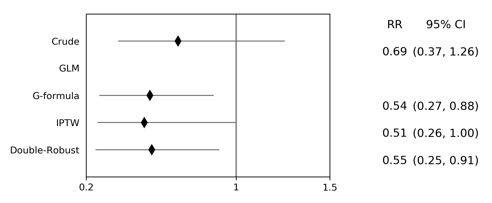

.. image:: images/zepid_logo.png

-------------------------------------

Causal
'''''''''''''''''''''''''''''''''
*zEpid* includes several different causal method implementions. This section is sub-divided into two sections; time-fixed exposures and time-varying exposures. 

Time-Fixed Exposures
==============================================

G-Computation Algorithm
----------------------------------------
The g-computation algorithm, also referred to as g-formula, is a method to obtain marginal estimates of various treatment comparisons (Robins 1986). For some introductions to the utility and usage of the g-formula, I recommend reading:

`Snowden JM et al. 2011 <https://www.ncbi.nlm.nih.gov/pmc/articles/PMC3105284/>`_

`Keil AP et al. 2014 <https://www.ncbi.nlm.nih.gov/pubmed/25140837>`_

`Westreich D et al. 2012 <https://www.ncbi.nlm.nih.gov/pmc/articles/PMC3641816/>`_

Currently, all implementations of the g-formula in *zEpid* are parametric implementations that use ``statsmodels`` logistic regression for binary outcomes and ``statsmodels`` linear regression for continuous outcomes. 

To implement the g-formula in the time fixed setting, the ``TimeFixedGFormula`` class is imported from ``zepid.causal.gformula``. The class is initialized with the dataset of interest, the exposure, the outcome, and the variable type of the outcome. Currently, only binary or continuous outcomes are implemented. Once initialized, the parametric outcome model is specified. After we specify the outcome model, we can obtain our marginal estimates for the outcome. I recommend reviewing Snowden et al 2011 for an introduction and further information.

Binary Outcomes
~~~~~~~~~~~~~~~~~~~
By default, ``TimeFixedGFormula`` implements a binary outcome model (i.e. logistic regression). The following is an example to obtain estimates of the g-formula for a binary outcome (death) in regards to a binary exposure (antiretroviral therapy). First, we will initialize the time-fixed g-formula class

.. code:: python

  import zepid as ze
  from zepid.causal.gformula import TimeFixedGFormula
  #Preparing dataframe
  df = ze.load_sample_data(timevary=False)
  df[['cd4_rs1','cd4_rs2']] = ze.spline(df,'cd40',n_knots=3,term=2,restricted=True)
  df[['age_rs1','age_rs2']] = ze.spline(df,'age0',n_knots=3,term=2,restricted=True)
  #Initializing the g-formula
  g = TimeFixedGFormula(df,exposure='art',outcome='dead')

Now that our class is specified, we can fit a model to predict the outcome. This is referred to as the Q-model. For user ease, ``TimeFixedGFormula`` refers to this as ``outcome_model()`` instead. We can fit the following outcome model

.. code:: python

  g.outcome_model(model='art + male + age0 + age_rs1 + age_rs2 + cd40 + cd4_rs1 + cd4_rs2 + dvl0')

When the Q-model is fit, the corresponding logistic regression output is provided. 

After our outcome model is specified, we can now obtain estimates of the treatment. There are three available options; ``all``, ``none``, or a custom assignment. We will discuss all and none first. ``all`` and ``none`` estimate the observed effect with the exposures, effect if everyone was exposed, and effect if everyone was unexposed, respectively. This is done by setting all observations to the specified exposure pattern and predicting the outcomes based on the Q-model. We can implement the ``all`` and ``none`` comparison for the intent-to-treat effect of ART on death via the following code

.. code:: python

  g.fit(treatment='all')
  r_all = g.marginal_outcome
  g.fit(treatment='none')
  r_none = g.marginal_outcome
  print('RD = ',r_all - r_none)
  print('RR = ',r_all / r_none)

After the g-formula is fit, it gains an attribute ``marginal_outcome`` which is the expected value of Y in that population with the set exposure pattern. 

.. code::

  RD =  -0.076607
  RR =  0.577448

One of the great utilities of the g-formula is being able to set custom exposure patterns / interventions. To implement our own custom exposure, we will call the treatment function with our specified treatment pattern. In this example, we will compare the situation where we treat all the females younger than 40 at baseline in our sample to the alternative if no one was treated. 

To set our exposure pattern we create a string object following the format construction of inside the ``pandas`` ``loc`` function. For our example we will create the following string object that corresponds to females younger than 40 all being treated.

.. code:: python

  "((g['male']==0) & (g['age0']<=40))"

This should look familiar to some of the data cleaning operations. Remember that ``|`` signifies ``or`` and ``&`` signifies ``and`` in ``numpy``. **It is vitally important that the referred to dataframe within the treatment options is referred to as** ``g``. If it is not, there will be an error generated by ``numpy`` or ``pandas``. Inside ``TimeFixedGFormula``, the predicted dataframe is referred to as ``g`` so it must be referred to as ``g`` in the custom treatment model.

We will fit the g-formula to our exposure strategy by 

.. code:: python

  g.fit(treatment="((g['male']==0) & (g['age0']<=40))")
  r_custom = g.marginal_outcome

Now we can make our comparison between our custom treatment compared to the counterfactual of no one being treated

.. code:: python

  print('RD = ',r_custom - r_none)
  print('RR = ',r_custom / r_none)

Continuous Outcomes
~~~~~~~~~~~~~~~~~~~~~~~
For continuous outcome variables, the following code would be used

.. code:: python

  g = TimeFixedGFormula(df,exposure='exposure',outcome='continuous',outcome_type='continuous')

Instead of logistic regression, the outcomes are predicted via linear regression. The remaining syntax is the same between binary outcomes and continuous outcomes

Generating Confidence Intervals
~~~~~~~~~~~~~~~~~~~~~~~~~~~~~~~~~~~~~
To get confidence intervals for our estimate, we need to use a bootstrap. Currently, the bootstrapped confidence intervals need to be user generated. Below is example code to obtain non-parametric bootstrapped 95% confidence intervals. 

.. code:: python

  rd_results = []
  rr_results = []
  for i in range(500):
      dfs = df.sample(n=df.shape[0],replace=True)
      g = TimeFixedGFormula(dfs,exposure='art',outcome='dead')
      g.outcome_model(model='art + male + age0 + age_rs1 + age_rs2 + cd40 + cd4_rs1 + cd4_rs2 + dvl0',print_model_results=False)
      g.fit(treatment='all')
      r_all = g.marginal_outcome
      g.fit(treatment='none')
      r_none = g.marginal_outcome
      rd_results.append(r_all - r_none)
      rr_results.append(r_all / r_none)

  print('RD 95% CI:',np.percentile(rd_results,q=[2.5,97.5]))
  print('RR 95% CI:',np.percentile(rr_results,q=[2.5,97.5]))

**NOTE** You will definitely want to use the ``print_model_results=False`` option in the ``outcome_model()``, otherwise 500 logistic regression results will be printed to your terminal. It is likely this will take at least several seconds to run, if not longer. Remember that it is fitting 500 logistic regression models to 500 bootstrapped sample to generate the confidence intervals.

Multivariate Exposures
~~~~~~~~~~~~~~~~~~~~~~~~~~~
Multivariate exposures are also available. To create a multivariate exposure, first a disjoint indicator variable must be generated. Our sample dataframe does not contain a multivariate exposure. Instead we will create one by creating a two new variables based on ART and reported gender.

.. code:: python

  df['art_male'] = df['art'] * df['male']
  df['art_female'] = df['art'] * ~df['male']+2

Now we can initialize the g-formula. For multivariate exposures, we will instead pass a list of the disjoint indicator terms for our exposure. In our context this corresponds to ``art_male`` and ``art_female``

.. code:: python

  g = TimeFixedGFormula(df,exposure=['art_male','art_female'],outcome='dead')
  g.outcome_model(model='art_male + art_female + age0 + age_rs1 + age_rs2 + cd40 + cd4_rs1 + cd4_rs2 + dvl0')

For multivariate exposures, a custom exposure pattern must be specified. Either ``all`` or ``none`` will generate an error. Since we will not be envisioning an intervention that changes individual's genders, we will put this into our custom exposure model. For males, anyone under 35 would be treated and for females anyone under 45 would be treated with ART. This is done via the following code

.. code:: python

  exposure_patterns = ["((g['male']==1) & (g['age0']<=35))",
                       "((g['male']==0) & (g['age0']<=45))"]
  g.fit(treatment=exposure_patterns)

The order of the input custom exposure patterns should be the same order as the inputs of the exposures when initializing ``TimeFixedGFormula``

For continuous outcomes and generation of confidence intervals, a similar process to the one described previously is used

Inverse Probability of Treatment Weights
--------------------------------------------
Inverse Probability of Treatment Weights (IPTW) are used to adjust for confounder imbalances between exposed and unexposed groups. SMR weights are also contained with this function. They can be accessed via the ``standardize`` option. IPTW adjusts for confounders by generating the propensity score (predicted probability of exposure) for each individual and then uses the inverse to weight observations. *zEpid* does this by fitting a parametric logistic regression model through ``statsmodels``

We will specify the regression model to predict our treatment, ``art``. With our adjustment set, we will now fit a logistic regression model to predict ``art`` and generate the weights

.. code:: python 

   model = 'male + age0 + age_rs1 + age_rs2 + cd40 + cd4_rs1 + cd4_rs2 + dvl0'
   df['iptw'] = ze.ipw.iptw(df,treatment='art',model_denominator=model,stabilized=True)

With the generated weights, we can fit a GEE with robust variance to obtain an estimate a valid (albeit slightly conservative) confidence interval. We will do this through ``statsmodels``

.. code:: python

   import statsmodels.api as sm 
   import statsmodels.formula.api as smf 
   from statsmodels.genmod.families import family,links
   
   ind = sm.cov_struct.Independence()
   f = sm.families.family.Binomial(sm.families.links.identity) 
   linrisk = smf.gee('dead ~ art',df['id'],df,cov_struct=ind,family=f,weights=df['iptw']).fit()
   print(linrisk.summary())

We obtain the following results

.. code::

                                 GEE Regression Results                              
  ===================================================================================
  Dep. Variable:                        dead   No. Observations:                  547
  Model:                                 GEE   No. clusters:                      547
  Method:                        Generalized   Min. cluster size:                   1
                        Estimating Equations   Max. cluster size:                   1
  Family:                           Binomial   Mean cluster size:                 1.0
  Dependence structure:         Independence   Num. iterations:                     2
  Date:                     Mon, 16 Jul 2018   Scale:                           1.000
  Covariance type:                    robust   Time:                         17:15:36
  ==============================================================================
                   coef    std err          z      P>|z|      [0.025      0.975]
  ------------------------------------------------------------------------------
  Intercept      0.1813      0.018     10.003      0.000       0.146       0.217
  art           -0.0840      0.037     -2.270      0.023      -0.157      -0.011
  ==============================================================================
  Skew:                          1.7569   Kurtosis:                       1.1271
  Centered skew:                 0.0000   Centered kurtosis:             -3.0000
  ==============================================================================

From our IPTW analysis the risk difference is -0.084 (95% CI: -0.157, -0.011). Note that ``statsmodels`` will generate a ``DomainWarning`` for log-binomial or identity-binomial models.

In this example, IPTW are stabilized weights and weighted to reflect the entire population (comparing everyone exposed vs. everyone unexposed). Stabilized weights are the default. Unstabilized weights can be requested by ``stabilized==False``. There are two other weighting schemes currently implemented. First is comparing the exposed group to if they were unexposed (specified by ``standardize='exposed'``). Second is comparing the unexposed group to if they were exposed (specified by ``standardize='unexposed'``). These are equivalent to the SMR weighting described by Sato and Matsuyama (2003) https://www.ncbi.nlm.nih.gov/pubmed/14569183 

Diagnostics
~~~~~~~~~~~~~~~~~~~~
There are several diagnostics implemented for IPTW that include both the probabilities (propensity scores) and the weights themselves. First, we will look at the diagnostics for our predicted probabilities. To initiate the treatment probability diagnostics, we estimate the probability of treatment and pass that information into the ``iptw_probability_diagnostic`` class

.. code:: python

   df['ptreat'] = ze.ipw.iptw(df,treatment='art',model_denominator=model,return_probability=True)
   dp = ze.ipw.iptw_probability_diagnostic(df,probability='ptreat')

There are two graphical assessments to look at the predicted probabilities by our binary exposure groups; ``p_boxplot`` and `p_kde``. ``p_boxplot`` generates a boxplot stratified by the exposure of interest

.. code:: python

   import matplotlib.pyplot as plt 
   dp.p_boxplot(treatment='art')
   plt.show()

.. image:: images/zepid_iptwbox.png

For the boxplot, the predicted probabilities should overlap largely between the two groups. A similar idea is behind the kernel density plots. It uses ``scipy`` Gaussian kernel to generate a smoothed curve of the probability density stratified by treatment. The density plot is implemented in a similar way

.. code:: python

  dp.p_kde(treatment='art')
  plt.xlim([0,1])
  plt.ylim([0,9])
  plt.show()

.. image:: images/zepid_iptdensity.png

As for IPTW diagnostics, they are implemented through the ``iptw_weight_diagnostic`` class. The class is initiated as follows

.. code:: python

   model = 'male + age0 + cd40 + cd40sq + cd40cu + dvl0'
   df['wtreat'] = ze.ipw.iptw(df,treatment='art',model_denominator=model,stabilized=True)
   dw = ze.ipw.iptw_weight_diagnostic(df,weight='wtreat')

This class has two diagnostics implemented ``positivity`` and ``standardized_diff``. As the name implies, ``positivity`` is helpful for checking for positivity violations. This is done by looking at the mean, min, and max weights

.. code:: python

   dw.positivity()

``standardized_diff`` calculates the standardized mean difference between the specified confounder

.. code:: python

  dw.standardized_diff(treatment='art',var='age0',var_type='continuous')
  dw.standardized_diff(treatment='art',var='male',var_type='binary')

For further discussion on IPTW diagnostics, I direct you to `Austin PC and Stuart EA <https://doi.org/10.1002/sim.6607>`_

Doubly Robust Estimator
----------------------------
Simply put, a doubly robust estimator combines estimates from two statistical models (one for the exposure and one for the outcome) together. This has a nice property for investigators. As long as one of the specified statistical models (either the exposure or the outcome) is correct in a causal identifiable way, then the doubly robust estimate will be consistent. Essentially, you get two "tries" at the correct model form rather than just one. The doubly robust estimators do not avoid the common causal identification assumptions, and still require the use of causal graphs.

For further discussion on doubly robust estimators, see 

`Robins J et al 2007 <https://arxiv.org/abs/0804.2965>`_

`Glynn AN and Quinn KM 2009 <https://www.cambridge.org/core/journals/political-analysis/article/div-classtitlean-introduction-to-the-augmented-inverse-propensity-weighted-estimatordiv/4B1B8301E46F4432C4DCC91FE20780DB>`_

`Funk MJ et al. 2011 <https://www.ncbi.nlm.nih.gov/pubmed/21385832>`_

`Keil AP et al 2018 <https://www.ncbi.nlm.nih.gov/pubmed/29394330>`_

The doubly robust estimator described by `Funk MJ et al. 2011 <https://www.ncbi.nlm.nih.gov/pubmed/21385832>`_ is implemented in *zEpid* through the ``SimpleDoubleRobust`` class. This is referred to as simple, since it does *not* handle missing data or other complex issues. Additionally, it only handles a binary exposure and binary outcome.

To obtain the double robust estimate, we first do all our background data preparation, then initialize the ``SimpleDoubleRobust`` with the pandas dataframe, exposure column name, and outcome column name.

.. code:: python

  import zepid as ze
  from zepid.causal.doublyrobust import SimpleDoubleRobust
  df = ze.load_sample_data(timevary=False)
  df[['cd4_rs1','cd4_rs2']] = ze.spline(df,'cd40',n_knots=3,term=2,restricted=True)
  df[['age_rs1','age_rs2']] = ze.spline(df,'age0',n_knots=3,term=2,restricted=True)

  sdr = SimpleDoubleRobust(df,exposure='art',outcome='dead')

After initialized, we need to fit an exposure model and an outcome model, as such

.. code:: python

  sdr.exposure_model('male + age0 + age_rs1 + age_rs2 + cd40 + cd4_rs1 + cd4_rs2 + dvl0')
  sdr.outcome_model('art + male + age0 + age_rs1 + age_rs2 + cd40 + cd4_rs1 + cd4_rs2 + dvl0')

If at least one of these models is not fit, the ``fit()`` option will generate an error saying that both models must be fit before the double-robust estimates can be produced.

After both an exposure and outcome model are fit, we can estimate the double robust model via the ``fit()`` option

.. code:: python

  sdr.fit()

After the ``fit()`` is run, the ``SimpleDoubleRobust`` class gains the following attributes; ``riskdiff`` corresponding to the risk difference, ``riskratio`` corresponding to the risk ratio, and the function ``summary()`` which prints both estimates. Running ``sdr.summary()`` gives us the following results

.. code:: python

  ----------------------------------------------------------------------
  Risk Difference:  -0.0706
  Risk Ratio:  0.5727
  ----------------------------------------------------------------------

Confidence Intervals
~~~~~~~~~~~~~~~~~~~~~~~~~~~~~~
As recommended, confidence intervals should be obtained from a non-parametric bootstrap. As will other methods, it is important to specify ``print_model_results=False`` in the model statements. Otherwise, each fit model of the bootstrap will be printed to the terminal. The bootstrap can be implemented by the following the general structure of the below code

.. code:: python

  rd = []
  rr = []
  for i in range(500):
      dfs = df.sample(n=df.shape[0],replace=True)
      s = SimpleDoubleRobust(dfs,exposure='art',outcome='dead')
      s.exposure_model('male + age0 + age_rs1 + age_rs2 + cd40 + cd4_rs1 + cd4_rs2 + dvl0',print_model_results=False)
      s.outcome_model('art + male + age0 + age_rs1 + age_rs2 + cd40 + cd4_rs1 + cd4_rs2 + dvl0',print_model_result=False)
      s.fit()
      rd.append(s.riskdiff)
      rr.append(s.riskratio)

  print('RD 95% CI: ',np.percentile(rd,q=[2.5,97.5]))
  print('RR 95% CI: ',np.percentile(rr,q=[2.5,97.5]))

Again, this code may take a little while to run since 1000 regression models are fit (500 exposure models, 500 outcome models).

Comparison between methods
----------------------------------------
For fun, we can demonstrate a comparison between the different methods implemented in ``zepid.causal``. We will display these results using the ``zepid.graphics.effectmeasure_plot()`` for both Risk Difference and Risk Ratio

.. code:: python

  labs = ['Crude','GLM','G-formula','IPTW','Double-Robust']
  measure = [-0.049,np.nan,-0.077,-0.084,-0.071]
  lower = ['-0.130',np.nan,-0.139,-0.157,-0.129]
  upper = [0.033,np.nan,-0.012,-0.011,-0.008]
  p = ze.graphics.effectmeasure_plot(label=labs,effect_measure=measure,lcl=lower,ucl=upper)
  p.labels(center=0,effectmeasure='RD')
  p.plot(figsize=(8.25,4),t_adjuster=0.09,max_value=0.1,min_value=-0.2)
  plt.tight_layout()
  plt.show()

  labs = ['Crude','GLM','G-formula','IPTW','Double-Robust']
  measure = [0.72,np.nan,0.58,0.54,0.57]
  lower = [0.39,np.nan,0.28,0.27,0.24]
  upper = [1.33,np.nan,0.93,1.06,0.95]
  p = ze.graphics.effectmeasure_plot(label=labs,effect_measure=measure,lcl=lower,ucl=upper)
  p.labels(center=1,effectmeasure='RR')
  p.plot(figsize=(7.25,3),t_adjuster=0.015,max_value=1.5,min_value=0.2)
  plt.tight_layout()
  plt.show()

.. image:: images/zepid_effrd.png

Our results are consistent between the methods with similar point estimates and largely overlapping confidence intervals. Note that the conditional regression model results (GLM) are not included in the plot. This is because the conditional regression models did not converge. This demonstrates an additional utility of these methods over standard conditional regression model

Time-Varying Exposures
==============================================

G-computation Algorithm
---------------------------
The time-varying g-formula will hopefully coming soon... There are several complex issues I am trying to resolve to allow the user to have extensive flexibility (the main advantage of the g-formula)

Inverse Probability of Treatment Weights
------------------------------------------
Crafting time-varying IPTW to fit a marginal structural model requires more thought on the contrast of interest and some underlying assumptions. We will fit a marginal structural model in the following example. For this, we will use the survival analysis package ``lifelines`` to estimate time-varying risk through Kaplan Meier.

Before we can fit the IPTW model to estimate weights, we need to do some data preparation. We will load the time-varying version of the data set.

.. code:: python

  import zepid as ze
  df = ze.load_sample_data(timevary=True)

Next, we will create lagged versions for ART and some polynomial terms for fitting our model.

.. code:: python

  #Generating lagged variables
  df['lagart'] = df.groupby('id')['art'].shift(1)
  df['lagart'] = np.where(df.groupby('id').cumcount() == 0,0,df['lagart'])
  #Generating polynomial (quadratic) terms
  df['cd40_q'] = df['cd40']**2
  df['cd40_c'] = df['cd40']**3
  df['cd4_q'] = df['cd4']**2
  df['cd4_c'] = df['cd4']**3
  df['enter_q'] = df['enter']**2
  df['enter_c'] = df['enter']**3
  df['age0_q'] = df['age0']**2
  df['age0_c'] = df['age0']**3

Now that our data is prepared, we can calculate the weights. Note, in our model we assume that once an individual is treated with ART, they are given ART until their death. Essentially, once someone is exposed, our marginal structural model assumes that they will always be exposed. This follows the pattern of the data, since all patients who received ART were always treated at follow-up visits. Since we will need to do further manipulation of the predicted probabilities, we will have ``zepid.ipw.iptw`` return the predicted probabilities of the denominator and numerator, respectively. We do this through the following code

.. code:: python

  modeln = 'enter + enter_q + enter_c' #Model numerator 
  modeld = '''enter + enter_q + enter_c + male + age0 + age0_q + age0_c + dvl0 + cd40 + 
          cd40_q + cd40_c + dvl + cd4 + cd4_q + cd4_c''' #Model denominator
  dfs = df.loc[df['lagart']==0].copy() #subsetting out only where patient was not treated with ART at previous visit
  df[['p_denom','p_numer']] = ze.ipw.iptw(dfs,treatment='art',model_denominator=modeld,
                                          model_numerator=modeln,return_probability=True)
  df['lagp_denom'] = df.groupby('id')['p_denom'].shift(1)
  df['lagp_numer'] = df.groupby('id')['p_numer'].shift(1)

Now that we have predicted probabilities, we can calculate our numerator and denominator based on the following conditionals

.. code:: python

  cond1 = (df.groupby('id').cumcount() == 0)
  cond2 = ((df['lagart']==0) & (df['art']==0) & (df.groupby('id').cumcount() != 0))
  cond3 = ((df['lagart']==0) & (df['art']==1) & (df.groupby('id').cumcount() != 0))

  #Condition 1: First record weight is 1
  df['ip_denom'] = 1 - df['p_denom'] #Getting probability minus 1
  df['ip_numer'] = 1 - df['p_numer']
  df['p_denom'] = np.where(cond1,1,df['p_denom']) #Setting first visit to Pr(.) = 1
  df['p_numer'] = np.where(cond1,1,df['p_numer'])
  df['ip_denom'] = np.where(cond1,1,df['ip_denom']) 
  df['ip_numer'] = np.where(cond1,1,df['ip_numer'])
  df['den'] = np.where(cond1,df['p_denom'],np.nan) #First visit is 1
  df['num'] = np.where(cond1,df['p_numer'],np.nan)
  #Condition 2: Records before ART initiation
  df['num'] = np.where(cond2,(df.groupby('id')['ip_numer'].cumprod()),df['num'])
  df['den'] = np.where(cond2,(df.groupby('id')['ip_denom'].cumprod()),df['den'])
  #Condition 3: Records at ART initiation
  df['num'] = np.where(cond3,df['num'].shift(1)*(df['p_numer']),df['num'])
  df['den'] = np.where(cond3,df['den'].shift(1)*(df['p_denom']),df['den'])
  #Condition 4: Records after ART initiation
  df['num'] = df['num'].ffill()
  df['den'] = df['den'].ffill()
  #Calculating weights
  df['w'] = df['num'] / df['den']
  print(df.w.describe())

Using ``lifelines`` we can estimate the risk functions via a weighted Kaplan Meier. Note that ``lifelines`` version will need to be ``0.14.5`` or greater. The following code will generate our risk function plot

.. code:: python 

  from lifelines import KaplanMeierFitter
  import matplotlib.pyplot as plt 

  kme = KaplanMeierFitter()
  kmu = KaplanMeierFitter()
  dfe = df.loc[df['art']==1].copy()
  dfu = df.loc[df['art']==0].copy()
  kme.fit(dfe['out'],event_observed=dfe['dead'],entry=dfe['enter'],weights=dfe['w'])
  kmu.fit(dfu['out'],event_observed=dfu['dead'],entry=dfu['enter'],weights=dfu['w'])

  plt.step(kme.event_table.index,1 - kme.survival_function_,c='b',label='ART')
  plt.step(kmu.event_table.index,1 - kmu.survival_function_,c='r',label='no ART')
  plt.title('Stratified risk function')
  plt.xlabel('Time')
  plt.ylabel('Probability of Death')
  plt.legend()
  plt.show()

.. image:: images/zepid_msm1.png

You can also create a dynamic risk plot, like the following. See the graphics page for details

.. image:: images/zepid_msm_rd.png

Other Inverse Probability Weights
===============================================
There are multiple other types of inverse probability weights. Other ones currently implemented include; inverse probability of censoring weights, and inverse probability of missing weights.

Inverse Probability Censoring Weights
--------------------------------------
Continuing with the previous example and weights, we will not calculate the inverse probability of censoring weights (IPCW) to relax the assumption that censored individuals are missing completely at random. While the included data set has an indicator for those who were censored, we will instead use the IPCW preparation function. This function formats the data properly for the ``ipcw()`` function. To implement it, we do the following:

.. code:: python

  df['uncensored'] = np.where(df['drop']==1,0,1)

Now with the prepared data, we can estimate the IPCW using ``zepid.ipw.ipcw()``, implemented as follows

.. code:: python

  cmodeln = 'enter + enter_q + enter_c'
  cmodeld = '''enter + enter_q + enter_c + male + age0 + age0_q + age0_c + dvl0 + cd40 + 
          cd40_q + cd40_c + dvl + cd4 + cd4_q + cd4_c'''
  df['cw'] = ze.ipw.ipcw(df,'uncensored',idvar='id',model_denominator=cmodeld,model_numerator=cmodeln)

Now that we have IPCW and IPTW, we can multiply the two to obtain our full weights and repeat the above ``lifelines`` code to estimate a marginal structural model fit with IPTW and assuming that censored individuals at missing at random (censored conditional on time period, age, gender, baseline diagnosed viral load, diagnosed viral load, baseline CD4 count, CD4 count only)

.. code:: python

  df['fw'] = df['w']*df['cw']

  kme = KaplanMeierFitter()
  kmu = KaplanMeierFitter()
  dfe = df.loc[df['art']==1].copy()
  dfu = df.loc[df['art']==0].copy()
  kme.fit(dfe['out'],event_observed=dfe['dead'],entry=dfe['enter'],weights=dfe['fw'])
  kmu.fit(dfu['out'],event_observed=dfu['dead'],entry=dfu['enter'],weights=dfu['fw'])

  plt.step(kme.event_table.index,1 - kme.survival_function_,c='b',label='ART')
  plt.step(kmu.event_table.index,1 - kmu.survival_function_,c='r',label='no ART')
  plt.title('Marginal Structural Model for ART on Death')
  plt.xlabel('Time')
  plt.ylabel('Probability of Death')
  plt.legend()
  plt.ylim([0,0.35])
  plt.show()

.. image:: images/zepid_msm2.png

In this example, the IPCW do not make a big difference in our results. 

If you have a data set that is not sub-divided into time periods (like ``ze.load_sample_data(timevary=False)``), you can easily generate a data set formatted for ``ipcw()``. To do this, call the function ``zepid.ipw.ipcw_prep(df,idvar,time,event)`` specifying the pandas dataframe, column name indicating the participant's ID, column name indicating the total time observed, and column name indicating the event indicator column, respectively. 
Note, this function breaks the observation period into ``1`` unit blocks. It may be necessary to multiple/divide the time by some constant to ensure blocks are an adequate size. For example, a data set where the naive time is ``0`` to ``1`` may need to be multiplied by ``10`` to ensure enough blocks of censored/uncensored are available for the model to fit to.

Inverse Probability of Missing Weights
----------------------------------------------
Guide is coming soon