.. image:: images/zepid_logo_small.png

-------------------------------------

Graphics
''''''''

This page demonstrates some of the different graphics possible to generate with *zEpid*. These plots are all generated
using `matplotlib`. The functions themselves return `matplotlib.axes` objects, so users can further edit and customize
their plots. Let's look at some of the plots

Functional Form Assessment
==========================
*zEpid* makes graphical (qualitative) and statistical (quantitative) functional form assessment easy to implement.
Functional form assessments are available for either discrete or continuous variables. The distinction only matters for
the calculation of the LOESS curve generated in the plots.

Plots and regression model results come from generalized linear models fit with `statsmodels`.

Let's look at some examples. We will look at baseline age (discrete variable). We will compare linear, quadratic, and
splines for the functional form. First, we set up the data

.. code:: python

   import zepid as ze
   from zepid.graphics import functional_form_plot

   df = ze.load_sample_data(timevary=False)
   df['age0_sq'] = df['age0']**2
   df[['rqs0', 'rqs1']] = ze.spline(df, var='age0', term=2, n_knots=3, knots=[30, 40, 55], restricted=True)

Linear 
^^^^^^
Now that our variables are all prepared, we will look at a basic linear term for ``age0``. 

.. code:: python

   functional_form_plot(df, outcome='dead', var='age0', discrete=True)
   plt.show()

In the console, the following results will be printed

.. code::

   Warning: missing observations of model variables are dropped
   0  observations were dropped from the functional form assessment
                    Generalized Linear Model Regression Results                  
   ==============================================================================
   Dep. Variable:                   dead   No. Observations:                  547
   Model:                            GLM   Df Residuals:                      545
   Model Family:                Binomial   Df Model:                            1
   Link Function:                  logit   Scale:                          1.0000
   Method:                          IRLS   Log-Likelihood:                -239.25
   Date:                Tue, 26 Jun 2018   Deviance:                       478.51
   Time:                        08:25:47   Pearson chi2:                     553.
   No. Iterations:                     5   Covariance Type:             nonrobust
   ==============================================================================
                    coef    std err          z      P>|z|      [0.025      0.975]
   ------------------------------------------------------------------------------
   Intercept     -3.6271      0.537     -6.760      0.000      -4.679      -2.575
   age0           0.0507      0.013      4.012      0.000       0.026       0.075
   ==============================================================================
   AIC:  482.50783872152573
   BIC:  -2957.4167585984537

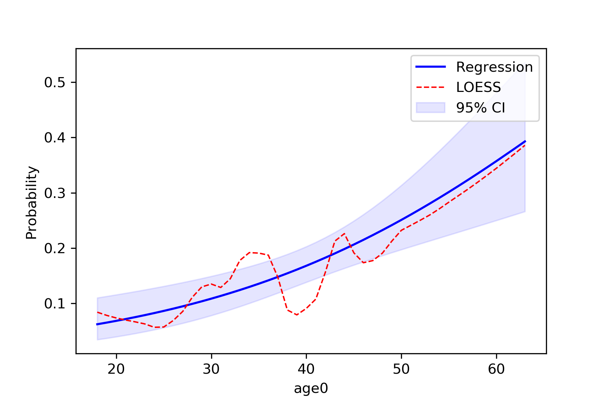

In the image, the blue line corresponds to the regression line and the shaded blue region is the 95% confidence
intervals. The red-dashed line is the ``statsmodels`` generated LOESS curve. We can also have the data points that the
LOESS curve is fit to plot as well

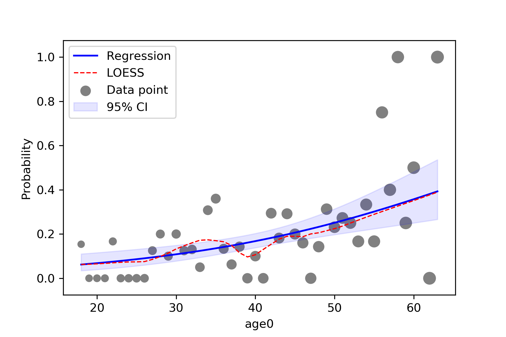

Quadratic
^^^^^^^^^^^
To implement other functional forms besides linear terms, the optional ``f_form`` argument must be supplied. Note that
any terms specified in the ``f_form`` argument must be part of the data set. We can assess a quadratic functional form
like the following

.. code:: python

   functional_form_plot(df, outcome='dead', var='age0', f_form='age0 + age0_sq', discrete=True)
   plt.show()

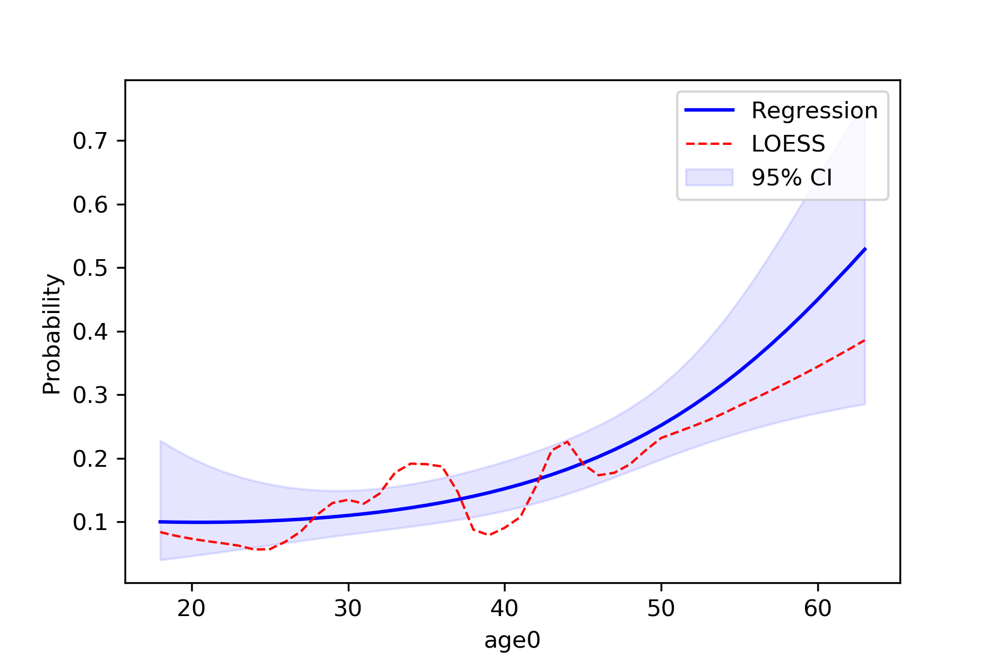

The ``f_form`` argument is used to specify any functional form variables that are coded by the user

Spline
^^^^^^^^^^^
We will now compare using restricted quadratic splines for the functional form of age. To show how users can further
edit the plot, we will add dashed lines to designate where the spline knots are located

.. code::

   functional_form_plot(df, outcome='dead', var='age0', f_form='age0 + rqs0 + rqs1', discrete=True)
   plt.vlines(30, 0, 0.85, colors='gray', linestyles='--')
   plt.vlines(40, 0, 0.85, colors='gray', linestyles='--')
   plt.vlines(55, 0, 0.85, colors='gray', linestyles='--')
   plt.show()

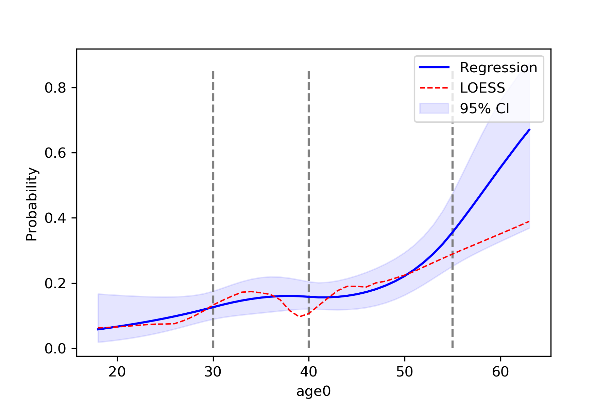

Continuous Variables
^^^^^^^^^^^^^^^^^^^^
For non-discrete variables (indicated by ``discrete=False``, the default), then data is binned into categories
automatically. The number of categories is determined via the maximum value minus the minimum divided by 5.

.. math::

    \frac{(max(X) - min(X))}{5}

To adjust the number of categories, the continuous variable can be multiplied by some constant. If more categories are
desired, then the continuous variable can be multiplied by some constant greater than 1. Conversely, if less categories
are desired, then the continuous variable can be multiplied by some constant between 0 and 1. In this example we will
look at ``cd40`` which corresponds to baseline viral load.

.. code:: python

   functional_form_plot(df, outcome='dead', var='cd40')
   plt.show()

If we use the current values, the number of categories is indicated in the console output as

.. code::

   A total of 99 categories were created. If you would like to influence the number of categories 
   the spline is fit to, do the following 
       Increase: multiply by a constant >1
       Decrease: multiply by a constant <1 and >0

We can see that ``statsmodels`` has an overflow issue in some exponential. We can decrease the number of categories
within ``cd40`` to see if that fixes this. We will decrease the number of categories by multiplying by ``0.25``.

.. code:: python

   df['cd4_red'] = df['cd40']*0.25
   functional_form_plot(df, outcome='dead', var='cd4_red')
   plt.show()

Now only ``24`` categories are created and it removes the overflow issue.

P-value Plot
============
As described and shown in *Epidemiology* 2nd Edition by K. Rothman, this function is meant to plot the p-value
distribution for a variable. From this distribution, p-values and confidence intervals can be visualized to compare or
contrast results. Note that this functionality only works for linear variables (i.e. Risk Difference and log(Risk
Ratio)). Returning to our results from the Measures section, we will look at plots of the Risk Difference.
For a risk difference of -0.049 (SE: 0.042), the plot is

.. code:: python

   from zepid.graphics import pvalue_plot

   pvalue_plot(point=-0.049, sd=0.042)
   plt.show()

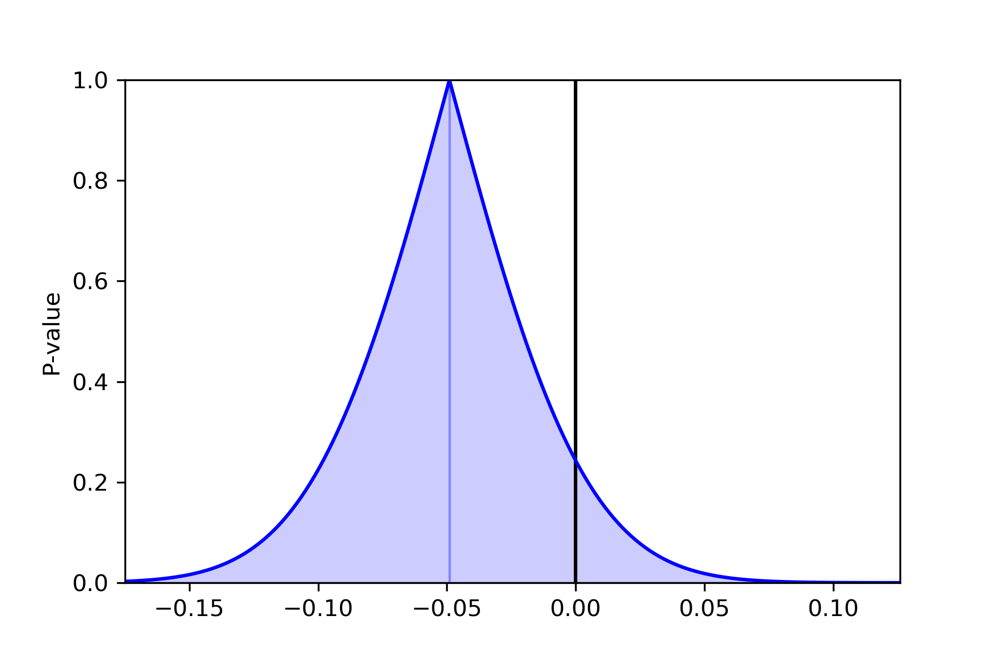

We can stack multiple p-value plots together. Imagine a systematic review was conducted prior to our study and resulted
in a summary risk difference of -0.062 (SE: 0.0231). We can use the p-value plots to visually display the results of
our data and the systematic review

.. code:: python

   from matplotlib.lines import Line2D

   pvalue_plot(point=-0.049, sd=0.042, color='b', fill=False)
   pvalue_plot(point=-0.062, sd=0.0231, color='r', fill=False)
   plt.legend([Line2D([0], [0], color='b', lw=2),
               Line2D([0], [0], color='r', lw=2)],
              ['Our Study', 'Review'])
   plt.show()

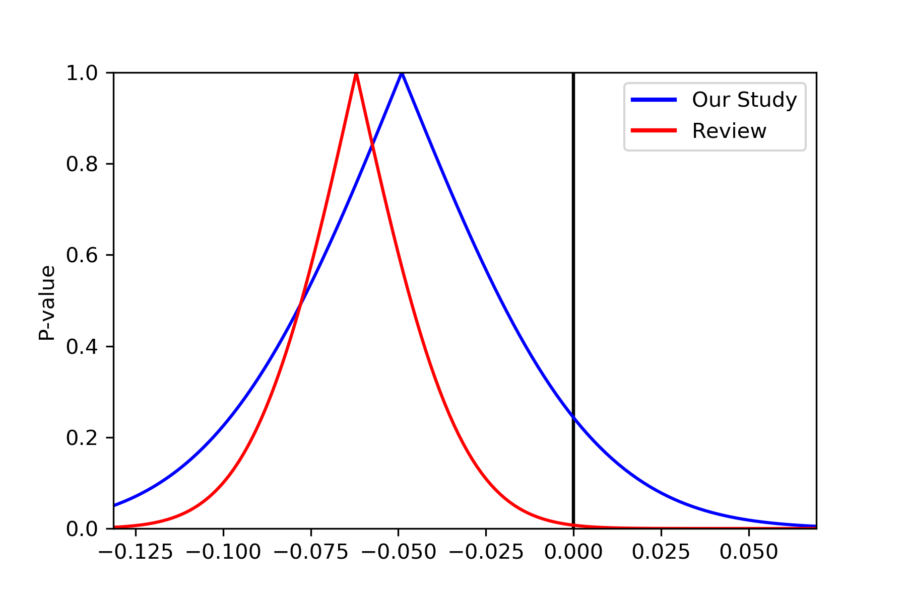

Spaghetti Plot
==============
Spaghetti plots are a fun (sometimes useful) way to look for outliers/patterns in longitudinal data. The following is
an example spaghetti plot using the longitudinal data from zepid and looking at CD4 T cell count over time.

.. code:: python

   df = ze.load_sample_data(timevary=True)
   ze.graphics.spaghetti_plot(df,idvar='id',variable='cd4',time='enter')
   plt.show()

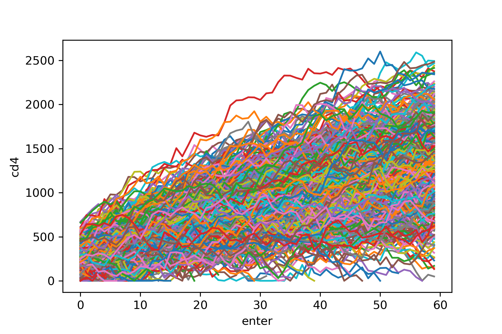

*NOTE* If your data set is particularly large, a spaghetti plot may take a long time to generate and may not be useful
as a visualization. They are generally easiest to observe with a smaller number of participants. However, they can be
useful for finding extreme outliers in large data sets.

Effect Measure Plots
====================
Effect measure plots are also referred to as forest plots. Forest plots generally summarize the of various studies and
collapse the studies into a single summary measure. Effect measure plots are similar but do not use the same summary
measure. For an example, I am going to replicate Figure 2 from my `2017 paper "Influenza vaccination status and
outcomes among influenza-associated hospitalizations in Columbus, Ohio
(2012-2015)" <https://www.ncbi.nlm.nih.gov/pubmed/29032772>`_ published in *Epidemiology and Infection*

The first step to creating the effect measure plot is to create lists containing; labels, point estimates, lower
confidence limits, and upper confidence limits

.. code:: python

   import numpy as np
   from zepid.graphics import EffectMeasurePlot

   labs = ['Overall', 'Adjusted', '',
           '2012-2013', 'Adjusted', '',
           '2013-2014', 'Adjusted', '',
           '2014-2015', 'Adjusted']
   measure = [np.nan, 0.94, np.nan, np.nan, 1.22, np.nan, np.nan, 0.59, np.nan, np.nan, 1.09]
   lower = [np.nan, 0.77, np.nan, np.nan, '0.80', np.nan, np.nan, '0.40', np.nan, np.nan, 0.83]
   upper = [np.nan, 1.15, np.nan, np.nan, 1.84, np.nan, np.nan, 0.85, np.nan, np.nan, 1.44]

Some general notes about the above code: (1) for blank y-axis labels, a blank string is indicated, (2) for blank
measure/confidence intervals, ``np.nan`` is specified, (3) for floats ending with a zero, they must be input as
characters. If floats that end in ``0`` (such as ``0.80``) are put into a list as a string and not a float, the
floating ``0`` will be truncated from the table. Now that our data is all prepared, we can now generate our plot

.. code:: python

   p = EffectMeasurePlot(label=labs, effect_measure=measure, lcl=lower, ucl=upper)
   p.labels(scale='log')
   p.plot(figsize=(6.5, 3), t_adjuster=0.02, max_value=2, min_value=0.38)
   plt.tight_layout()
   plt.show()

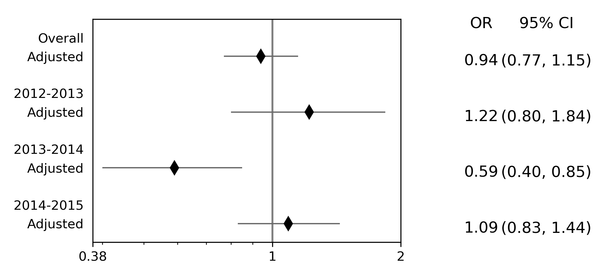

There are other optional arguments to adjust the plot (colors of points/point shape/etc.). Take a look through the
Reference page for available options

*NOTE* There is one part of the effect measure plot that is not particularly pretty. In the ``plot()`` function there
is an optional argument ``t_adjuster``. This argument changes the alignment of the table so that the table aligns
properly with the plot values. I have NOT figured out a way to do this automatically. Currently, ``t_adjuster`` must
be changed by the user manually to find a good table alignment. I recommend using changes of ``0.01`` in
``t_adjuster`` until a good alignment is found. Additionally, sometimes the plot will be squished. To fix this, the
plot size can be changes by the ``figsize`` argument

Receiver-Operator Curves
========================
Receiver-Operator Curves (ROC) are a fundamental tool for diagnosing the sensitivity and specificity of a test over a
variety of thresholds. ROC curves can be generated for predicted probabilities from a model or different diagnostics
thresholds (ex. ALT levels to predict infections). In this example, we will predict the probability of death among the
sample data set. First, we will need to get some predicted probabilities. We will use ``statsmodels`` to build a simple
predictive model and obtain predicted probabilities.

.. code:: python

   import matplotlib.pyplot as plt 
   import statsmodels.api as sm 
   import statsmodels.formula.api as smf 
   from statsmodels.genmod.families import family,links
   from zepid.graphics import roc

   df = ze.load_sample_data(timevary=False)
   f = sm.families.family.Binomial(sm.families.links.logit) 
   df['age0_sq'] = df['age0']**2
   df['cd40sq'] = df['cd40']**2
   model = 'dead ~ art + age0 + age0_sq + cd40 + cd40sq + dvl0 + male'
   m = smf.glm(model, df, family=f).fit()
   df['predicted'] = m.predict(df)

Now with predicted probabilities, we can generate a ROC plot

.. code:: python

   roc(df.dropna(), true='dead', threshold='predicted')
   plt.tight_layout()
   plt.title('Receiver-Operator Curve')
   plt.show()

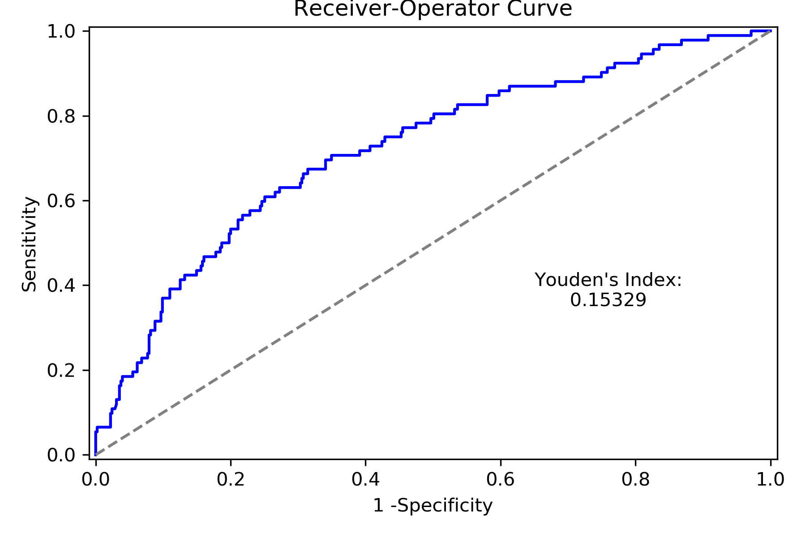

Which generates the following plot. For this plot the Youden's Index is also calculated by default. The following
output is printed to the console

.. code:: python

   ----------------------------------------------------------------------
   Youden's Index:  0.15328818469754796
   Predictive values at Youden's Index
      Sensitivity:  0.6739130434782609
	  Specificity:  0.6857142857142857
   ----------------------------------------------------------------------

Youden's index is the solution to the following

.. math:: 

  Sensitivity + Specificity - 1

where Youden's index is the value that maximizes the above. Basically, it maximizes both sensitivity and specificity.
You can learn more from `HERE <https://en.wikipedia.org/wiki/Youden%27s_J_statistic>`_

Dynamic Risk Plots
==================
Dynamic risk plots allow the visualization of how the risk difference/ratio changes over time. For a published example,
see `HERE <https://www.ncbi.nlm.nih.gov/pmc/articles/PMC4325676/>`_ and discussed further
`HERE <https://academic.oup.com/aje/article/181/4/246/122265>`_

For this example, we will borrow our results from our IPTW marginal structural model. We will used the fitted survival
functions to obtain the risk estimates for our exposed and unexposed groups. These were generated from the
``lifelines`` Kaplan Meier curves (estimated via ``KaplanMeierFitter``).

.. code:: python

  a = 1 - kme.survival_function_
  b = 1 - kmu.survival_function_
  dynamic_risk_plot(a, b)
  plt.show()

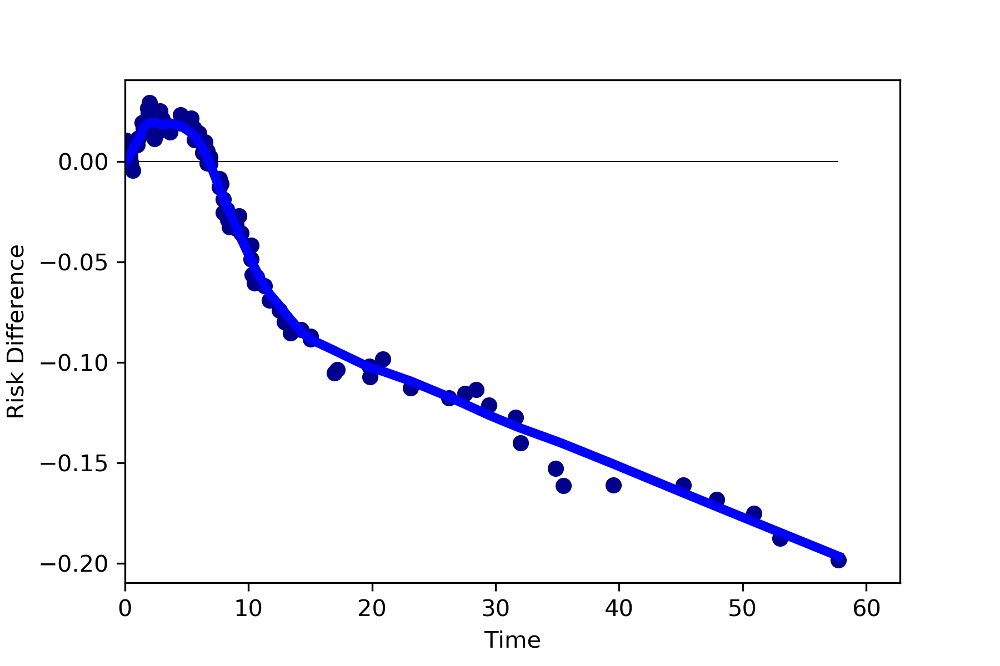

By default, the function returns the risk difference plot. You can also request a risk ratio plot (and with different
colors).

.. code:: python

  dynamic_risk_plot(a, b, measure='RR', point_color='darkred', line_color='r', scale='log')
  plt.yticks([0.4, 0.6, 0.8, 1, 2, 4, 6])
  plt.show()

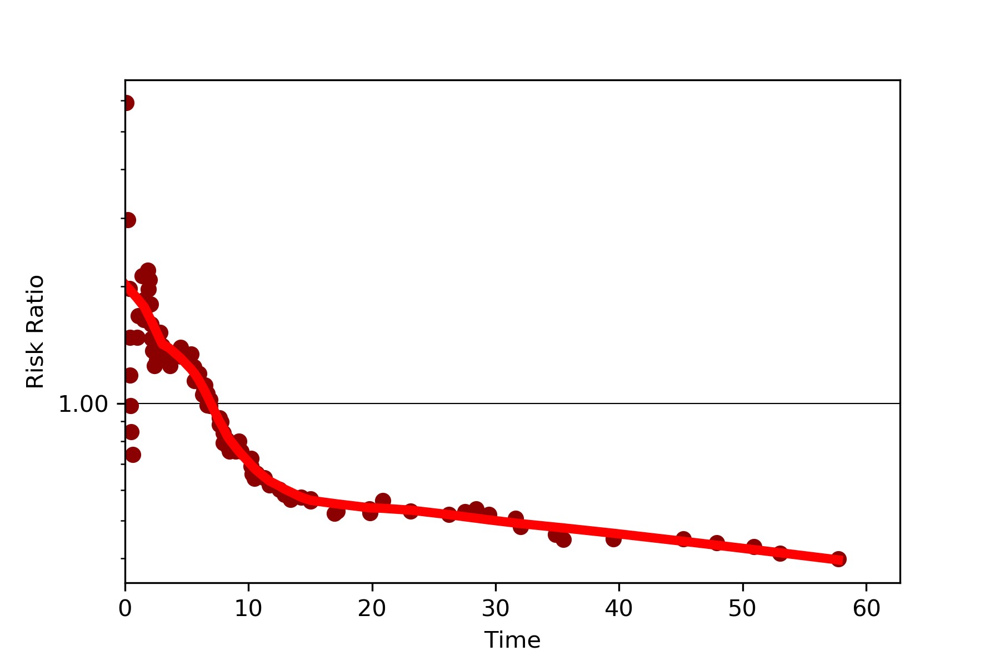

The log-transformed risk ratio is also available

.. code:: python
  
 dynamic_risk_plot(a, b, measure='RR', point_color='darkgreen', line_color='g', scale='log-transform')
 plt.show()

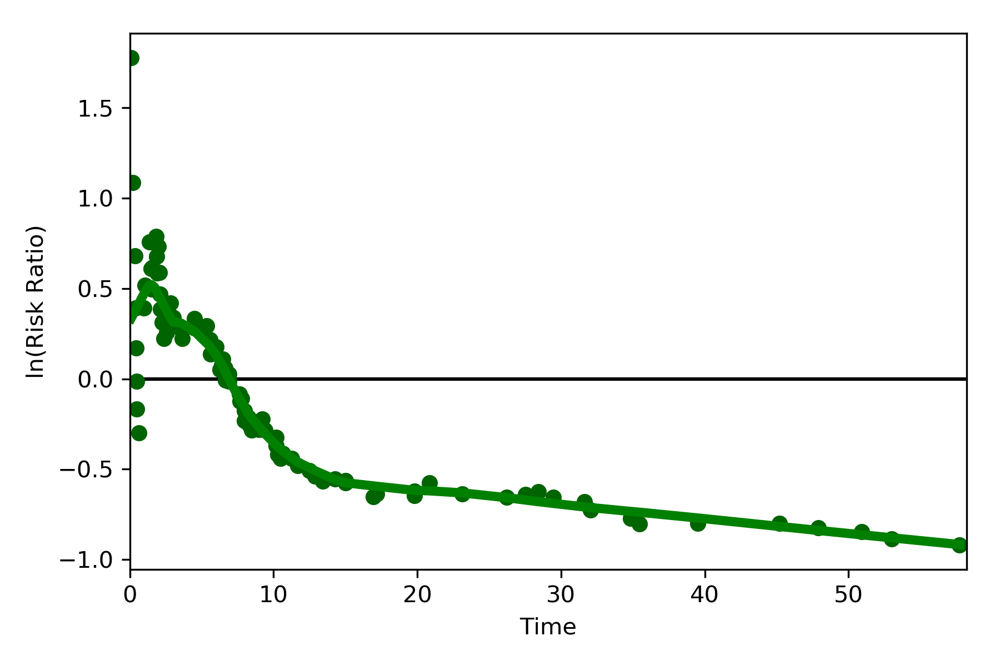

L'Abbe Plots
============
L'Abbe plots have generally been use to display meta-analysis results. However, I also find them to be a useful too to
explain effect/association measure modification on the additive or the multiplicative scales. Furthermore, it
visually demonstrates that when there is a non-null average causal effect, then there must be modification on at least
one scale.

To generate a L'Abbe plot, you can use the ``labbe_plot()`` function. Below is example code to generate an empty L'Abbe
plot.

.. code:: python

 from zepid.graphics import labbe_plot

 labbe_plot()
 plt.show()

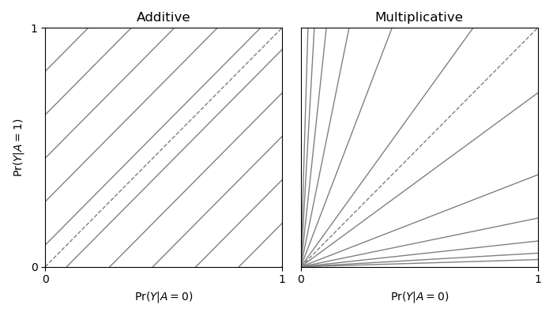

In this plot, you are presented lines that indicate where stratified measures would need to lie on for there to be
no additive / multiplicative interaction. By default, both the additive and multiplicative plots are presented. Let's
look at an example with some data

.. code:: python

 from zepid.graphics import labbe_plot

 labbe_plot(r1=[0.3, 0.5], r0=[0.2, 0.7], color='red')
 plt.show()

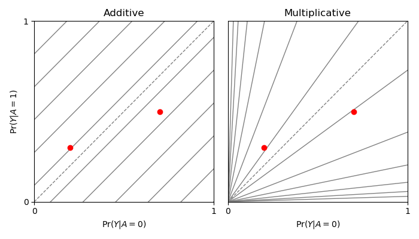

As seen in the plot, there is both additive and multiplicative interaction. As would be described by Hernan, Robins, and
others, there is qualitative modification (estimates are on opposite sides of the null, the dashed-line). Let's look at
one more example,

.. code:: python

 from zepid.graphics import labbe_plot

 labbe_plot(r1=[0.25, 0.5], r0=[0.1, 0.2], color='red')
 plt.show()

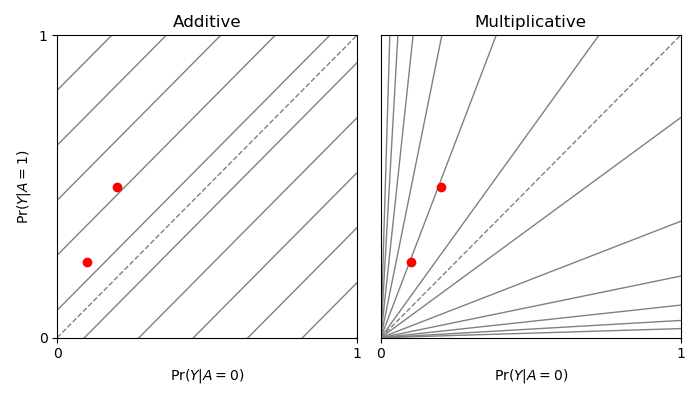

In this example, there is additive modification, but *no multiplicative modification*. These plots also can have the
number of reference lines displayed changed, and support the keyword arguments of `plt.plot()` function. See the
function documentation for further details.

Zipper Plot
===========
Zipper plots provide an easy way to visualize the performance of confidence intervals in simulations. Confidence
intervals across simulations are displayed in a single plot, with the option to color the confidence limits by whether
they include the true value. Below is an example of a zipper plot. For ease, I generated the confidence intervals using
some random numbers (you would pull the confidence intervals from the estimators in practice).

.. code:: python

 from zepid.graphics import zipper_plot
 lower = np.random.uniform(-0.1, 0.1, size=100)
 upper = lower + np.random.uniform(0.1, 0.2, size=100)

 zipper_plot(truth=0,
             lcl=lower,
             ucl=upper,
             colors=('blue', 'green'))
 plt.show()

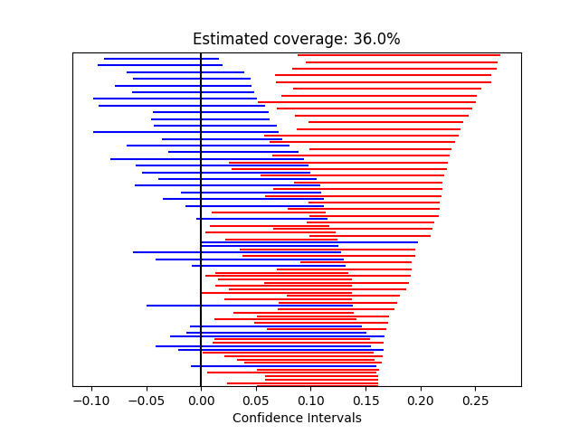

In this example, confidence interval coverage would be considered rather poor (if we are expecting the usual 95%
coverage).