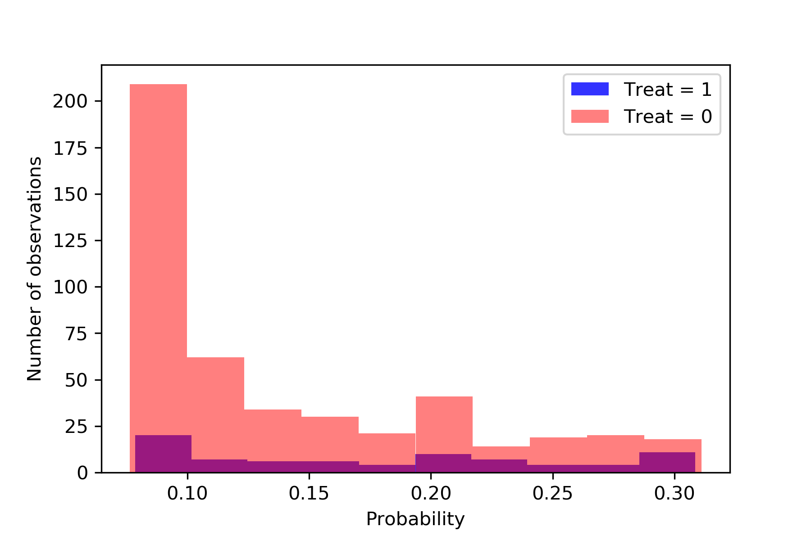

.. image:: images/zepid_logo.png

-------------------------------------

Inverse Probability Weights
'''''''''''''''''''''''''''''''''
Inverse probability weights (IPW) are a useful way to use propensity scores to adjust for confounders and estimate a marginal estimate. These weights can be used to fit marginal structural models, adjust for time-fixed confounders, adjust for time-varying confounders, adjust for missingness, adjust for censoring, and others. There are several different IPW that are currently implemented in *zEpid*. For a deeper discussion of IPW (specifically IPTW), we direct to https://www.ncbi.nlm.nih.gov/pmc/articles/PMC2732954/

IP Treatment Weights
====================================
Inverse Probability of Treatment Weights (IPTW) are used to adjust for confounder imbalances between exposed and unexposed groups. This is done by generating the propensity score (predicted probability of exposure) for each individual. *zEpid* does this by fitting a parametric logistic regression model through ``statsmodels``. For IPTW, we will demonstrate in two settings; time-fixed and time-varying

Time-fixed
^^^^^^^^^^^^^^
First, we will load our time-fixed data set and complete some variable preparation

.. code:: python

   df = ze.load_sample_data(timevary=False)
   df['cd40sq'] = df['cd40']**2
   df['cd40cu'] = df['cd40']**3

With all our variable preparation, we will now specify the regression model to predict our treatment (``art``). The predictors in this model are *a priori* identified confounders. With our adjustment set, we will now fit a logistic regression model to predict ``art`` and generate the weights

.. code:: python 

   model = 'male + age0 + cd40 + cd40sq + cd40cu + dvl0'
   df['iptw'] = ze.ipw.iptw(df,treatment='art',model_denominator=model,stabilized=True)

With the generated weights, we can fit a GEE with robust variance to obtain an estimate and valid (albeit slightly conservative) confidence interval. We will do this through ``statsmodels``

.. code:: python

   import statsmodels.api as sm 
   import statsmodels.formula.api as smf 
   from statsmodels.genmod.families import family,links
   
   ind = sm.cov_struct.Independence()
   f = sm.families.family.Binomial(sm.families.links.identity) 
   linrisk = smf.gee('dead ~ art',df['id'],df,cov_struct=ind,family=f,weights=df['iptw']).fit()
   print(linrisk.summary())

We obtain the following results

.. code::

                                  GEE Regression Results                              
   ===================================================================================
   Dep. Variable:                        dead   No. Observations:                  547
   Model:                                 GEE   No. clusters:                      547
   Method:                        Generalized   Min. cluster size:                   1
                         Estimating Equations   Max. cluster size:                   1
   Family:                           Binomial   Mean cluster size:                 1.0
   Dependence structure:         Independence   Num. iterations:                     2
   Date:                     Tue, 26 Jun 2018   Scale:                           1.000
   Covariance type:                    robust   Time:                         13:56:22
   ==============================================================================
                    coef    std err          z      P>|z|      [0.025      0.975]
   ------------------------------------------------------------------------------
   Intercept      0.1817      0.018     10.008      0.000       0.146       0.217
   art           -0.0826      0.037     -2.205      0.027      -0.156      -0.009
   ==============================================================================
   Skew:                          1.7574   Kurtosis:                       1.1278
   Centered skew:                 0.0000   Centered kurtosis:             -3.0000
   ==============================================================================

From our IPTW analysis the risk difference is -0.083 (95% CI: -0.156, -0.009). Note that ``statsmodels`` will generate a ``DomainWarning`` for log-binomial or identity-binomial models.

In this example, IPTW are stabilized weights and weighted to reflect the entire population (comparing everyone exposed vs. everyone unexposed). Stabilized weights are the default. Unstabilized weights can be requested by ``stabilized==False``. There are two other weighting schemes currently implemented. First is comparing the exposed group to if they were unexposed (specified by ``standardize='exposed'``). Second is comparing the unexposed group to if they were exposed (specified by ``standardize='unexposed'``). These are equivalent to the SMR weighting described by Sato and Matsuyama (2003) https://www.ncbi.nlm.nih.gov/pubmed/14569183 

Diagnostics
^^^^^^^^^^^^^^
There are several diagnostics implemented for IPTW that include both the probabilities (propensity scores) and the weights themselves. First, we will look at the diagnostics for our predicted probabilities. To initiate the treatment probability diagnostics, we estimate the probability of treatment and pass that information into the ``iptw_probability_diagnostic`` class

.. code:: python

   model = 'male + age0 + cd40 + cd40sq + cd40cu + dvl0'
   df['ptreat'] = ze.ipw.iptw(df,treatment='art',model_denominator=model,return_probability=True)
   dp = ze.ipw.iptw_probability_diagnostic(df,probability='ptreat')

There are two graphical assessments to look at the predicted probabilities by our binary exposure groups; ``p_boxplot`` and `p_hist``. ``p_boxplot`` generates a boxplot stratified by the exposure of interest

.. code:: python

   import matplotlib.pyplot as plt 
   dp.p_boxplot(treatment='art')
   plt.show()

.. image:: images/zepid_iptwbox.png

For the boxplot, the predicted probabilities should overlap largely between the two groups. A similar idea is behind the histogram. It is implemented in a similar way

.. code:: python

   dp.p_hist(treatment='art')
   plt.show()

As for IPTW diagnostics, they are implemented through the ``iptw_weight_diagnostic`` class. The class is initiated as follows

.. code:: python

   model = 'male + age0 + cd40 + cd40sq + cd40cu + dvl0'
   df['wtreat'] = ze.ipw.iptw(df,treatment='art',model_denominator=model,stabilized=True)
   dw = ze.ipw.iptw_weight_diagnostic(df,weight='wtreat')

This class has two diagnostics implemented ``positivity`` and ``standardized_diff``. As the name implies, ``positivity`` is helpful for checking for positivity violations. This is done by looking at the mean, min, and max weights

.. code:: python

   dw.positivity()

.. code:: 

   ----------------------------------------------------------------------
   IPW Diagnostic for positivity
   If the mean of the weights is far from either the min or max, this may
    indicate the model is mispecified or positivity is violated
   Standard deviation can help in IPTW model selection
   ----------------------------------------------------------------------
   Mean weight:			         1.0
   Standard Deviation:		         0.19
   Minimum weight:			 0.468
   Maximum weight:			 1.837
   ----------------------------------------------------------------------

``standardized_diff`` calculates the standardized mean difference ...

For further discussion on IPTW diagnostics, I direct you to https://doi.org/10.1002/sim.6607 

Time-varying
^^^^^^^^^^^^^^
Crafting time-varying IPTW to fit a marginal structural model requires more thought on the contrast of interest and some underlying assumptions. We will fit a marginal structural model in the following example. For this, we will use the survival analysis package ``lifelines`` to estimate time-varying risk through Kaplan Meier.

Before we can fit the IPTW model to estimate weights, we need to do some data preparation. We will load the time-varying version of the data set.

.. code:: python

   df = ze.load_sample_data(timevary=True)

Next, we will create lagged versions for ART and some polynomial terms for fitting our model.

.. code:: python

  #Generating lagged variables
  df['lagart'] = df.groupby('id')['art'].shift(1)
  df['lagart'] = np.where(df.groupby('id').cumcount() == 0,0,df['lagart'])
  #Generating polynomial (quadratic) terms
  df['cd40_q'] = df['cd40']**2
  df['cd40_c'] = df['cd40']**3
  df['cd4_q'] = df['cd4']**2
  df['cd4_c'] = df['cd4']**3
  df['enter_q'] = df['enter']**2
  df['enter_c'] = df['enter']**3
  df['age0_q'] = df['age0']**2
  df['age0_c'] = df['age0']**3

Now that our data is prepared, we will calculate the weights. Note, in our model we assume that once an individual is treated with ART, they are given ART until their death. Essentially, once someone is exposed, our marginal structural model assumes that they will always be exposed. This follows the pattern of the data, since all patients who received ART were always treated at follow-up visits. Since we will need to do further manipulation of the predicted probabilities, we will have ``zepid.ipw.iptw`` return the predicted probabilities of the denominator and numerator, respectively. We do this through the following code

.. code:: python

  modeln = 'enter + enter_q + enter_c' #Model numerator 
  modeld = '''enter + enter_q + enter_c + male + age0 + age0_q + age0_c + dvl0 + cd40 + 
          cd40_q + cd40_c + dvl + cd4 + cd4_q + cd4_c''' #Model denominator
  dfs = df.loc[df['lagart']==0].copy() #subsetting out only where patient was not treated with ART at previous visit
  df[['p_denom','p_numer']] = ze.ipw.iptw(dfs,treatment='art',model_denominator=modeld,
                                          model_numerator=modeln,return_probability=True)
  df['lagp_denom'] = df.groupby('id')['p_denom'].shift(1)
  df['lagp_numer'] = df.groupby('id')['p_numer'].shift(1)

Now that we have predicted probabilities, we can calculate our numerator and denominator based on the following conditionals

.. code:: python

  cond1 = (df.groupby('id').cumcount() == 0)
  cond2 = ((df['lagart']==0) & (df['art']==0) & (df.groupby('id').cumcount() != 0))
  cond3 = ((df['lagart']==0) & (df['art']==1) & (df.groupby('id').cumcount() != 0))

  #Condition 1: First record weight is 1
  df['ip_denom'] = 1 - df['p_denom'] #Getting probability minus 1
  df['ip_numer'] = 1 - df['p_numer']
  df['p_denom'] = np.where(cond1,1,df['p_denom']) #Setting first visit to Pr(.) = 1
  df['p_numer'] = np.where(cond1,1,df['p_numer'])
  df['ip_denom'] = np.where(cond1,1,df['ip_denom']) 
  df['ip_numer'] = np.where(cond1,1,df['ip_numer'])
  df['den'] = np.where(cond1,df['p_denom'],np.nan) #First visit is 1
  df['num'] = np.where(cond1,df['p_numer'],np.nan)
  #Condition 2: Records before ART initiation
  df['num'] = np.where(cond2,(df.groupby('id')['ip_numer'].cumprod()),df['num'])
  df['den'] = np.where(cond2,(df.groupby('id')['ip_denom'].cumprod()),df['den'])
  #Condition 3: Records at ART initiation
  df['num'] = np.where(cond3,df['num'].shift(1)*(df['p_numer']),df['num'])
  df['den'] = np.where(cond3,df['den'].shift(1)*(df['p_denom']),df['den'])
  #Condition 4: Records after ART initiation
  df['num'] = df['num'].ffill()
  df['den'] = df['den'].ffill()
  #Calculating weights
  df['w'] = df['num'] / df['den']
  print(df.w.describe())

Which gives the following description for the calculated weights

.. code:: python

  count    27382.000000
  mean         0.991776
  std          0.601284
  min          0.068958
  25%          0.721254
  50%          0.961638
  75%          1.083521
  max          9.464515

Using ``lifelines`` we can estimate the risk functions via a weighted Kaplan Meier. Note that ``lifelines`` version will need to be ``0.14.5`` or greater. The following code will generate our risk function plot

.. code:: python 

  from lifelines import KaplanMeierFitter
  import matplotlib.pyplot as plt 

  kme = KaplanMeierFitter()
  kmu = KaplanMeierFitter()
  dfe = df.loc[df['art']==1].copy()
  dfu = df.loc[df['art']==0].copy()
  kme.fit(dfe['out'],event_observed=dfe['dead'],entry=dfe['enter'],weights=dfe['w'])
  kmu.fit(dfu['out'],event_observed=dfu['dead'],entry=dfu['enter'],weights=dfu['w'])

  plt.step(kme.event_table.index,1 - kme.survival_function_,c='b',label='ART')
  plt.step(kmu.event_table.index,1 - kmu.survival_function_,c='r',label='no ART')
  plt.title('Stratified risk function')
  plt.xlabel('Time')
  plt.ylabel('Probability of Death')
  plt.legend()
  plt.show()

.. image:: images/zepid_msm1.png

We can also use in a built-in graphic function to generate dynamic risk difference/ratio plots are discussed in https://academic.oup.com/aje/article/181/4/246/122265 and demonstrated in https://www.ncbi.nlm.nih.gov/pmc/articles/PMC4325676/ Essentially, this plot allows us to visualize how the risk difference or risk ratio changes over time. To use this function, we obtain the risk estimates for our exposed and unexposed groups from the ``lifelines`` Kaplan Meier curves.

.. code:: python

  a = 1 - kme.survival_function_
  b = 1 - kmu.survival_function_
  ze.graphics.dyanmic_risk_plot(a,b)
  plt.show()

.. image:: images/zepid_msm_rd.png

By default, the function returns the risk difference plot. You can also request a risk ratio plot. Here is the risk ratio plot, with the point and line colors changed

.. code:: python

  ze.graphics.dyanmic_risk_plot(a,b,measure='RR',point_color='darkred',line_color='r',scale='log')
  plt.show()

.. image:: images/zepid_msm_rr.png

This concludes the section on inverse probability of treatment weights

IP Censoring Weights
====================================
Continuing with the previous example and weights, we will not calculate the inverse probability of censoring weights (IPCW) to relax the assumption that censored individuals are missing completely at random. While the included data set has an indicator for those who were censored, we will instead use the IPCW preparation function. This function formats the data properly for the ``ipcw()`` function. To implement it, we do the following:

.. code:: python

  df['uncensored'] = np.where(df['drop']==1,0,1)

Now with the prepared data, we can estimate the IPCW using ``zepid.ipw.ipcw()``, implemented as follows

.. code:: python

  cmodeln = 'enter + enter_q + enter_c'
  cmodeld = '''enter + enter_q + enter_c + male + age0 + age0_q + age0_c + dvl0 + cd40 + 
          cd40_q + cd40_c + dvl + cd4 + cd4_q + cd4_c'''
  df['cw'] = ze.ipw.ipcw(df,'uncensored',idvar='id',model_denominator=cmodeld,model_numerator=cmodeln)

Now that we have IPCW and IPTW, we can multiply the two to obtain our full weights and repeat the above ``lifelines`` code to estimate a marginal structural model fit with IPTW and assuming that censored individuals at missing at random (censored conditional on time period, age, gender, baseline diagnosed viral load, diagnosed viral load, baseline CD4 count, CD4 count only)

.. code:: python

  df['fw'] = df['w']*df['cw']

  kme = KaplanMeierFitter()
  kmu = KaplanMeierFitter()
  dfe = df.loc[df['art']==1].copy()
  dfu = df.loc[df['art']==0].copy()
  kme.fit(dfe['out'],event_observed=dfe['dead'],entry=dfe['enter'],weights=dfe['fw'])
  kmu.fit(dfu['out'],event_observed=dfu['dead'],entry=dfu['enter'],weights=dfu['fw'])

  plt.step(kme.event_table.index,1 - kme.survival_function_,c='b',label='ART')
  plt.step(kmu.event_table.index,1 - kmu.survival_function_,c='r',label='no ART')
  plt.title('Marginal Structural Model for ART on Death')
  plt.xlabel('Time')
  plt.ylabel('Probability of Death')
  plt.legend()
  plt.ylim([0,0.35])
  plt.show()

.. image:: images/zepid_msm2.png

In this example, the IPCW do not make a big difference in our results. 

If you have a data set that is not sub-divided into time periods (like ``ze.load_sample_data(timevary=False)``), you can easily generate a data set formatted for ``ipcw()``. To do this, call the function ``zepid.ipw.ipcw_prep(df,idvar,time,event)`` specifying the pandas dataframe, column name indicating the participant's ID, column name indicating the total time observed, and column name indicating the event indicator column, respectively. 
Note, this function breaks the observation period into ``1`` unit blocks. It may be necessary to multiple/divide the time by some constant to ensure blocks are an adequate size. For example, a data set where the naive time is ``0`` to ``1`` may need to be multiplied by ``10`` to ensure enough blocks of censored/uncensored are available for the model to fit to.

IP Missingness Weights
====================================
Guide is coming soon