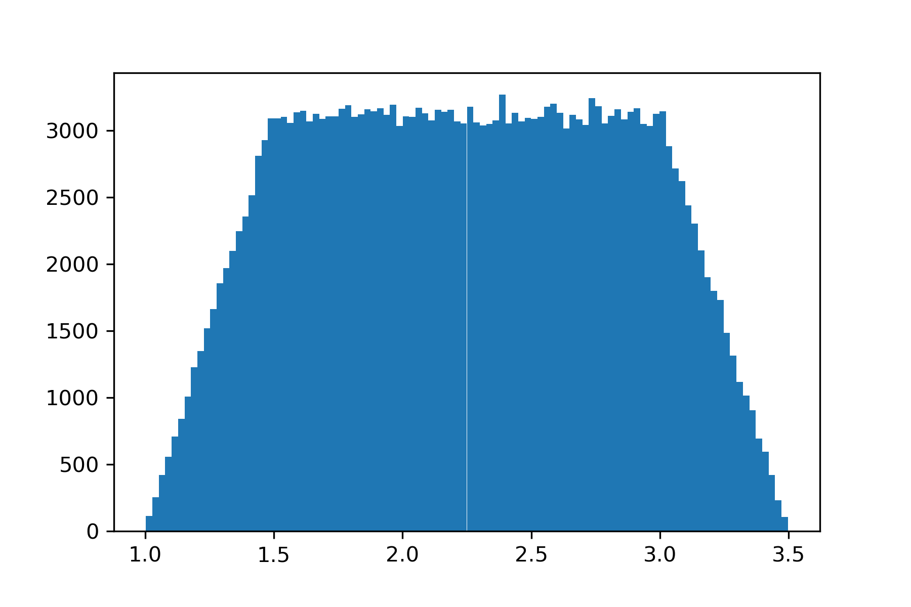
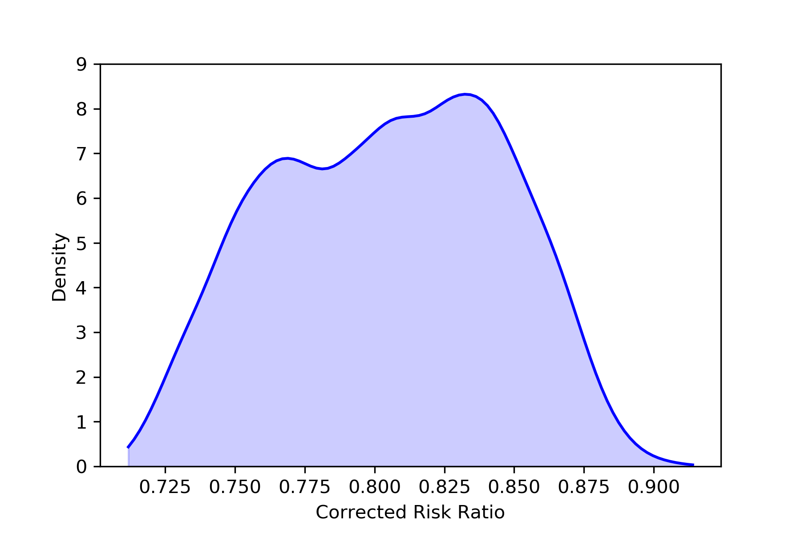

.. image:: images/zepid_logo_small.png

-------------------------------------

Sensitivity Analyses
''''''''''''''''''''
Sensitivity analyses are a way to determine the robustness of findings against certain assumptions or unmeasured
factors. Currently, *zEpid* supports Monte Carlo bias analysis

Trapezoidal Distribution
========================
NumPy doesn't have a trapezoidal distribution, so this is an implementation. The trapezoid distribution is contains a
central "zone of indifference" where values are from a uniform distribution. The tails of this distribution reflect the
uncertainty around the edges of the distribution. I think a visual will explain it more clearly, so let's generate one

.. code:: python

  from zepid.sensitivity_analysis import trapezoidal
  import matplotlib.pyplot as plt
  
  plt.hist(trapezoidal(mini=1, mode1=1.5, mode2=3, maxi=3.5, size=250000), bins=100)
  plt.show()

As can be seen in the histogram, ``mini`` refers to the smallest value of the distribution, ``maxi`` refers to the
maximum value of the distribution, and ``mode1`` and ``mode2`` refer to the start and end of the uniform distribution
respectively. ``size`` is how many samples to draw from the distribution. When ``size`` is not specified, a single draw
from the distribution is generated.

.. code:: python

  trapezoidal(mini=1, mode1=1.5, mode2=3, maxi=3.5)

Monte Carlo Risk Ratio
===========================
As described in `Lash TL, Fink AK 2003 <https://www.ncbi.nlm.nih.gov/pubmed/12843771>`_ and
`Fox et al. 2005 <https://www.ncbi.nlm.nih.gov/pubmed/16172102>`_ , a probability distribution is defined for
unmeasured confounder - outcome risk ratio, proportion of individuals in exposed group with unmeasured confounder, and
proportion of individuals in unexposed group with unmeasured confounder. This version only supports binary exposures,
binary outcomes, and binary unmeasured confounders.

.. code:: python

  import matplotlib.pyplot as plt()
  from zepid.sensitivity_analysis import MonteCarloRR, trapezoidal

Below is code to complete the Monte Carlo bias analysis procedure

.. code:: python

  mcrr = MonteCarloRR(observed_RR=0.73322, sample=10000)
  mcrr.confounder_RR_distribution(trapezoidal(mini=0.9, mode1=1.1, mode2=1.7, maxi=1.8, size=10000))
  mcrr.prop_confounder_exposed(trapezoidal(mini=0.25, mode1=0.28, mode2=0.32, maxi=0.35, size=10000))
  mcrr.prop_confounder_unexposed(trapezoidal(mini=0.55, mode1=0.58, mode2=0.62, maxi=0.65, size=10000))
  mcrr.fit()

We can view basic summary information about the distribution of the corrected Risk Ratios

.. code:: python

  mcrr.summary()

Alternatively, we can easily get a kernel density plot of the distribution of corrected RR

.. code:: python

  mcrr.plot()
  plt.show()

