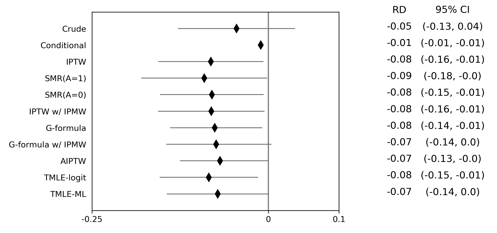
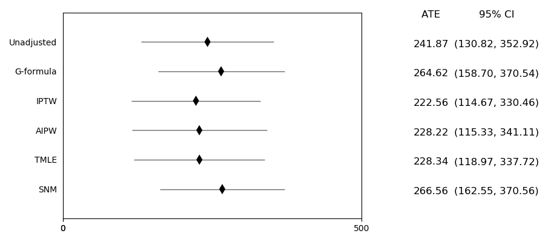
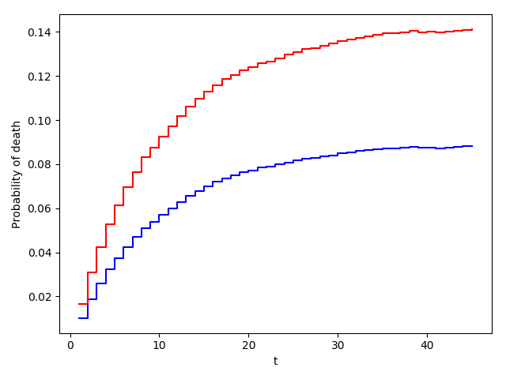

.. image:: images/zepid_logo_small.png

-------------------------------------

Time-Fixed Exposure
'''''''''''''''''''''''''''''''''''''
In this section, we will go through some methods to estimate the average causal effect of a time-fixed treatment /
exposure on a specific outcome. We will review binary outcomes, continuous outcomes, and time-to-event data. To follow
along with the tutorial, run the following code to set up the data

.. code::

    import numpy as np
    import pandas as pd
    from lifelines import KaplanMeierFitter

    from zepid import load_sample_data, spline, RiskDifference
    from zepid.causal.gformula import TimeFixedGFormula, SurvivalGFormula
    from zepid.causal.ipw import IPTW, IPMW
    from zepid.causal.snm import GEstimationSNM
    from zepid.causal.doublyrobust import AIPTW, TMLE

    df = load_sample_data(timevary=False)
    df = df.drop(columns=['cd4_wk45'])
    df[['cd4_rs1', 'cd4_rs2']] = spline(df, 'cd40', n_knots=3, term=2, restricted=True)
    df[['age_rs1', 'age_rs2']] = spline(df, 'age0', n_knots=3, term=2, restricted=True)

Which estimator should I use?
====================================
What estimator to use is an important question. Unfortunately, my answer is that it depends. Review the following list
of estimators to help you decide. Afterwards, I would recommend the following process.

First, what are you trying to estimate? Depending on what you want to estimate (the estimand), some estimators don't
make sense to use. For example, if you wanted to estimate the marginal causal effect comparing all treated versus all
untreated, then you wouldn't want to use g-estimation of structural nested models. G-estimation, as detailed below,
targets something slightly different than the target estimand. However, if you were interested in average causal effect
within defined strata, then g-estimation would be a good choice. Your causal question can (*and should*) narrow down
the list of potential estimators

Second, does your question of interest require something not available for all methods? This can also narrow down
estimators, at least ones currently available. For example, only `TimeFixedGFormula`, `StochasticIPTW`, and
`StochasticTMLE` allow for stochastic treatments. See the tutorials
on `Python for Epidemiologists <https://github.com/pzivich/Python-for-Epidemiologists/>`_ for further details on what
each estimator can do.

Lastly, if there are multiple estimators to use, then use them all. Each has different advantages/disadvantages that
don't necessarily make one unilaterally better than the other. If all the estimators provide similar answers, that can
generally be taken as a good sign. It builds some additional confidence in your results. If there are distinctly
different results across the estimators, that means that at least one assumption is being substantively broken
somewhere. In these situations, I would recommend the doubly robust estimators because they make less restrictive
modeling assumptions. Alternatively, machine learning promises to make less restrictive assumptions regarding
functional forms. However, the lack of agreement between estimators should be noted.

Binary Outcome
==============================================
To begin, we are interested in the average causal effect of anti-retroviral therapy (ART) on 45-week risk of death.

.. math::

    ACE = \Pr(Y^{a=1}) - \Pr(Y^{a=1})

where :math:`Y^{a}` indicates the potential outcomes under treatment :math:`a`. Unfortunately, we cannot observe these
potential outcomes (or counterfactuals after they occur). We stuck with our observational data, so we need to make
some additional assumptions to go from

.. math::

    \Pr(Y | A=1) - \Pr(Y | A=0)

to

.. math::

    \Pr(Y^{a=1}) - \Pr(Y^{a=1})

We will assume conditional mean exchangeability, causal consistency, and positivity. These assumptions allow us to go
from our observed data to potential outcomes. See
`Hernan and Robins <https://www.hsph.harvard.edu/miguel-hernan/causal-inference-book/>`_ for further details on these
assumptions and these methods in general. We will assume conditional exchangeability by age (continuous),
gender (male / female), baseline CD4 T-cell count (continuous), and baseline detectable viral load (yes / no)
throughout. The data set we will use is a simulated data set that comes with *zEpid*

Our set of confounders for conditional exchangeability is quite large and includes some continuous variables. Therefore,
we will use parametric models (for the most part). As a result, we assume that our models are correctly specified, in
addition to the above assumptions.

Unadjusted Risk Difference
----------------------------------------
The first option is the unadjusted risk difference. We can calculate this by

.. code::

    rd = RiskDifference()
    rd.fit(df, exposure='art', outcome='dead')
    rd.summary()

By using this measure as our average causal effect, we are assuming that there are no confounding variables. However,
this is an unreasonable assumption for our observational data. However, the `RiskDifference` gives us some useful
information. In the summary, we find `LowerBound` and `UpperBound`. These bounds are the Frechet probability bounds.
The true causal effect must be contained within these bounds, without requiring exchangeability. This is a good check.
All methods below should produce values that are within these bounds.

Therefore, the Frechet bounds allow for partial identification of the causal effect. We narrowed the range of possible
values from two unit width (-1 to 1) to unit width (-0.87 to 0.13). However, we don't have point identification. The
following methods allow for point identification under the assumption of conditional exchangeability.

Our unadjusted estimate is -0.05 (-0.13, 0.04), which we could interpret as: ART is associated with a 4.5%
point reduction (95% CL: -0.13, 0.04) in the probability of death at 45-weeks. However, this interpretation implies
that ART is given randomly (which is unlikely to occur in the data).

Parametric g-formula
----------------------------------------
The parametric g-formula allows us to estimate the average causal effect of ART on death by specifying an outcome
model. From our outcome model, we predict individuals' counterfactual outcomes under our treatment plans and marginalize
over these predicted counterfactuals. This allows us to estimate the marginal risk under our treatment plan of
interest.

To estimate the parametric g-formula, we can use the following code

.. code::

    g = TimeFixedGFormula(df, exposure='art', outcome='dead')
    g.outcome_model(model='art + male + age0 + age_rs1 + age_rs2 + cd40 + cd4_rs1 + cd4_rs2 + dvl0')

    # Estimating marginal effect under treat-all plan
    g.fit(treatment='all')
    r_all = g.marginal_outcome

    # Estimating marginal effect under treat-none plan
    g.fit(treatment='none')
    r_none = g.marginal_outcome

    riskd = r_all - r_none
    print('RD:', riskd)

which gives us an estimated risk difference of -0.076. To calculate confidence intervals, we need to use a bootstrapping
procedure. Below is an example that uses bootstrapped confidence limits.

.. code::

    rd_results = []
    for i in range(1000):
        s = dfs.sample(n=df.shape[0],replace=True)
        g = TimeFixedGFormula(s,exposure='art',outcome='dead')
        g.outcome_model(model='art + male + age0 + age_rs1 + age_rs2 + cd40 + cd4_rs1 + cd4_rs2 + dvl0',
                        print_results=False)
        g.fit(treatment='all')
        r_all = g.marginal_outcome
        g.fit(treatment='none')
        r_none = g.marginal_outcome
        rd_results.append(r_all - r_none)

    se = np.std(rd_results)
    print('95% LCL', riskd - 1.96*se)
    print('95% UCL', riskd + 1.96*se)

In my run (your results may differ), the estimate's 95% confidence limits were -0.15, 0.00. We could interpret our
results as; the 45-week risk of death when everyone was treated with ART at enrollment was 7.6% points
(95% CL: -0.15, -0.00) lower than if no one had been treated with ART at enrollment. For further details and
examples of other usage of this estimator see this
`tutorial <https://github.com/pzivich/Python-for-Epidemiologists/blob/master/3_Epidemiology_Analysis/c_causal_inference/1_time-fixed-treatments/01_g-formula.ipynb>`_

Inverse probability of treatment weights
----------------------------------------
For the g-formula, we specified the outcome model. Another option is to specify a treatment / exposure model.
Specifically, this model predicts the probability of treatment, sometimes called propensity scores. From these
propensity scores, we can calculate inverse probability of treatment weights.

Below is some code to calculate our stabilized inverse probability of treatment weights for ART.

.. code::

    iptw = IPTW(df, treatment='art')
    iptw.treatment_model('male + age0 + age_rs1 + age_rs2 + cd40 + cd4_rs1 + cd4_rs2 + dvl0',
                         print_results=False)

A variety of diagnostics is available to check the calculated weights. See the below referenced tutorial for further
details and examples. For our analysis, we use the following marginal structural model

.. math::

    \Pr(Y | A) = \alpha_0 + \alpha_1 A

While this model looks like a crude regression model, we are fitting it with the weighted data. The weights make it
such that there is no confounding in our pseudo-population. As of v0.8.0, `IPTW` now estimates the marginal structural
model for you. GEE is used to estimate the standard error. Robust standard errors are required since weighting our
population builds in some correlation between our observations. We need to account for this. While GEE does account
for this, our confidence intervals will be somewhat conservative. Below is code to estimate the marginal structural
model and print the results

.. code::

    iptw.marginal_structural_model('art')
    iptw.fit()
    iptw.summary()

My results were fairly similar to the g-formula (RD = -0.08; 95% CL: -0.16, -0.01). We would interpret this in a
similar way: the 45-week risk of death when everyone was treated with ART at enrollment was 8.2% points
(95% CL: -0.16, -0.01) lower than if no one had been treated with ART at enrollment.

To account for data that is missing at random, inverse probability of missing weights can be stacked together with
IPTW. As of v0.8.0, this is built into the `IPTW` class. Below is an example with accounting for informative censoring
(missing outcome data)

.. code::
    iptw = IPTW(df, treatment='art')
    iptw.treatment_model('male + age0 + age_rs1 + age_rs2 + cd40 + cd4_rs1 + cd4_rs2 + dvl0',
                         print_results=False)
    iptw.missing_model('art + male + age0 + age_rs1 + age_rs2 + cd40 + cd4_rs1 + cd4_rs2 + dvl0',
                       print_results=False)
    iptw.marginal_structural_model('art')
    iptw.fit()
    iptw.summary()

When accounting for censoring by the above variables, a similar is obtained (RD = -0.08, 95% CL: -0.16, -0.01). For
further details and examples of other usage of this estimator see this
`tutorial <https://github.com/pzivich/Python-for-Epidemiologists/blob/master/3_Epidemiology_Analysis/c_causal_inference/1_time-fixed-treatments/>`_

Augmented inverse probability weights
----------------------------------------
As you read through the previous estimators, you may have thought "is there a way to combine these approaches?" The
answer is yes! Augmented inverse probability of treatment weights require you to specify both a treatment model
(pi-model) and an outcome model (Q-model). But why would you want to specify two models? Well, by specifying both and
merging them, AIPTW becomes doubly robust. This means that as long as one model is correct, our estimate will be
unbiased on average. Essentially, we get two attempts to get our models correct.

We can calculate the AIPTW estimator through the following code

.. code::

    aipw = AIPTW(df, exposure='art', outcome='dead')

    # Treatment model
    aipw.exposure_model('male + age0 + age_rs1 + age_rs2 + cd40 + cd4_rs1 + cd4_rs2 + dvl0')

    # Outcome model
    aipw.outcome_model('art + male + age0 + age_rs1 + age_rs2 + cd40 + cd4_rs1 + cd4_rs2 + dvl0')

    # Calculating estimate
    aipw.fit()

    # Printing summary results
    aipw.summary()

In the printed results, we have an estimated risk difference of -0.08 (95% CL: -0.15, -0.02). Confidence intervals
come from the efficient influence curve. You can also bootstrap confidence intervals. For the risk ratio, you will
need to bootstrap the confidence intervals currently. Our results can be interpreted as: the 45-week risk of death
when everyone was treated with ART at enrollment was 8.4% points (95% CL: -0.15, -0.02) lower than if no one
had been treated with ART at enrollment.

Similarly, we can also account for missing outcome data using inverse probability weights. Below is an example

.. code::

    aipw = AIPTW(df, exposure='art', outcome='dead')
    aipw.exposure_model('male + age0 + age_rs1 + age_rs2 + cd40 + cd4_rs1 + cd4_rs2 + dvl0')
    aipw.outcome_model('art + male + age0 + age_rs1 + age_rs2 + cd40 + cd4_rs1 + cd4_rs2 + dvl0')
    aipw.missing_model('art + male + age0 + age_rs1 + age_rs2 + cd40 + cd4_rs1 + cd4_rs2 + dvl0')
    aipw.fit()
    aipw.summary()

AIPTW can also be paired with machine learning algorithms, particularly super-learner. The use of machine learning with
AIPTW means we are making less restrictive parametric assumptions than all the model described above. For further
details, using super-learner / sklearn with AIPTW, and examples see this
`tutorial <https://github.com/pzivich/Python-for-Epidemiologists/blob/master/3_Epidemiology_Analysis/c_causal_inference/1_time-fixed-treatments/05_AIPTW_intro.ipynb>`_

Targeted maximum likelihood estimation
----------------------------------------
For AIPTW, we merged IPW and the g-formula. The targeted maximum likelihood estimator (TMLE) is another variation on
this procedure. TMLE uses a targeting step to update the estimate of the average causal effect. This approach is
doubly robust but keeps some of the nice properties of plug-in estimators (like the g-formula). In general, TMLE will
likely have narrower confidence intervals than AIPTW.

Below is code to generate the average causal effect of ART on death using TMLE. Additionally, we will specify a missing
outcome data model (like `AIPTW` and `IPTW`).

.. code::

    tmle = TMLE(df, exposure='art', outcome='dead')
    tmle.exposure_model('male + age0 + age_rs1 + age_rs2 + cd40 + cd4_rs1 + cd4_rs2 + dvl0')
    tmle.missing_model('art + male + age0 + cd40 + cd4_rs1 + cd4_rs2 + dvl0')
    tmle.outcome_model('male + age0 + age_rs1 + age_rs2 + cd40 + cd4_rs1 + cd4_rs2 + dvl0')
    tmle.fit()
    tmle.summary()

Using TMLE, we estimate a risk difference of -0.08 (95% CL: -0.15, -0.01). We can interpret this as: the 45-week
risk of death when everyone was treated with ART at enrollment was 8.3% points (95% CL: -0.15, -0.01) lower than if
no one had been treated with ART at enrollment.

TMLE can also be paired with machine learning algorithms, particularly super-learner. The use of machine learning with
TMLE means we are making less restrictive parametric assumptions than all the model described above. For further
details, using super-learner / sklearn with TMLE, and examples see this
`tutorial <https://github.com/pzivich/Python-for-Epidemiologists/blob/master/3_Epidemiology_Analysis/c_causal_inference/1_time-fixed-treatments/07_TMLE_intro.ipynb>`_

Single Cross-fit TMLE
----------------------------------------
While both AIPTW and TMLE are able to incorporate the use of *some* machine learning algorithms, there are limits.
More specifically, both require that the machine learning algorithms are Donsker. Unfortunately, many flexible
algorithms we may want to use may not be Donsker. In this scenario, confidence interval coverage may be below what
is expected (i.e. the confidence interval are overly narrow due to over-fitting by the machine learning algorithms).

Recently, cross-fitting procedures have been proposed as a way to weaken this condition. Cross-fitting allows for
non-Donsker algorithms. For more extensive details on the cross-fitting procedure and why it is necessary, please see my
`paper <https://arxiv.org/abs/2004.10337>`_ and the references within.

*zEpid* supports both single and double cross-fitting for AIPTW and TMLE. The following are simple examples that use
`SuperLearner` with a single cross-fitting procedure for TMLE. The 10-fold super-learner consists of a GLM, a
step-wise GLM with all first-order interactions, and a Random Forest.

.. code::

    from sklearn.ensemble import RandomForestClassifier
    from zepid.superlearner import GLMSL, StepwiseSL, SuperLearner
    from zepid.causal.doublyrobust import SingleCrossfitAIPTW, SingleCrossfitTMLE

    # SuperLearner setup
    labels = ["LogR", "Step.int", "RandFor"]
    candidates = [GLMSL(sm.families.family.Binomial()),
                  StepwiseSL(sm.families.family.Binomial(), selection="forward", order_interaction=0),
                  RandomForestClassifier()]

    # Single cross-fit TMLE
    sctmle = SingleCrossfitTMLE(df, exposure='art', outcome='dead')
    sctmle.exposure_model('male + age0 + age_rs1 + age_rs2 + cd40 + cd4_rs1 + cd4_rs2 + dvl0',
                          SuperLearner(candidates, labels, folds=10, loss_function="nloglik"),
                          bound=0.01)
    sctmle.outcome_model('male + age0 + age_rs1 + age_rs2 + cd40 + cd4_rs1 + cd4_rs2 + dvl0',
                         SuperLearner(candidates, labels, folds=10, loss_function="nloglik"))
    sctmle.fit()
    sctmle.summary()

Using `SingleCrossfitTMLE`, we estimate a risk difference of -0.08 (95% CL: -0.17, 0.00). We can interpret this as:
the 45-week risk of death when everyone was treated with ART at enrollment was 8.3% points (95% CL: -0.17, 0.00)
lower than if no one had been treated with ART at enrollment. When comparing SingleCrossfitTMLE to the previous TMLE,
you can see the confidence intervals are wider. This is a result of weakening the parametric modeling restrictions
(by including the random forest as a possible option in super learner).

As these are new procedures, guidelines on their use are still developing. In my experience, I would recommend at least
100 different partitions to be used. Additionally, the data set must be fairly large (more than 500 observations) to
take advantage of the flexibility of the cross-fit estimators with machine learning. If the data set is not that large, I
recommend using a higher number of folds with SuperLearner (if using), using single cross-fitting, and using the
minimal number of required splits.

G-estimation of SNM
----------------------------------------
The final method I will review is g-estimation of structural nested mean models (SNM). G-estimation of SNM is distinct
from all of the above estimation procedures. The g-formula, IPTW, AIPTW, and TMLE all estimated the average causal
effect of ART on mortality comparing everyone treated to everyone untreated. G-estimation of SNM estimate the average
causal effect within levels of the confounders, *not* the average causal effect in the population. Therefore, if no
product terms are included in the SNM if there is effect measure modification, then the SNM will be biased due to model
misspecification. SNM are useful for learning about effect modification.

To first demonstrate g-estimation, we will assume there is no effect measure modification. For g-estimation, we specify
two models; the treatment model and the structural nested model. The treatment model is the same format as the treatment
model for IPTW / AIPTW / TMLE. The structural nested model states the interaction effects we are interested in. Since
we are assuming no interaction, we only put the treatment variable into the model.

.. code::

    snm = GEstimationSNM(df, exposure='art', outcome='dead')

    # Specify treatment model
    snm.exposure_model('male + age0 + age_rs1 + age_rs2 + cd40 + cd4_rs1 + cd4_rs2 + dvl0')

    # Specify structural nested model
    snm.structural_nested_model('art')

    # G-estimation
    snm.fit()
    snm.summary()

    psi = snm.psi
    print('Psi:', psi)

Similarly, we need to bootstrap our confidence intervals

.. code::

    psi_results = []
    for i in range(500):
        dfs = df.sample(n=df.shape[0],replace=True)
        snm = GEstimationSNM(dfs, exposure='art', outcome='dead')
        snm.exposure_model('male + age0 + age_rs1 + age_rs2 + cd40 + cd4_rs1 + cd4_rs2 + dvl0', print_results=False)
        snm.structural_nested_model('art')
        snm.fit()
        psi_results.append(snm.psi)

    se = np.std(psi_results)
    print('95% LCL', psi - 1.96*se)
    print('95% UCL', psi + 1.96*se)

Overall, the SNM results are similar to the other models (RD = -0.09; 95% CL: -0.17, -0.00). Instead, we interpret
this estimate as: the 45-week risk of death when everyone was treated with ART at enrollment was 8.8% points
(95% CL: -0.17, -0.00) lower than if no one had been treated with ART at enrollment across all strata.

SNM can be expanded to include additional terms. Below is code to do that. For this SNM, we will assess if there is
modification by gender

.. code::

    snm = GEstimationSNM(df, exposure='art', outcome='dead')
    snm.exposure_model('male + age0 + age_rs1 + age_rs2 + cd40 + cd4_rs1 + cd4_rs2 + dvl0')
    snm.structural_nested_model('art + art:male')
    snm.fit()
    snm.summary()

The 45-week risk of death when everyone was treated with ART at enrollment was 17.6% points lower than if no one had
been treated with ART at enrollment, *among women*. Among men, risk of death with ART treatment at enrollment was
6.8% points lower compared to no treatment.

Remember, g-estimation of SNM is distinct from these other methods and targets a different estimand. It is a great
method to consider when you are interested in effect measure modification.

Summary
----------------------------------------
Below is a figure summarizing the results across methods.

As we can see, all the methods provided fairly similar answers, even the misspecified structural nested model. This
will not always be the case. Differences in model results may indicate parametric model misspecification. In those
scenarios, it may be preferable to use a doubly-robust estimator with machine learning and cross-fitting (when
possible).

Additionally, for simplicity we dropped all missing outcome data. We made the assumption that outcome data was missing
completely at random, a strong assumption. We could relax this assumption using built-in methods
(e.g. `missing_model()` functions)

Continuous Outcome
==============================================
In the previous example we focused on a binary outcome, death. In this example, we will repeat the above procedure but
focus on the 45-week CD4 T-cell count. This can be expressed as

.. math::

    E[Y^{a=1}] - E[Y^{a=0}]

For illustrative purposes, we will ignore the implications of competing risks (those dying before week 45 cannot have
a CD4 T-cell count). We will start by restricting our data to only those who are not missing a week 45 T-cell count.
In an actual analysis, you wouldn't want to do this

.. code::

    df = load_sample_data(timevary=False)
    dfs = df.drop(columns=['dead']).dropna()

With our data loaded and restricted, let's compare the estimators. Overall, the estimators are pretty much
the same as the binary case. However, we are interested in estimating the average treatment effect instead. Most of the
methods auto-detect binary or continuous data in the background. Additionally, we will assume that CD4 T-cell count
is appropriately fit by a normal-distribution. Poisson is also available.

Parametric g-formula
----------------------------------------
The parametric g-formula allows us to estimate the average causal effect of ART on death by specifying an outcome
model. From our outcome model, we predict individuals' counterfactual outcomes under our treatment plans and marginalize
over these predicted counterfactuals. This allows us to estimate the marginal risk under our treatment plan of
interest.

To estimate the parametric g-formula, we can use the following code

.. code::

    g = TimeFixedGFormula(df, exposure='art', outcome='cd4_wk45', outcome_type='normal')
    g.outcome_model(model='art + male + age0 + age_rs1 + age_rs2 + cd40 + cd4_rs1 + cd4_rs2 + dvl0')
    g.fit(treatment='all')
    r_all = g.marginal_outcome

    g.fit(treatment='none')
    r_none = g.marginal_outcome
    ate = r_all - r_none

    print('ATE:', ate)

To calculate confidence intervals, we need to use a bootstrapping procedure. Below is an example that uses
bootstrapped confidence limits.

.. code::

    ate_results = []
    for i in range(1000):
        s = df.sample(n=df.shape[0],replace=True)
        g = TimeFixedGFormula(s,exposure='art',outcome='cd4_wk45', outcome_type='normal')
        g.outcome_model(model='art + male + age0 + age_rs1 + age_rs2 + cd40 + cd4_rs1 + cd4_rs2 + dvl0',
                        print_results=False)
        g.fit(treatment='all')
        r_all = g.marginal_outcome
        g.fit(treatment='none')
        r_none = g.marginal_outcome
        ate_results.append(r_all - r_none)

    se = np.std(ate_results)
    print('95% LCL', ate - 1.96*se)
    print('95% UCL', ate + 1.96*se)

In my run (your results may differ), the estimate's 95% confidence limits were 158.70, 370.54.
We can interpret this estimate as: the mean 45-week CD4 T-cell count if everyone had been given ART at enrollment
was 264.62 (95% CL: 158.70, 370.54) higher than the mean if everyone has not been given ART at baseline.

Inverse probability of treatment weights
----------------------------------------
Since inverse probability of treatment weights rely on specification of the treatment-model, there is no difference
between the weight calculation and the binary outcome. This is also because we assume the same sufficient adjustment
set. We will estimate new weights since there is a different missing data pattern. Below is code to estimate our
weights

.. code::

    ipw = IPTW(df, treatment='art')
    ipw.treatment_model('male + age0 + age_rs1 + age_rs2 + cd40 + cd4_rs1 + cd4_rs2 + dvl0')
    ipw.marginal_structural_model('art')
    ipw.fit()
    ipw.summary()

Our marginal structural model estimates 222.56 (95% CL: 114.67, 330.46). We can interpret this estimate as: the mean
45-week CD4 T-cell count if everyone had been given ART at enrollment was 222.56 (95% CL: 114.67, 330.46) higher than
the mean if everyone has not been given ART at baseline.

Augmented inverse probability weights
----------------------------------------
Similarly to the binary outcome case, AIPTW follows the same recipe to merge IPTW and g-formula estimates. We can
calculate the AIPTW estimator through the following code

.. code::

    aipw = AIPTW(df, exposure='art', outcome='cd4_wk45')
    aipw.exposure_model('male + age0 + age_rs1 + age_rs2 + cd40 + cd4_rs1 + cd4_rs2 + dvl0')
    aipw.outcome_model('art + male + age0 + age_rs1 + age_rs2 + cd40 + cd4_rs1 + cd4_rs2 + dvl0')
    aipw.fit()
    aipw.summary()

AIPTW produces a similar estimate to the marginal structural model (ATE = 228.22; 95% CL: 115.33, 341.11). We can
interpret this estimate as: the mean 45-week CD4 T-cell count if everyone had been given ART at enrollment was
228.22 (95% CL: 115.33, 341.11) higher than the mean if everyone has not been given ART at baseline.

Targeted maximum likelihood estimation
----------------------------------------
TMLE also supports continuous outcomes and is similarly doubly robust. Below is code to estimate TMLE for a continuous
outcome.

.. code::

    tmle = TMLE(df, exposure='art', outcome='cd4_wk45')
    tmle.exposure_model('male + age0 + age_rs1 + age_rs2 + cd40 + cd4_rs1 + cd4_rs2 + dvl0')
    tmle.outcome_model('art + male + age0 + age_rs1 + age_rs2 + cd40 + cd4_rs1 + cd4_rs2 + dvl0')
    tmle.fit()
    tmle.summary()

Our results are fairly similar to the other models. The mean 45-week CD4 T-cell count if everyone had been given ART
at enrollment was 228.35 (95% CL: 118.97, 337.72) higher than the mean if everyone has not been given ART at baseline.

Single Cross-fit TMLE
----------------------------------------
Similarly, we can pair TMLE with a cross-fitting procedure and machine learning. In this example, we use SuperLearner
with a GLM, a stepwise selection, and a random forest.

.. code::

    from sklearn.ensemble import RandomForestClassifier, RandomForestRegressor

    # SuperLearner set-up
    labels = ["LogR", "Step.int", "RandFor"]
    b_candidates = [GLMSL(sm.families.family.Binomial()),
                    StepwiseSL(sm.families.family.Binomial(), selection="forward", order_interaction=0),
                    RandomForestClassifier(random_state=809512)]
    c_candidates = [GLMSL(sm.families.family.Gaussian()),
                    StepwiseSL(sm.families.family.Gaussian(), selection="forward", order_interaction=0),
                    RandomForestRegressor(random_state=809512)]

    # Single cross-fit TMLE
    sctmle = SingleCrossfitTMLE(df, exposure='art', outcome='cd4_wk45')
    sctmle.exposure_model('male + age0 + age_rs1 + age_rs2 + cd40 + cd4_rs1 + cd4_rs2 + dvl0',
                          SuperLearner(b_candidates, labels, folds=10, loss_function="nloglik"),
                          bound=0.01)
    sctmle.outcome_model('male + age0 + age_rs1 + age_rs2 + cd40 + cd4_rs1 + cd4_rs2 + dvl0',
                         SuperLearner(c_candidates, labels, folds=10))
    sctmle.fit(n_partitions=3, random_state=201820)
    sctmle.summary()

The mean 45-week CD4 T-cell count if everyone had been given ART at enrollment was 176.9 (95% CL: -37.7, 391.5)
higher than the mean if everyone has not been given ART at baseline.

The point estimate is similar to other approaches, but the confidence intervals are substantially wider. This is likely
a result of the random forest dominating super-learner and being somewhat dependent on the particular split. This is
the penalty of weaker modeling assumptions (or rather it showcases the undue confidence that results from assuming
that our particular parametric model is sufficient in other estimators).

G-estimation of SNM
----------------------------------------
Recall that g-estimation of SNM estimates the average causal effect within levels of the confounders, *not* the average
causal effect in the population. Therefore, if no product terms are included in the SNM if there is effect measure
modification, then the SNM will be biased due to model misspecification.

For illustrative purposes, I will specify a one-parameter SNM. Below is code to estimate the model

.. code::

    snm = GEstimationSNM(df, exposure='art', outcome='cd4_wk45')
    snm.exposure_model('male + age0 + age_rs1 + age_rs2 + cd40 + cd4_rs1 + cd4_rs2 + dvl0')
    snm.structural_nested_model('art')
    snm.fit()
    snm.summary()

Overall, the SNM results are similar to the other models (ATE = 227.2). Instead, we interpret
this estimate as: the mean 45-week CD T-cell count when everyone was treated with ART at enrollment was 227.2
higher (95% CL: 134.2, 320.2) than if no one had been treated with ART at enrollment across all strata.

SNM can be expanded to include additional terms. Below is code to do that. For this SNM, we will assess if there is
modification by gender

.. code::

    snm = GEstimationSNM(df, exposure='art', outcome='cd4_wk45')
    snm.exposure_model('male + age0 + age_rs1 + age_rs2 + cd40 + cd4_rs1 + cd4_rs2 + dvl0')
    snm.structural_nested_model('art + art:male')
    snm.fit()
    snm.summary()

The mean 45-week CD4 T-cell count when everyone was treated with ART at enrollment was 277.1 higher than if no one had
been treated with ART at enrollment, *among women*. Among men, CD4 T-cell count with ART treatment at enrollment was
213.8 higher compared to no treatment.

Remember, g-estimation of SNM is distinct from these other methods and targets a different estimand. It is a great
method to consider when you are interested in effect measure modification.

Summary
----------------------------------------
Below is a figure summarizing the results across methods.

There was some difference in results between outcome models and treatment models. Specifically, the g-formula and IPTW
differ. AIPTW and TMLE are similar to IPTW. This may indicate substantive misspecification of the outcome model. This
highlights why you may consider using multiple models.

Additionally, for simplicity we dropped all missing outcome data. We made the assumption that outcome data was missing
complete at random, a strong assumption. We could relax this assumption by pairing the above methods with
inverse-probability-of-missing-weights or using built-in methods (like `TMLE`'s `missing_model`)

Causal Survival Analysis
========================
Previously, we focused on the risk of death at 45-weeks. However, we may be interested in conducting a time-to-event
analysis. For the following methods, we will focus on treatment at baseline. Specifically, we will not allow the
treatment to vary over time. For methods that allow for time-varying treatment, see the tutorial for time-varying
exposures.

For the following analysis, we are interested in the average causal effect of ART treatment at baseline compared to no
treatment. We will compare the parametric g-formula and IPTW. The parametric g-formula is further described in Hernan's
"The hazards of hazard ratio" paper. For the analysis in this section, we will get a little help from the `lifelines`
library. It is a great library with a variety of survival models and procedures. We will use the `KaplanMeierFitter`
function to estimate risk function

Parametric g-formula
----------------------------------------
We can use a similar g-formula procedure to estimate average causal effects with time-to-event data. To do this, we
use a pooled logistic model. We then use the pooled logistic regression model to predict outcomes at each time under
the treatment strategy of interest. For the pooled logistic model, it is fit to data in a long format, where each row
corresponds to one unit of time per participant. There will be multiple rows per participant.

For `SurvivalGFormula`, we need to convert the data set into a long format. We can do that with the following code

.. code::

    df = load_sample_data(False).drop(columns=['cd4_wk45'])
    df['t'] = np.round(df['t']).astype(int)
    df = pd.DataFrame(np.repeat(df.values, df['t'], axis=0), columns=df.columns)
    df['t'] = df.groupby('id')['t'].cumcount() + 1
    df.loc[((df['dead'] == 1) & (df['id'] != df['id'].shift(-1))), 'd'] = 1
    df['d'] = df['d'].fillna(0)

    # Spline terms
    df[['t_rs1', 't_rs2', 't_rs3']] = spline(df, 't', n_knots=4, term=2, restricted=True)
    df[['cd4_rs1', 'cd4_rs2']] = spline(df, 'cd40', n_knots=3, term=2, restricted=True)
    df[['age_rs1', 'age_rs2']] = spline(df, 'age0', n_knots=3, term=2, restricted=True)

If you look at this data, you will notice there are multiple rows per participant. Each row for a participant
corresponds to one unit of time (weeks in this example) up to the event time or 45-weeks. All variables (aside from
time and outcomes) take the same value over follow-up. This is because we are interested in the baseline exposure. We
then adjust for all baseline confounders. Nothing should be time-varying in this model (aside from the outcome and
time).

We can estimate the average causal effect comparing a treat-all plan versus a treat-none. Below is code to estimate
the time-to-event g-formula

.. code::

    sgf = SurvivalGFormula(df.drop(columns=['dead']), idvar='id', exposure='art', outcome='d', time='t')
    sgf.outcome_model(model='art + male + age0 + age_rs1 + age_rs2 + cd40 + '
                            'cd4_rs1 + cd4_rs2 + dvl0 + t + t_rs1 + t_rs2 + t_rs3')
    sgf.fit(treatment='all')
    sgf.plot(c='b')

    sgf.fit(treatment='none')
    sgf.plot(c='r')
    plt.ylabel('Probability of death')
    plt.show()

The plot functionality will return the following plot of the cumulative incidence function

We see that ART reduces mortality throughout follow-up

Inverse probability of treatment weights
----------------------------------------
A new estimator, `SurvivalIPTW` will soon be implemented and available to estimate IPTW-adjusted survival curves.

Summary
----------------------------------------
Currently, only these two options are available. I plan on adding further functionalities in future updates

The difference in these results highlight the differences between the approaches. The g-formula makes some strong
parametric assumptions, but smooths over sparse data. IPTW uses the observed data, so it is more sensitive to sparse
data. IPTW particularly highlights why we might consider using methods to handle time-varying treatments.
Particularly, if few participants are treated at baseline, then we may have trouble estimating the average causal
effect. Please refer to the *Time-Varying Treatment* tutorial for further discussion.
