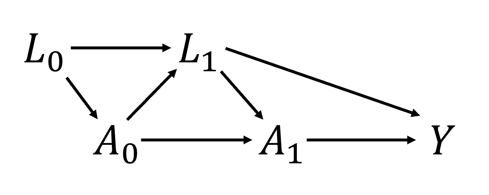
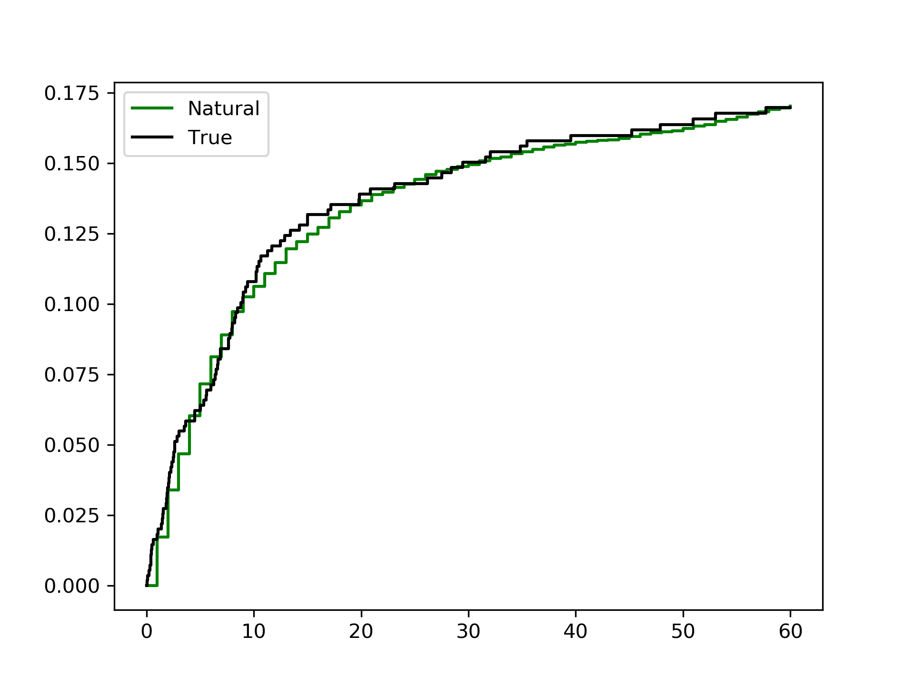
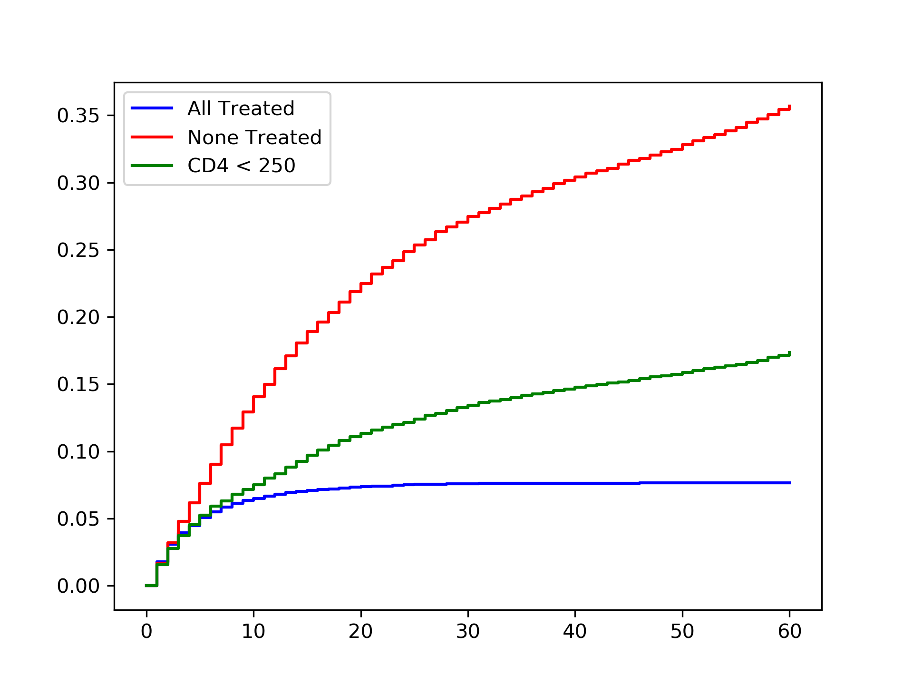
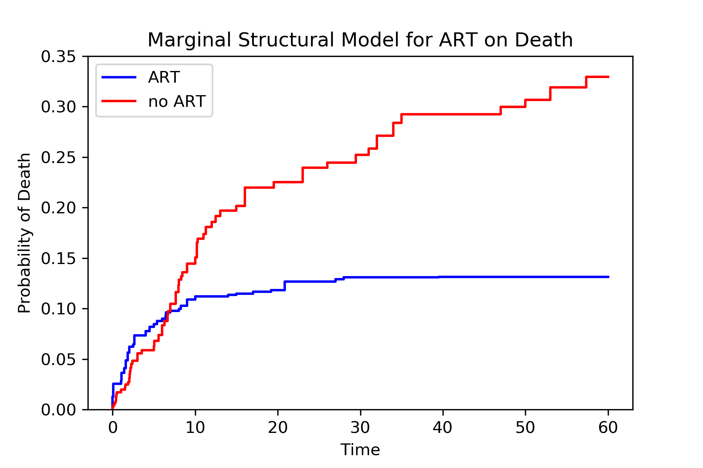

.. image:: images/zepid_logo_small.png

-------------------------------------

Time-Varying Exposure
'''''''''''''''''''''''''''''''''''''
In this section, we will go through some methods to estimate the average causal effect of a time-varying treatment /
exposure on a specific outcome. The key problem we must overcome is time-varying confounding. Time-varying confounders
are both a mediator and a confounder, depending on the causal path. As such, conditional models will not correctly
estimate the causal effects with time-varying confounders. We need to use special methods to account for time-varying
confounding. We will focus on time-to-event and longitudinal data separately.

To help solidify understanding, consider the following causal diagram, where subscripts are used to indicate time

If we are interested in the effect of :math:`A` (*not only* :math:`A_0`), then we need to account for confounding
variables. :math:`L_0` is easy, since we know we can condition on this variable safely. The problem comes with
:math:`L_1`. On the :math:`A_0` causal path to :math:`Y`, :math:`L_1` is a mediator. However, on the :math:`A_1` to
:math:`Y` causal path, :math:`L_1` is a confounder. Therefore, we need to simultaneously condition on :math:`L_1`,
while also not condition on it. We can't do that, so we are damned if we do and damned if we don't.

Not all hope is lost. James Robins developed his "g-methods" (g-formula, IPTW, g-estimation) for this exact problem.
These methods allows us to account for confounding by :math:`L_1`, but do not require conditioning on any variables.
Instead the g-methods provide marginal estimates rather than conditional. I introduced g-methods in the baseline
exposure setting, but time-varying exposure is where these methods really shine.

We will assume conditional mean exchangeability, causal consistency, and positivity throughout. These assumptions
allow us to go from our observed data to potential outcomes. See
`Hernan and Robins <https://www.hsph.harvard.edu/miguel-hernan/causal-inference-book/>`_ for further details on these
assumptions and the g-methods in general.

This section is divided into two scenarios; time-to-event and longitudinal data. For time-to-event, I mean that we have
data collected on the exact time of the event. For the g-methods, we will coarsen this data to discrete time, but this
is only necessary since we have finite data. As for longitudinal, I mean that our input data is already coarsened. The
data comes from follow-ups at constant intervals. The event at the follow-up visit happened some time between the
previous visit and the current visit. I draw this distinction, since some approaches for estimation work better in one
scenario over the other.

Time-to-Event Data
====================================
We will start with estimating the average causal effect of ART on mortality, assuming that once someone is treated with
ART, they remain on treatment (I will refer to as the intent-to-treat assumption in this tutorial). We will set up
the environment with the following code

.. code::

    import numpy as np
    import pandas as pd
    from lifelines import KaplanMeierFitter

    from zepid import load_sample_data, spline
    from zepid.causal.gformula import MonteCarloGFormula
    from zepid.causal.ipw import IPTW, IPCW

    df = load_sample_data(timevary=True)

    # Background variable preparations
    df['lag_art'] = df['art'].shift(1)
    df['lag_art'] = np.where(df.groupby('id').cumcount() == 0, 0, df['lag_art'])
    df['lag_cd4'] = df['cd4'].shift(1)
    df['lag_cd4'] = np.where(df.groupby('id').cumcount() == 0, df['cd40'], df['lag_cd4'])
    df['lag_dvl'] = df['dvl'].shift(1)
    df['lag_dvl'] = np.where(df.groupby('id').cumcount() == 0, df['dvl0'], df['lag_dvl'])
    df[['age_rs0', 'age_rs1', 'age_rs2']] = spline(df, 'age0', n_knots=4, term=2, restricted=True)  # age spline
    df['cd40_sq'] = df['cd40'] ** 2  # cd4 baseline cubic
    df['cd40_cu'] = df['cd40'] ** 3
    df['cd4_sq'] = df['cd4'] ** 2  # cd4 current cubic
    df['cd4_cu'] = df['cd4'] ** 3
    df['enter_sq'] = df['enter'] ** 2  # entry time cubic
    df['enter_cu'] = df['enter'] ** 3

We will assume conditional exchangeability by age (continuous), gender (male / female), baseline CD4 T-cell count
(continuous), and baseline detectable viral load (yes / no), CD4 T-cell count (continuous), detectable viral load
(yes / no), and previous ART treatment. CD4 T-cell count and detectable viral load are time-varying confounders in
this example.

Our set of confounders for conditional exchangeability is quite large and includes some continuous variables. Therefore,
we will use parametric models (for the most part). As a result, we assume that our models are correctly specified, in
addition to the above assumptions.

Monte-Carlo g-formula
----------------------------------------
The first option is to use the Monte-Carlo g-formula. This approach works by estimating pooled logistic regression
models for each time-varying variable (treatment, outcome, time-varying confounding). We then sample the population
from baseline and predict individuals time-varying variables going forward in time. We use Monte Carlo re-sampling to
reduce simulation error of the outcomes.

To begin, we initialize the Monte-Carlo g-formula with

.. code::

    mcgf = MonteCarloGFormula(df,  # Data set
                              idvar='id',  # ID variable
                              exposure='art',  # Exposure
                              outcome='dead',  # Outcome
                              time_in='enter',  # Start of study period
                              time_out='out')  # End of time per study period

We then specify models for each of our time-varying variables (ART, death, CD4 T-cell count, detectable viral load).
Additionally, we will specify a model for censoring. Below is example code for this procedure

.. code::

    # Pooled Logistic Model: Treatment
    exp_m = ('male + age0 + age_rs0 + age_rs1 + age_rs2 + cd40 + cd40_sq + cd40_cu + dvl0 + '
             'cd4 + cd4_sq + cd4_cu + dvl + enter + enter_sq + enter_cu')
    mcgf.exposure_model(exp_m,
                        restriction="g['lag_art']==0")  # Restricts to only untreated (for ITT assumption)

    # Pooled Logistic Model: Outcome
    out_m = ('art + male + age0 + age_rs0 + age_rs1 + age_rs2 + cd40 + cd40_sq + cd40_cu + dvl0 + '
             'cd4 + cd4_sq + cd4_cu + dvl + enter + enter_sq + enter_cu')
    mcgf.outcome_model(out_m,
                       restriction="g['drop']==0")  # Restricting to only uncensored individuals

    # Pooled Logistic Model: Detectable viral load
    dvl_m = ('male + age0 + age_rs0 + age_rs1 + age_rs2 + cd40 + cd40_sq + cd40_cu + dvl0 + '
             'lag_cd4 + lag_dvl + lag_art + enter + enter_sq + enter_cu')
    mcgf.add_covariate_model(label=1,  # Order to fit time-varying models in
                             covariate='dvl',  # Time-varying confounder
                             model=dvl_m,
                             var_type='binary')  # Variable type

    # Pooled Logistic Model: CD4 T-cell count
    cd4_m = ('male + age0 + age_rs0 + age_rs1 + age_rs2 +  cd40 + cd40_sq + cd40_cu + dvl0 + lag_cd4 + '
             'lag_dvl + lag_art + enter + enter_sq + enter_cu')
    cd4_recode_scheme = ("g['cd4'] = np.maximum(g['cd4'], 1);"
                         "g['cd4_sq'] = g['cd4']**2;"
                         "g['cd4_cu'] = g['cd4']**3")
    mcgf.add_covariate_model(label=2,  # Order to fit time-varying models in
                             covariate='cd4',  # Time-varying confounder
                             model=cd4_m,
                             recode=cd4_recode_scheme,  # Recoding process to use for each iteraction of MCMC
                             var_type='continuous')  # Variable type

    # Pooled Logistic Model: Censoring
    cens_m = ("male + age0 + age_rs0 + age_rs1 + age_rs2 +  cd40 + cd40_sq + cd40_cu + dvl0 + lag_cd4 + " +
              "lag_dvl + lag_art + enter + enter_sq + enter_cu")
    mcgf.censoring_model(cens_m)

After our models are specified, we can now predict the outcome plans under our treatment plan. To start, we will
compare to the natural course. The natural course is the world observed as it is. Since we are relying on the ITT
assumption, we will use the custom treatment option to fit the natural course. Below is code to estimate the natural
course under the ITT assumption

.. code::

    mcgf.fit(treatment="((g['art']==1) | (g['lag_art']==1))",  # Treatment plan
             lags={'art': 'lag_art',  # Lagged variables to create each loop
                   'cd4': 'lag_cd4',
                   'dvl': 'lag_dvl'},
             in_recode=("g['enter_sq'] = g['enter']**2;"  # Recode statement to execute at the start
                        "g['enter_cu'] = g['enter']**3"),
             sample=20000)  # Number of resamples from population (should be large number)

Afterwards, we can generate a plot of the risk curves.

.. code::

    # Accessing predicted outcome values
    gf = mcgf.predicted_outcomes

    # Fitting Kaplan Meier to Natural Course
    kmn = KaplanMeierFitter()
    kmn.fit(durations=gfs['out'], event_observed=gfs['dead'])

    # Fitting Kaplan Meier to Observed Data
    kmo = KaplanMeierFitter()
    kmo.fit(durations=df['out'], event_observed=df['dead'], entry=df['enter'])

    # Plotting risk functions
    plt.step(kmn.event_table.index, 1 - kmn.survival_function_, c='k', where='post', label='Natural')
    plt.step(kmo.event_table.index, 1 - kmo.survival_function_, c='gray', where='post', label='True')
    plt.legend()
    plt.show()

From this we can see that out natural course predictions (green) follow the observed data pretty well (black). Note:
this does not mean that our models are correctly specified.
*Rather it only means they may not be incorrectly specified.* Sadly, there is no way to know that all our models are
correctly specified... We may take some comfort that our curves largely overlap, but do not take this for granted

We can now estimate the counterfactual outcomes under various treatment plans. In the following code, we will estimate
the outcomes under treat-all plan, treat-none plan, and treat only once CD4 T-cell count drops below 200.

.. code::

    # Treat-all plan
    mcgf.fit(treatment="all",
             lags={'art': 'lag_art',
                   'cd4': 'lag_cd4',
                   'dvl': 'lag_dvl'},
             in_recode=("g['enter_sq'] = g['enter']**2;"
                        "g['enter_cu'] = g['enter']**3"),
             sample=20000)
    g_all = mcgf.predicted_outcomes

    # Treat-none plan
    mcgf.fit(treatment="none",
             lags={'art': 'lag_art',
                   'cd4': 'lag_cd4',
                   'dvl': 'lag_dvl'},
             in_recode=("g['enter_sq'] = g['enter']**2;"
                        "g['enter_cu'] = g['enter']**3"),
             sample=20000)
    g_none = mcgf.predicted_outcomes

    # Custom treatment plan
    mcgf.fit(treatment="g['cd4'] <= 200",
             lags={'art': 'lag_art',
                   'cd4': 'lag_cd4',
                   'dvl': 'lag_dvl'},
             in_recode=("g['enter_sq'] = g['enter']**2;"
                        "g['enter_cu'] = g['enter']**3"),
             sample=20000,
             t_max=None)
    g_cd4 = mcgf.predicted_outcomes

    # Risk curve under treat-all
    gfs = g_all.loc[g_all['uid_g_zepid'] != g_all['uid_g_zepid'].shift(-1)].copy()
    kma = KaplanMeierFitter()
    kma.fit(durations=gfs['out'], event_observed=gfs['dead'])

    # Risk curve under treat-all
    gfs = g_none.loc[g_none['uid_g_zepid'] != g_none['uid_g_zepid'].shift(-1)].copy()
    kmn = KaplanMeierFitter()
    kmn.fit(durations=gfs['out'], event_observed=gfs['dead'])

    # Risk curve under treat-all
    gfs = g_cd4.loc[g_cd4['uid_g_zepid'] != g_cd4['uid_g_zepid'].shift(-1)].copy()
    kmc = KaplanMeierFitter()
    kmc.fit(durations=gfs['out'], event_observed=gfs['dead'])

    # Plotting risk functions
    plt.step(kma.event_table.index, 1 - kma.survival_function_, c='blue', where='post', label='All')
    plt.step(kmn.event_table.index, 1 - kmn.survival_function_, c='red', where='post', label='None')
    plt.step(kmc.event_table.index, 1 - kmc.survival_function_, c='green', where='post', label='CD4 < 200')
    plt.legend()
    plt.show()

From these results, we can see that the treat-all plan reduces the probability of death across all time points.
Importantly, the treat-all plan outperforms the custom treatment plan. Based on this result, we would recommend that
all HIV-infected individuals receive ART treatment as soon as they are diagnosed.

To obtain confidence intervals, nonparametric bootstrapping should be used. Take note that this will take awhile to
finish (especially if a high number of resamples are used). As it stands, `MonteCarloGFormula` is slow, and future
work is to try to optimize the Monte Carlo procedure (specifically some large matrix multiplications)

Marginal Structural Model
----------------------------------------
We can also use inverse probability of treatment weights to estimate a marginal structural model for time-varying
treatments. Similar to the Monte-Carlo g-formula, we will rely on the sam ITT assumption previous described. To
calculate the corresponding IPTW, we will use `IPTW` again. Since we will need to do further manipulation of the
predicted probabilities, we will have ``IPTW`` return the predicted probabilities of the denominator and numerator,
respectively. We do this through the following code

.. code::

    # Specifying models
    modeln = 'enter + enter_q + enter_c'
    modeld = ('enter + enter_q + enter_c + male + age0 + age0_q + age0_c + dvl0 + cd40 + '
              'cd40_q + cd40_c + dvl + cd4 + cd4_q + cd4_c')

    # Restricting to only the previously untreated data
    dfs = df.loc[df['lagart']==0].copy()

    # Calculating probabilities for IPTW
    ipt = IPTW(dfs,treatment='art')
    ipt.regression_models(model_denominator=modeld, model_numerator=modeln)
    ipt.fit()

    # Extracting probabilities for later manipulation
    df['p_denom'] = ipt.ProbabilityDenominator
    df['p_numer'] = ipt.ProbabilityNumerator

Note: you should only use stabilized weights for time-varying treatments. Unstabilized weights can have poor
performance

We now need to do some further manipulation of the weights

.. code::

  #Condition 1: First record weight is 1
  cond1 = (df.groupby('id').cumcount() == 0)
  df['p_denom'] = np.where(cond1, 1, df['p_denom']) #Setting first visit to Pr(...) = 1
  df['p_numer'] = np.where(cond1, 1, df['p_numer'])
  df['ip_denom'] = np.where(cond1, 1, (1-df['p_denom']))
  df['ip_numer'] = np.where(cond1, 1, (1-df['p_numer']))
  df['den'] = np.where(cond1, df['p_denom'], np.nan)
  df['num'] = np.where(cond1, df['p_numer'], np.nan)

  #Condition 2: Records before ART initiation
  cond2 = ((df['lagart']==0) & (df['art']==0) & (df.groupby('id').cumcount() != 0))
  df['num'] = np.where(cond2, df.groupby('id')['ip_numer'].cumprod(), df['num'])
  df['den'] = np.where(cond2, df.groupby('id')['ip_denom'].cumprod(), df['den'])

  #Condition 3: Records at ART initiation
  cond3 = ((df['lagart']==0) & (df['art']==1) & (df.groupby('id').cumcount() != 0))
  df['num'] = np.where(cond3, df['num'].shift(1)*(df['p_numer']), df['num'])
  df['den'] = np.where(cond3, df['den'].shift(1)*(df['p_denom']), df['den'])

  #Condition 4: Records after ART initiation
  df['num'] = df['num'].ffill()
  df['den'] = df['den'].ffill()

  #Calculating weights
  df['w'] = df['num'] / df['den']

After calculating our weights, we can estimate the risk functions via a weighted Kaplan Meier. Note that
``lifelines`` version will need to be ``0.14.5`` or greater. The following code will generate our risk function plot

.. code:: python

  kme = KaplanMeierFitter()
  dfe = df.loc[df['art']==1].copy()
  kme.fit(dfe['out'],event_observed=dfe['dead'],entry=dfe['enter'],weights=dfe['w'])

  kmu = KaplanMeierFitter()
  dfu = df.loc[df['art']==0].copy()
  kmu.fit(dfu['out'],event_observed=dfu['dead'],entry=dfu['enter'],weights=dfu['w'])

  plt.step(kme.event_table.index,1 - kme.survival_function_,c='b',label='ART')
  plt.step(kmu.event_table.index,1 - kmu.survival_function_,c='r',label='no ART')
  plt.show()

Similarly, we see the treat-all plan is better than the never-treat plan. We see a discrepancy between the two
approaches during the early times (weeks less than 5). Note that we did not account for informative censoring. To
account for informative censoring, we could use inverse probability of censoring weights. See the Missing Data tutorial
for further details.

Longitudinal Data
====================================
We will use a different simulated data set within *zEpid* for this section. This data is longitudinal data simulated
for demonstrative purposes. This data set is in a wide-format, such that each row is a single person and columns are
variables measured at specific time points. *Note:* this format is distinct from the time-to-event data, which was in
a long format. Below is code to load this data set

.. code::

    from zepid import load_longitudinal_data
    df = load_longitudinal_data()

In this data, we have outcomes measured at three time points. Additionally, we have treatments (`A`), time-varying
confounder (`L`), and a baseline confounder (`W`) measured in our data. We will assume exchangeability (sometimes also
referred to as sequential ignorability) for the effect of `A` on `Y` by `L` and `W`.

Iterative Conditional g-formula
----------------------------------------
The iterative conditional g-formula is an alternative to the Monte-Carlo estimation procedure, as detailed in the
previous sections. While the Monte-Carlo g-formula requires that we specify a parametric regression model for *all*
time-varying variables, the iterative conditional approach only requires that we specify an outcome regression model.
This drastically cuts down on the potential for model misspecification. However, we no longer use a pooled logistic
regression model, so the iterative conditional g-formula does not estimate nicely in sparse survival data (in my
experience).

The iterative conditional procedure works like the following. Starting at the last observed time, we fit our specified
outcome model. From this model, we predict the probability of the outcome under observed treatment (:math:`\hat{Q}`)
and under the counterfactual treatment of interest (:math:`Q^*`). Next, we move to the previous time point. For those
who were observed at the last time point, we use their :math:`\hat{Q}` as their outcome. If they were not observed at
the furtherest time point, we use their observed :math:`Y` instead. We repeat the process of model fitting. We then
repeat this whole procedure (hence "iterative" conditionals) until we end up at the origin. Now our predicted
:math:`Q^*` value is the counterfactual mean under the specified treatment plan

The following is code to use the iterative conditional process. We will start with estimating the counterfactual mean
under a treat-all strategy for t=3.

.. code::

    icgf = IterativeCondGFormula(df, exposures=['A1', 'A2', 'A3'], outcomes=['Y1', 'Y2', 'Y3'])

    # Specifying regression models for each treatment-outcome pair
    icgf.outcome_model(models=['A1 + L1',
                               'A2 + A1 + L2',
                               'A3 + A2 + L3'],
                       print_results=False)

    # Estimating marginal ‘Y3’ under treat-all at every time
    icgf.fit(treatments=[1, 1, 1])
    r_all = icgf.marginal_outcome

`r_all` is the overall risk of Y at time 3 under a treat-all at all time points strategy. This value was 0.433. We can
estimate the overall risk of Y at time 3 under a treat-none strategy by running

.. code::

    icgf.fit(treatments=[0, 0, 0])
    r_non = icgf.marginal_outcome

    print('RD =', r_all - r_non)

We can interpret our estimated risk difference as; the risk of Y at time 3 under a treat-all strategy was 19.5% points
lower than under a treat-none strategy. We can make further comparisons between treatment plans by changing the
`treatments` argument. Below is an example where treatment is only given a baseline

.. code::

    icgf.fit(treatments=[1, 0, 0])

The estimated risk under this treatment strategy is 0.547. To estimate Y at t=2, we use a similar process as above but
limit our data to `Y2`. Below is an example of estimating Y at t=2 for a treat-all strategy

.. code::

    icgf = IterativeCondGFormula(df, exposures=['A1', 'A2'], outcomes=['Y1', 'Y2'])
    icgf.outcome_model(models=['A1 + L1',
                               'A2 + A1 + L2'],
                       print_results=False)
    icgf.fit(treatments=[1, 1])

The estimate risk of Y at t=2 under a treat-all strategy was 0.350. The above process can be repeated for all
observation times in a wide data set. For calculation of confidence intervals, a non-parametric bootstrapping procedure
should be used.

Marginal Structural Model
----------------------------------------
We can also use inverse probability weights to estimate a marginal structural model. Easier implementation of this
estimation will be added later.

Longitudinal TMLE
----------------------------------------
In a future update, the longitudinal targeted maximum likelihood estimator will be added.

G-estimation
----------------------------------------
Currently, g-estimation of structural nested models for time-varying exposures is not implemented. I plan to add AFT
estimation procedures in a future update

Summary
========================================
G-methods allow us to answer more complex questions than standard methods. With these tools, we can start to ask
questions about ideal treatment strategies. See further tutorials at this
`GitHub repo <https://github.com/pzivich/Python-for-Epidemiologists/tree/master/3_Epidemiology_Analysis/c_causal_inference/2-time-varying-treatments>`_
for further examples
